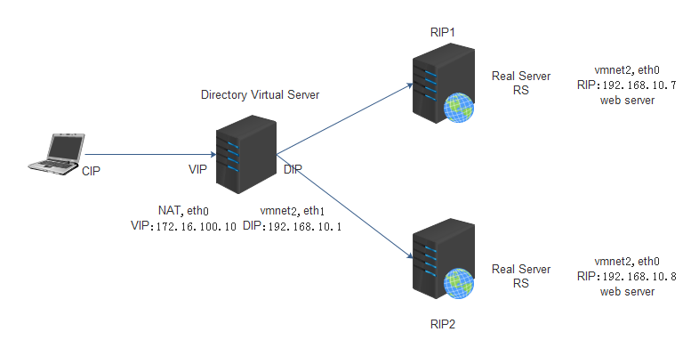

[TOC]

## LVS-NAT

Network Address Translation（LVS-NAT）【常用】

==目标地址转换==，所有客户端的请求都被Director根据访问请求和算法定向转发到后台的real server上

特性：

所有RS的网关必须指向DIP，用来响应客户端的请求；

RIP和DIP一般是内网私有地址，用于和集群节点RS通信；

Director会响应所有的客户端请求，负载较大；

Director支持端口重映射，即前端使用标准端口，后端可使用非标准端口；

请求和响应报文都要经过Director，高负载场景中，Director容易成为性能瓶颈；

VS必须是linux，RS可以是任何可支持服务的OS。

实验拓扑图：



1-1,在Director上配置两块网卡:

VIP(eth0)：172.16.100.10/24,用于接受客户端请求;

DIP(eth1)：192.168.10.1/24,用于后端的RS服务器的网关,注意开启forward转发功能；

 

```
# 虚拟机上添加一块网卡,复制eth0文件为eth1, 删除eth1内的mac和uuid地址,修改ip为dip, 网关无
[root@study-linux network-scripts]# cat ifcfg-eth1
"""
DEVICE=eth1
TYPE=Ethernet
ONBOOT=yes
NM_CONTROLLED=yes
BOOTPROTO=none
IPADDR=192.168.10.1
NETMASK=255.255.255.0
ARPCHECK=no
"""

[root@study-linux ~]# > /etc/udev/rules.d/70-persistent-net.rules
[root@study-linux ~]# reboot
```

 

```
# 虚拟机上添加一块网卡,复制eth0文件为eth1, 删除eth1内的mac和uuid地址,修改ip为dip, 网关无
[root@study-linux network-scripts]# cat ifcfg-eth1
"""
DEVICE=eth1
TYPE=Ethernet
ONBOOT=yes
NM_CONTROLLED=yes
BOOTPROTO=none
IPADDR=192.168.10.1
NETMASK=255.255.255.0
ARPCHECK=no
"""
[root@study-linux ~]# > /etc/udev/rules.d/70-persistent-net.rules
[root@study-linux ~]# reboot
```

1-2,配置RS的IP地址

RS1(eth0)：192.168.10.7/24，网关为192.168.10.1;

RS2(eth0)：192.168.10.8/24，网关为192.168.10.1;

 

```
# RS1
[root@node1 network-scripts]# cat ifcfg-eth0
"""
DEVICE=eth0
TYPE=Ethernet
ONBOOT=yes
NM_CONTROLLED=yes
BOOTPROTO=none
IPADDR=192.168.10.7
NETMASK=255.255.255.0
GATEWAY=192.168.10.1
ARPCHECK=no
USERCTL=no
IPV6INIT=no
PEERDNS=yes
"""

# RS2
[root@node1 network-scripts]# cat ifcfg-eth0
"""
DEVICE=eth0
TYPE=Ethernet
ONBOOT=yes
NM_CONTROLLED=yes
BOOTPROTO=none
IPADDR=192.168.10.8
NETMASK=255.255.255.0
GATEWAY=192.168.10.1
ARPCHECK=no
USERCTL=no
IPV6INIT=no
PEERDNS=yes
"""
```

 

```
# RS1
[root@node1 network-scripts]# cat ifcfg-eth0
"""
DEVICE=eth0
TYPE=Ethernet
ONBOOT=yes
NM_CONTROLLED=yes
BOOTPROTO=none
IPADDR=192.168.10.7
NETMASK=255.255.255.0
GATEWAY=192.168.10.1
ARPCHECK=no
USERCTL=no
IPV6INIT=no
PEERDNS=yes
"""
# RS2
[root@node1 network-scripts]# cat ifcfg-eth0
"""
DEVICE=eth0
TYPE=Ethernet
ONBOOT=yes
NM_CONTROLLED=yes
BOOTPROTO=none
IPADDR=192.168.10.8
NETMASK=255.255.255.0
GATEWAY=192.168.10.1
ARPCHECK=no
USERCTL=no
IPV6INIT=no
PEERDNS=yes
"""
```

1-3,在RS1和RS2上分别安装web服务，并提供一个页面文档用于测试,实际环境中的web页面是需要相同的,这里为了区别调度方法,配置了不同的内容;

 

```
# RS1
[root@node2 ~]# mount /dev/cdrom /media/cdrom/
[root@node2 ~]# yum install httpd
[root@node2 ~]# vim /var/www/html/index.html
"""
<h1>
    Test Page from node1...
</h1>
"""

# RS2
[root@node2 ~]# mount /dev/cdrom /media/cdrom/
[root@node2 ~]# yum install httpd
[root@node2 ~]# vim /var/www/html/index.html
"""
<h1>
    Test Page from node2...
</h1>
"""
```

 

```
# RS1
[root@node2 ~]# mount /dev/cdrom /media/cdrom/
[root@node2 ~]# yum install httpd
[root@node2 ~]# vim /var/www/html/index.html
"""
<h1>
    Test Page from node1...
</h1>
"""
# RS2
[root@node2 ~]# mount /dev/cdrom /media/cdrom/
[root@node2 ~]# yum install httpd
[root@node2 ~]# vim /var/www/html/index.html
"""
<h1>
    Test Page from node2...
</h1>
"""
```

1-4,在Director上配置集群服务

 

```
# 检查内核是否开启了IPVS功能
[root@study-linux ~]# grep -i -A 10 'IPVS' /boot/config-2.6.32-642.el6.x86_64
[root@study-linux ~]# yum install ipvsadm -y
[root@study-linux ~]# man ipvsadm

# 打开转发功能
[root@study-linux ~]# echo 1 > /proc/sys/net/ipv4/ip_forward   # 临时生效
[root@study-linux ~]# vim /etc/sysctl.conf  # 永久生效
"""
net.ipv4.ip_forward = 1  # 修改为1
"""

[root@study-linux ~]# sysctl -p | grep net.ipv4.ip_forward

# 添加一个集群，协议为tcp，地址为172.16.100.10的80端口，调度方式为rr轮询
[root@study-linux ~]# ipvsadm -A -t 172.16.100.10:80 -s rr

 # 向已建立的集群服务172.16.100.10中添加一个RS 192.168.10.7，集群类型为NAT
[root@study-linux ~]# ipvsadm -a -t 172.16.100.10:80 -r 192.168.10.7 -m

# 向已建立的集群服务172.16.100.7中添加一个RS 192.168.10.8，集群类型为NAT
[root@study-linux ~]# ipvsadm -a -t 172.16.100.10:80 -r 192.168.10.8 -m
```

 

```
# 检查内核是否开启了IPVS功能
[root@study-linux ~]# grep -i -A 10 'IPVS' /boot/config-2.6.32-642.el6.x86_64
[root@study-linux ~]# yum install ipvsadm -y
[root@study-linux ~]# man ipvsadm
# 打开转发功能
[root@study-linux ~]# echo 1 > /proc/sys/net/ipv4/ip_forward   # 临时生效
[root@study-linux ~]# vim /etc/sysctl.conf  # 永久生效
"""
net.ipv4.ip_forward = 1  # 修改为1
"""
[root@study-linux ~]# sysctl -p | grep net.ipv4.ip_forward
# 添加一个集群，协议为tcp，地址为172.16.100.10的80端口，调度方式为rr轮询
[root@study-linux ~]# ipvsadm -A -t 172.16.100.10:80 -s rr
 # 向已建立的集群服务172.16.100.10中添加一个RS 192.168.10.7，集群类型为NAT
[root@study-linux ~]# ipvsadm -a -t 172.16.100.10:80 -r 192.168.10.7 -m
# 向已建立的集群服务172.16.100.7中添加一个RS 192.168.10.8，集群类型为NAT
[root@study-linux ~]# ipvsadm -a -t 172.16.100.10:80 -r 192.168.10.8 -m
```

查看集群

 

```
[root@study-linux ~]# ipvsadm -L -n           # 查看已定义的集群服务
[root@study-linux ~]# ipvsadm -L -n -c        # 查看当前所有的连接
[root@study-linux ~]# ipvsadm -L -n --stats   # 查看当前的连接总数
[root@study-linux ~]# ipvsadm -L -n --rate    # 查看速率
[root@study-linux ~]# ipvsadm -L -n --exact   # 显示精确值
```

 

```
[root@study-linux ~]# ipvsadm -L -n           # 查看已定义的集群服务
[root@study-linux ~]# ipvsadm -L -n -c        # 查看当前所有的连接
[root@study-linux ~]# ipvsadm -L -n --stats   # 查看当前的连接总数
[root@study-linux ~]# ipvsadm -L -n --rate    # 查看速率
[root@study-linux ~]# ipvsadm -L -n --exact   # 显示精确值
```

修改集群调度方式

 

```
# wrr调度方式, rs2权重为2
[root@study-linux ~]# ipvsadm -E -t 172.16.100.10:80 -s wrr
[root@study-linux ~]# ipvsadm -e -t 172.16.100.10:80 -r 192.168.10.8 -m -w 2

# sh源地址hash[session绑定]
[root@study-linux ~]# ipvsadm -E -t 172.16.100.10:80 -s sh
```

 

```
# wrr调度方式, rs2权重为2
[root@study-linux ~]# ipvsadm -E -t 172.16.100.10:80 -s wrr
[root@study-linux ~]# ipvsadm -e -t 172.16.100.10:80 -r 192.168.10.8 -m -w 2
# sh源地址hash[session绑定]
[root@study-linux ~]# ipvsadm -E -t 172.16.100.10:80 -s sh
```

删除集群服务

 

```
# 删除某一条Directory记录
[root@study-linux ~]# ipvsadm -D -t 172.16.100.10:80 

# 清空所有集群服务记录,包括定义的RS一并删除
[root@study-linux ~]# ipvsadm -C

# 删除某条集群服务记录中的某个RS记录
[root@study-linux ~]# ipvsadm -d -t 172.16.100.10:80 -r 192.168.10.7
```

 

```
# 删除某一条Directory记录
[root@study-linux ~]# ipvsadm -D -t 172.16.100.10:80 
# 清空所有集群服务记录,包括定义的RS一并删除
[root@study-linux ~]# ipvsadm -C
# 删除某条集群服务记录中的某个RS记录
[root@study-linux ~]# ipvsadm -d -t 172.16.100.10:80 -r 192.168.10.7
```

保存与读取规则

 

```
[root@study-linux ~]# service ipvsadm save

# 将规则保存到某个文件中
[root@study-linux ~]# ipvsadm -S > /etc/sysconfig/ipvsadm.2
[root@study-linux ~]# ipvsadm-save > /etc/sysconfig/ipvsadm.2

# 读取文件中的规则
[root@study-linux ~]# ipvsadm -R < /etc/sysconfig/ipvsadm.2
[root@study-linux ~]# ipvsadm-restore < /etc/sysconfig/ipvsadm.2
```

 

```
[root@study-linux ~]# service ipvsadm save
# 将规则保存到某个文件中
[root@study-linux ~]# ipvsadm -S > /etc/sysconfig/ipvsadm.2
[root@study-linux ~]# ipvsadm-save > /etc/sysconfig/ipvsadm.2
# 读取文件中的规则
[root@study-linux ~]# ipvsadm -R < /etc/sysconfig/ipvsadm.2
[root@study-linux ~]# ipvsadm-restore < /etc/sysconfig/ipvsadm.2
```

测试访问: http://172.16.100.10

