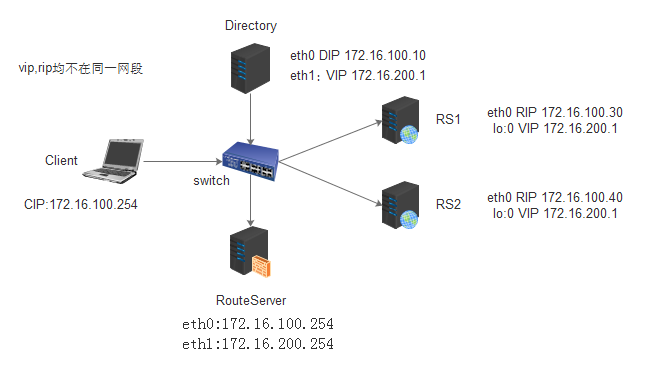

[TOC]

## LVS-DR

Director Routing（LVS-DR）【常用】

Director将接收到的请求报文源IP和目标IP都不做修改,而是将源MAC设定自己的MAC,目标MAC设定目标RS的MAC，通过交换机发送给RS，当RS server拆解后发现源目标IP不是自己,此时要在RS上配置一个自己的VIP,即RS服务器有RIP和VIP.

特性：

要保证前端路由器可以将报文发往Director的VIP，而非RS的vip：

解决方案：

a，在前端路由器上，做静态地址和mac地址绑定，即绑定Director的VIP地址和其mac，以便强制使报文发给Director的VIP；

b，如果前端路由器没有操作权限，可以在RS上，利用arptables防火墙规则，限制RS接收前端路由器的广播报文；

c，修改RS上的内核参数（linux），将RS上的VIP配置在自己的lo接口的别名上，并限制其响应发送ARP广播请求；

RS可以使用私有地址,亦可以使用公网地址(这时可以远程连接RIP对其访问);

RS和Director必须在同一个物理网络中；

所有的请求报文需经由Director来调度，但响应报文决不能经过Director；

不支持端口映射；

RS的网关不允许指向DIP；

RS可以是大多数常见的OS；

实验要求1:

这里RS使用私有地址,且RIP和VIP在同一网段;

Directory:

dip(eth0): 172.16.100.10/24

vip(eth0:0): 172.16.100.100/32

RS1:

rip(eth0): 172.16.100.30/24

vip(lo:0): 172.16.100.100/32

RS2:

rip(eth0): 172.16.100.40/24

vip(lo:0): 172.16.100.100/32

实验拓扑图：


2-1,在Director上配置dip(eth0)和vip(eth0:0),同时,为了让请求从哪个网卡来就从哪个网口出去响应,添加一条主机路由

 

```
# Directory
[root@study-linux ~]# ifconfig eth0:0 172.16.100.100/32 broadcast 172.16.100.100 up
[root@study-linux ~]# ifconfig
[root@study-linux ~]# route add -host 172.16.100.100 dev eth:0
[root@study-linux ~]# route -n
```

 

```
# Directory
[root@study-linux ~]# ifconfig eth0:0 172.16.100.100/32 broadcast 172.16.100.100 up
[root@study-linux ~]# ifconfig
[root@study-linux ~]# route add -host 172.16.100.100 dev eth:0
[root@study-linux ~]# route -n
```

2-2,分别修改RS上的内核参数(linux),将RS上的VIP配置在自己的lo接口的别名上,并限制其响应发送ARP广播请求;

内核参数:(每个接口上都需要定义,先修改内核参数，在定义ip)

内核参数说明:

arp_announce：定义接入一个网络中后如何通告自己的地址

   0：默认级别，表示通告自己的所有网卡IP

   1：尽量只通告直连接的接口ip

   2：只通告直连的接口ip

arp_ignore：定义收到arp广播后如何响应

   0：默认级别,收到arp请求后，只要自己符合，即会回应

   1：收到arp请求后，仅用收到请求的接口响应，其他接口不予响应

注意:先设置内核参数,在配置vip

 

```
# RS1
[root@study-linux ~]# echo 1 > /proc/sys/net/ipv4/conf/all/arp_ignore
[root@study-linux ~]# echo 1 > /proc/sys/net/ipv4/conf/eth0/arp_ignore
[root@study-linux ~]# echo 2 > /proc/sys/net/ipv4/conf/eth0/arp_announce
[root@study-linux ~]# echo 2 > /proc/sys/net/ipv4/conf/all/arp_announce

# RS2:
[root@study-linux ~]# echo 1 > /proc/sys/net/ipv4/conf/all/arp_ignore
[root@study-linux ~]# echo 1 > /proc/sys/net/ipv4/conf/eth0/arp_ignore
[root@study-linux ~]# echo 2 > /proc/sys/net/ipv4/conf/eth0/arp_announce
[root@study-linux ~]# echo 2 > /proc/sys/net/ipv4/conf/all/arp_announce
```

 

```
# RS1
[root@study-linux ~]# echo 1 > /proc/sys/net/ipv4/conf/all/arp_ignore
[root@study-linux ~]# echo 1 > /proc/sys/net/ipv4/conf/eth0/arp_ignore
[root@study-linux ~]# echo 2 > /proc/sys/net/ipv4/conf/eth0/arp_announce
[root@study-linux ~]# echo 2 > /proc/sys/net/ipv4/conf/all/arp_announce
# RS2:
[root@study-linux ~]# echo 1 > /proc/sys/net/ipv4/conf/all/arp_ignore
[root@study-linux ~]# echo 1 > /proc/sys/net/ipv4/conf/eth0/arp_ignore
[root@study-linux ~]# echo 2 > /proc/sys/net/ipv4/conf/eth0/arp_announce
[root@study-linux ~]# echo 2 > /proc/sys/net/ipv4/conf/all/arp_announce
```

2-3,在RS上配置rip(eth0)和vip(lo:0),同时,为了让过来的请求从哪个网卡来就从哪个网口出,添加一条主机路由

 

```
# RS1
# 添加vip,定义vip掩码为32位,只广播给自己
[root@study-linux ~]# ifconfig lo:0 172.16.100.100/32 broadcast 172.16.100.100 up
[root@study-linux ~]# ifconfig

# 添加一条路由,所有目标为172.16.100.100的请求,从lo:0接口响应
[root@study-linux ~]# route add -host 172.16.100.100 dev lo:0
[root@study-linux ~]# route -n

# RS2
# 添加vip,定义vip掩码为32位,只广播给自己
[root@study-linux ~]# ifconfig lo:0 172.16.100.100/32 broadcast 172.16.100.100 up
[root@study-linux ~]# ifconfig

# 添加一条路由,所有目标为172.16.100.100的请求,从lo:0接口响应
[root@study-linux ~]# route add -host 172.16.100.100 dev lo:0
[root@study-linux ~]# route -n
```

 

```
# RS1
# 添加vip,定义vip掩码为32位,只广播给自己
[root@study-linux ~]# ifconfig lo:0 172.16.100.100/32 broadcast 172.16.100.100 up
[root@study-linux ~]# ifconfig
# 添加一条路由,所有目标为172.16.100.100的请求,从lo:0接口响应
[root@study-linux ~]# route add -host 172.16.100.100 dev lo:0
[root@study-linux ~]# route -n
# RS2
# 添加vip,定义vip掩码为32位,只广播给自己
[root@study-linux ~]# ifconfig lo:0 172.16.100.100/32 broadcast 172.16.100.100 up
[root@study-linux ~]# ifconfig
# 添加一条路由,所有目标为172.16.100.100的请求,从lo:0接口响应
[root@study-linux ~]# route add -host 172.16.100.100 dev lo:0
[root@study-linux ~]# route -n
```

2-4，在Director上配置集群服务

 

```
[root@study-linux ~]# ipvsadm -A -t 172.16.100.100:80 -s rr
[root@study-linux ~]# ipvsadm -a -t 172.16.100.100:80 -r 172.16.100.30 -g
[root@study-linux ~]# ipvsadm -a -t 172.16.100.100:80 -r 172.16.100.40 -g
```

 

```
[root@study-linux ~]# ipvsadm -A -t 172.16.100.100:80 -s rr
[root@study-linux ~]# ipvsadm -a -t 172.16.100.100:80 -r 172.16.100.30 -g
[root@study-linux ~]# ipvsadm -a -t 172.16.100.100:80 -r 172.16.100.40 -g
```

2-5,客户端访问172.16.100.100,测试

实验要求2:

这里RS使用私有地址,且RIP和VIP不在同一网段;

说明:

a, Directory上需要2块网卡,一块用于连接外网的Client请求,一块用于连接后端的RS服务器,故2个不同的网段,需要开启转发功能;

b, 后端的RS的vip必须不能让其他设备知道;

c, RouteServer当做路由器,配有2块网卡,一块可访问外网,一块可访问RS所在的网段,需要开启转发功能

思路:

当Client访问vip(172.16.200.1)时,请求先到达Directory(DS),DS转发到后端的某个RS上,这个RS处理完后,发给自己的网关路由(RouteServer),通过该路由直接回应给Client.

实验拓扑图:



Directory:

dip(eth0): 172.16.100.10/24

vip(eth1): 172.16.200.1/32

RS1:

rip(eth0): 172.16.100.30/24

vip(lo:0): 172.16.200.1/32

RS2:

rip(eth0): 172.16.100.40/24

vip(lo:0): 172.16.200.1/32

RouteServer:

eth0:172.16.100.254

eth1:172.16.200.254

2-6,在Directory上配置2块网卡,dip和vip

 

```
[root@study-linux ~]# vim ifcfg-eth0
"""
IPADDR=172.16.100.10
NETMASK=255.255.255.0
GATEWAY=172.16.100.254
"""

[root@study-linux ~]# vim ifcfg-eth1
"""
IPADDR=172.16.200.1
NETMASK=255.255.255.0
"""

[root@study-linux ~]# route add -host 172.16.200.1 dev eth1

# 配置lvs
[root@study-linux ~]# ipvsadm -A -t 172.16.200.1:80 -s rr
[root@study-linux ~]# ipvsadm -a -t 172.16.200.1:80 -r 172.16.100.30 -g
[root@study-linux ~]# ipvsadm -a -t 172.16.200.1:80 -r 172.16.100.40 -g
[root@study-linux ~]# ipvsadm -L -n
```

 

```
[root@study-linux ~]# vim ifcfg-eth0
"""
IPADDR=172.16.100.10
NETMASK=255.255.255.0
GATEWAY=172.16.100.254
"""
[root@study-linux ~]# vim ifcfg-eth1
"""
IPADDR=172.16.200.1
NETMASK=255.255.255.0
"""
[root@study-linux ~]# route add -host 172.16.200.1 dev eth1
# 配置lvs
[root@study-linux ~]# ipvsadm -A -t 172.16.200.1:80 -s rr
[root@study-linux ~]# ipvsadm -a -t 172.16.200.1:80 -r 172.16.100.30 -g
[root@study-linux ~]# ipvsadm -a -t 172.16.200.1:80 -r 172.16.100.40 -g
[root@study-linux ~]# ipvsadm -L -n
```

2-7,在RS上,先配置网卡禁止广播,然后在配置vip和路由

 

```
# RS1
[root@study-linux ~]# echo 1 > /proc/sys/net/ipv4/conf/all/arp_ignore
[root@study-linux ~]# echo 1 > /proc/sys/net/ipv4/conf/eth0/arp_ignore
[root@study-linux ~]# echo 2 > /proc/sys/net/ipv4/conf/eth0/arp_announce
[root@study-linux ~]# echo 2 > /proc/sys/net/ipv4/conf/all/arp_announce

[root@study-linux ~]# vim ifcfg-eth0
"""
IPADDR=172.16.100.30
NETMASK=255.255.255.0
GATEWAY=172.16.100.254
"""
[root@study-linux ~]# ifconfig lo:0 172.16.200.1/32 broadcast 172.16.200.1 up
[root@study-linux ~]# route add -host 172.16.200.1 dev lo:0


# RS2:
[root@study-linux ~]# echo 1 > /proc/sys/net/ipv4/conf/all/arp_ignore
[root@study-linux ~]# echo 1 > /proc/sys/net/ipv4/conf/eth0/arp_ignore
[root@study-linux ~]# echo 2 > /proc/sys/net/ipv4/conf/eth0/arp_announce
[root@study-linux ~]# echo 2 > /proc/sys/net/ipv4/conf/all/arp_announce

[root@study-linux ~]# vim ifcfg-eth0
"""
IPADDR=172.16.100.40
NETMASK=255.255.255.0
GATEWAY=172.16.100.254
"""
[root@study-linux ~]# ifconfig lo:0 172.16.200.1/32 broadcast 172.16.200.1 up
[root@study-linux ~]# route add -host 172.16.200.1 dev lo:0
```

 

```
# RS1
[root@study-linux ~]# echo 1 > /proc/sys/net/ipv4/conf/all/arp_ignore
[root@study-linux ~]# echo 1 > /proc/sys/net/ipv4/conf/eth0/arp_ignore
[root@study-linux ~]# echo 2 > /proc/sys/net/ipv4/conf/eth0/arp_announce
[root@study-linux ~]# echo 2 > /proc/sys/net/ipv4/conf/all/arp_announce
[root@study-linux ~]# vim ifcfg-eth0
"""
IPADDR=172.16.100.30
NETMASK=255.255.255.0
GATEWAY=172.16.100.254
"""
[root@study-linux ~]# ifconfig lo:0 172.16.200.1/32 broadcast 172.16.200.1 up
[root@study-linux ~]# route add -host 172.16.200.1 dev lo:0
# RS2:
[root@study-linux ~]# echo 1 > /proc/sys/net/ipv4/conf/all/arp_ignore
[root@study-linux ~]# echo 1 > /proc/sys/net/ipv4/conf/eth0/arp_ignore
[root@study-linux ~]# echo 2 > /proc/sys/net/ipv4/conf/eth0/arp_announce
[root@study-linux ~]# echo 2 > /proc/sys/net/ipv4/conf/all/arp_announce
[root@study-linux ~]# vim ifcfg-eth0
"""
IPADDR=172.16.100.40
NETMASK=255.255.255.0
GATEWAY=172.16.100.254
"""
[root@study-linux ~]# ifconfig lo:0 172.16.200.1/32 broadcast 172.16.200.1 up
[root@study-linux ~]# route add -host 172.16.200.1 dev lo:0
```

2-8,在RouteServer上配置,并开启路由转发功能,添加路由

 

```
# 打开转发功能
# [root@study-linux ~]# echo 1 > /proc/sys/net/ipv4/ip_forward   # 临时生效
[root@study-linux ~]# vim /etc/sysctl.conf  # 永久生效
"""
net.ipv4.ip_forward = 1  # 修改为1
"""

[root@study-linux ~]# vim ifcfg-eth0
"""
IPADDR=172.16.100.254
NETMASK=255.255.255.0
"""

[root@study-linux ~]# vim ifcfg-eth1
"""
IPADDR=172.16.200.254
NETMASK=255.255.255.0
"""
```

 

```
# 打开转发功能
# [root@study-linux ~]# echo 1 > /proc/sys/net/ipv4/ip_forward   # 临时生效
[root@study-linux ~]# vim /etc/sysctl.conf  # 永久生效
"""
net.ipv4.ip_forward = 1  # 修改为1
"""
[root@study-linux ~]# vim ifcfg-eth0
"""
IPADDR=172.16.100.254
NETMASK=255.255.255.0
"""
[root@study-linux ~]# vim ifcfg-eth1
"""
IPADDR=172.16.200.254
NETMASK=255.255.255.0
"""
```

vmware实验未成功,问题所在,虚拟机的网卡模式不知道设置什么

# 附:

Director脚本：

 

```
#!/bin/bash
#
# LVS script for VS/DR
#
. /etc/rc.d/init.d/functions
#
VIP=192.168.0.10
RIP1=172.16.100.30
RIP2=172.16.100.40
PORT=80
#

case "$1" in

start)           
  /sbin/ifconfig eth0:1 $VIP broadcast $VIP netmask 255.255.255.255 up
  /sbin/route add -host $VIP dev eth0:1

# Since this is the Director we must be able to forward packets
  echo 1 > /proc/sys/net/ipv4/ip_forward

# Clear all iptables rules.
  /sbin/iptables -F

# Reset iptables counters.
  /sbin/iptables -Z

# Clear all ipvsadm rules/services.
  /sbin/ipvsadm -C

# Add an IP virtual service for VIP 192.168.0.219 port 80
# In this recipe, we will use the round-robin scheduling method. 
# In production, however, you should use a weighted, dynamic scheduling method. 
  /sbin/ipvsadm -A -t $VIP:80 -s wlc

# Now direct packets for this VIP to
# the real server IP (RIP) inside the cluster
  /sbin/ipvsadm -a -t $VIP:80 -r $RIP1 -g -w 1
  /sbin/ipvsadm -a -t $VIP:80 -r $RIP2 -g -w 2
  /bin/touch /var/lock/subsys/ipvsadm &> /dev/null
;; 

stop)
# Stop forwarding packets
  echo 0 > /proc/sys/net/ipv4/ip_forward

# Reset ipvsadm
  /sbin/ipvsadm -C

# Bring down the VIP interface
  /sbin/ifconfig eth0:1 down
  /sbin/route del $VIP
  /bin/rm -f /var/lock/subsys/ipvsadm
  echo "ipvs is stopped..."
;;

status)
  if [ ! -e /var/lock/subsys/ipvsadm ]; then
    echo "ipvsadm is stopped ..."
  else
    echo "ipvs is running ..."
    ipvsadm -L -n
  fi
;;

*)
  echo "Usage: $0 {start|stop|status}"
;;
esac
```

 

```
#!/bin/bash
#
# LVS script for VS/DR
#
. /etc/rc.d/init.d/functions
#
VIP=192.168.0.10
RIP1=172.16.100.30
RIP2=172.16.100.40
PORT=80
#
case "$1" in
start)           
  /sbin/ifconfig eth0:1 $VIP broadcast $VIP netmask 255.255.255.255 up
  /sbin/route add -host $VIP dev eth0:1
# Since this is the Director we must be able to forward packets
  echo 1 > /proc/sys/net/ipv4/ip_forward
# Clear all iptables rules.
  /sbin/iptables -F
# Reset iptables counters.
  /sbin/iptables -Z
# Clear all ipvsadm rules/services.
  /sbin/ipvsadm -C
# Add an IP virtual service for VIP 192.168.0.219 port 80
# In this recipe, we will use the round-robin scheduling method. 
# In production, however, you should use a weighted, dynamic scheduling method. 
  /sbin/ipvsadm -A -t $VIP:80 -s wlc
# Now direct packets for this VIP to
# the real server IP (RIP) inside the cluster
  /sbin/ipvsadm -a -t $VIP:80 -r $RIP1 -g -w 1
  /sbin/ipvsadm -a -t $VIP:80 -r $RIP2 -g -w 2
  /bin/touch /var/lock/subsys/ipvsadm &> /dev/null
;; 
stop)
# Stop forwarding packets
  echo 0 > /proc/sys/net/ipv4/ip_forward
# Reset ipvsadm
  /sbin/ipvsadm -C
# Bring down the VIP interface
  /sbin/ifconfig eth0:1 down
  /sbin/route del $VIP
  /bin/rm -f /var/lock/subsys/ipvsadm
  echo "ipvs is stopped..."
;;
status)
  if [ ! -e /var/lock/subsys/ipvsadm ]; then
    echo "ipvsadm is stopped ..."
  else
    echo "ipvs is running ..."
    ipvsadm -L -n
  fi
;;
*)
  echo "Usage: $0 {start|stop|status}"
;;
esac
```

RS脚本：

 

```
#!/bin/bash
#
# Script to start LVS DR real server.
# description: LVS DR real server
#
.  /etc/rc.d/init.d/functions

VIP=192.168.0.10
host=`/bin/hostname`

case "$1" in
start)
  # Start LVS-DR real server on this machine.
    /sbin/ifconfig lo down
    /sbin/ifconfig lo up
    echo 1 > /proc/sys/net/ipv4/conf/lo/arp_ignore
    echo 2 > /proc/sys/net/ipv4/conf/lo/arp_announce
    echo 1 > /proc/sys/net/ipv4/conf/all/arp_ignore
    echo 2 > /proc/sys/net/ipv4/conf/all/arp_announce

    /sbin/ifconfig lo:0 $VIP broadcast $VIP netmask 255.255.255.255 up
    /sbin/route add -host $VIP dev lo:0
;;

stop)

  # Stop LVS-DR real server loopback device(s).
    /sbin/ifconfig lo:0 down
    echo 0 > /proc/sys/net/ipv4/conf/lo/arp_ignore
    echo 0 > /proc/sys/net/ipv4/conf/lo/arp_announce
    echo 0 > /proc/sys/net/ipv4/conf/all/arp_ignore
    echo 0 > /proc/sys/net/ipv4/conf/all/arp_announce
;;

status)

  # Status of LVS-DR real server.
    islothere=`/sbin/ifconfig lo:0 | grep $VIP`
    isrothere=`netstat -rn | grep "lo:0" | grep $VIP`
    if [ ! "$islothere" -o ! "isrothere" ];then
    # Either the route or the lo:0 device
    # not found.
    echo "LVS-DR real server Stopped."
    else
    echo "LVS-DR real server Running."
    fi
;;

*)
  # Invalid entry.
    echo "$0: Usage: $0 {start|status|stop}"
    exit 1
;;
esac
```

 

```
#!/bin/bash
#
# Script to start LVS DR real server.
# description: LVS DR real server
#
.  /etc/rc.d/init.d/functions
VIP=192.168.0.10
host=`/bin/hostname`
case "$1" in
start)
  # Start LVS-DR real server on this machine.
    /sbin/ifconfig lo down
    /sbin/ifconfig lo up
    echo 1 > /proc/sys/net/ipv4/conf/lo/arp_ignore
    echo 2 > /proc/sys/net/ipv4/conf/lo/arp_announce
    echo 1 > /proc/sys/net/ipv4/conf/all/arp_ignore
    echo 2 > /proc/sys/net/ipv4/conf/all/arp_announce
    /sbin/ifconfig lo:0 $VIP broadcast $VIP netmask 255.255.255.255 up
    /sbin/route add -host $VIP dev lo:0
;;
stop)
  # Stop LVS-DR real server loopback device(s).
    /sbin/ifconfig lo:0 down
    echo 0 > /proc/sys/net/ipv4/conf/lo/arp_ignore
    echo 0 > /proc/sys/net/ipv4/conf/lo/arp_announce
    echo 0 > /proc/sys/net/ipv4/conf/all/arp_ignore
    echo 0 > /proc/sys/net/ipv4/conf/all/arp_announce
;;
status)
  # Status of LVS-DR real server.
    islothere=`/sbin/ifconfig lo:0 | grep $VIP`
    isrothere=`netstat -rn | grep "lo:0" | grep $VIP`
    if [ ! "$islothere" -o ! "isrothere" ];then
    # Either the route or the lo:0 device
    # not found.
    echo "LVS-DR real server Stopped."
    else
    echo "LVS-DR real server Running."
    fi
;;
*)
  # Invalid entry.
    echo "$0: Usage: $0 {start|status|stop}"
    exit 1
;;
esac
```