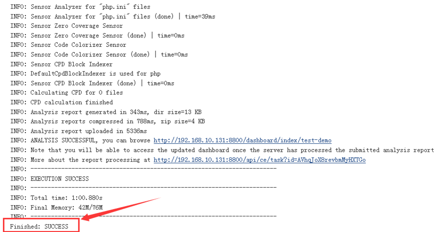
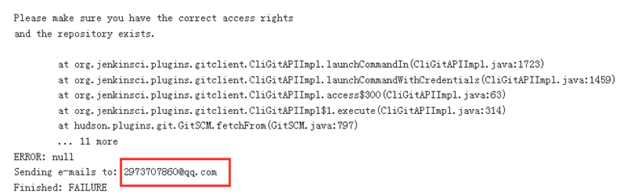

[TOC]

# 简介

代码测试Sonar 是一个用于代码质量管理的开放平台，通过插件机制，Sonar 可以集成不同的测试工具，代码分析工具，以及持续集成工具。与持续集成工具（例如 Hudson/Jenkins 等）不同，Sonar 并不是简单地把不同的代码检查工具结果（例如FindBugs，PMD等）直接显示在Web页面上，而是通过不同的插件对这些结果进行再加工处理，通过量化的方式度量代码质量的变化，从而可以方便地对不同规模和种类的工程进行代码质量管理。在对其他工具的支持方面，Sonar 不仅提供了对 IDE 的支持，可以在 Eclipse 和 IntelliJ IDEA 这些工具里联机查看结果；同时Sonar还对大量的持续集成工具提供了接口支持，可以很方便地在持续集成中使用 Sonar,此外，Sonar 的插件还可以对 Java 以外的其他编程语言提供支持，对国际化以及报告文档化也有良好的支持。

官方网站：http://www.sonarqube.org/

# 安装

## 数据库部署

使用5.6版本，不支持5.5及以下版本


 

```
yum -y install autoconf   && tar xvf mysql-5.6.34-linux-glibc2.5-x86_64.tar.gz
ln -sv /usr/local/src/mysql-5.6.34-linux-glibc2.5-x86_64 /usr/local/mysql
cd /usr/local/mysql/
useradd  mysql  -s /sbin/nologin
chown  -R mysql.mysql  ./* -R
mkdir /data && chown  mysql.mysql /data/ -R
/usr/local/mysql/scripts/mysql_install_db  --user=mysql --datadir=/data/ --basedir=/usr/local/mysql/
cp /usr/local/mysql/support-files/mysql.server /etc/init.d/mysql
cp /usr/local/mysql/my.cnf  /etc/my.cnf

vim /etc/my.cnf
'''
basedir = /usr/local/mysql
datadir = /data
port = 3306
'''

/etc/init.d/mysql  start
ln -sv /usr/local/mysql/bin/mysql /usr/bin/

# Mysql数据库创建及授权：
/usr/local/mysql/bin/mysql
> CREATE DATABASE sonar CHARACTER SET utf8 COLLATE utf8_general_ci;
> GRANT ALL ON sonar.* TO sonar@"jenkins-server.example.com"  IDENTIFIED BY "123456";
> GRANT ALL ON sonar.* TO sonar@"192.168.100.%" IDENTIFIED BY "123456";
> FLUSH PRIVILEGES;

/usr/local/mysql/bin/mysql  -usonar -p123456 -h192.168.10.131

```


## sonar部署

sonar依赖于java环境，而且java版本必须是1.8版本或更高，否则sonar启动失败

 

```
unzip sonarqube-5.6.zip
ln -sv /usr/local/src/sonarqube-5.6 /usr/local/sonar

grep "^[za-Z]" /usr/local/sonar/conf/sonar.properties
'''
sonar.jdbc.username=sonar
sonar.jdbc.password=123456
sonar.jdbc.url=jdbc:mysql://192.168.10.131:3306/sonar?useUnicode=true&characterEncoding=utf8&rewriteBatchedStatements=true&useConfigs=maxPerformance
sonar.web.port=8800
'''

/usr/local/sonar/bin/linux-x86-64/sonar.sh  start
```


登录用户名和密码：admin/admin

### 安装中文支持

/usr/local/sonar/extensions/plugins/   # 插件本地路径

administration-system-update center-available，在后面的搜索框搜索插件名称，然后点install安装： 

或在插件目录/usr/local/sonar/extensions/plugins执行wget https://github.com/SonarQubeCommunity/sonar-l10n-zh/releases/download/sonar-l10n-zh-plugin-1.11/sonar-l10n-zh-plugin-1.11.jar然后重启服务： 

 

```
/usr/local/sonarqube-5.6/bin/linux-x86-64/sonar.sh restart 
```

### 安装各种语言插件

php，java，python

## 扫描器部署

Sonar通过扫描器进行代码质量分析，即扫描器的具体工作就是扫描代码：

下载地址：http://docs.sonarqube.org/display/SCAN/Analyzing+with+SonarQube+Scanner

 

```
 unzip sonar-scanner-2.6.1.zip 
ln -sv /usr/local/src/sonar-scanner-2.6.1 /usr/local/sonar-scanner
cd /usr/local/sonar-scanner/
grep "^[a-Z]" conf/sonar-scanner.properties 
'''
sonar.host.url=http://localhost:8800
sonar.sourceEncoding=UTF-8
sonar.jdbc.username=sonar
sonar.jdbc.password=123456
sonar.jdbc.url=jdbc:mysql://192.168.10.131:3306/sonar?useUnicode=true&amp;characterEncoding=utf8
'''

# 准备测试代码
cd /home/jack/
unzip sonar-examples-master.zip 
cd  sonar-examples-master

cat  projects/languages/php/php-sonar-runner/sonar-project.properties  #以下是默认配置
'''
# Required metadata
sonar.projectKey=org.sonarqube:php-simple-sq-scanner #key
sonar.projectName=PHP :: Simple Project :: SonarQube Scanner #项目名称，会显示在仪表盘
sonar.projectVersion=1.0 #版本

# Comma-separated paths to directories with sources (required)
sonar.sources=src #代码目录

# Language
sonar.language=php #语言格式为php

# Encoding of the source files
sonar.sourceEncoding=UTF-8 #编码格式
'''

# 执行扫描
pwd
'''
/home/jack/sonar-examples-master/projects/languages/php/php-sonar-runner
'''

# 手动在当前目录执行扫描，以下是扫描过程的提示信息
/usr/local/sonar-scanner/bin/sonar-scanner
```

扫描的配置文件可以在每个项目都放一个，或者再Jenkins界面做配置


## jenkins关联到sonar scanner

### 安装插件SonarQube Plugin

在jenkins插件安装界面安装Sonar插件SonarQube Plugin

系统管理 -> 系统设置


### 填写sonar服务器信息


### 添加扫描器

系统管理 -> Global Tool Configuration


### 配置扫描

选择自己的项目（demo）-构建触发器-构建-execute sonarqube scanner，将配置文件的内容修改成如下格式填写完成后点保存：

 

```
sonar.projectKey=test-demo
sonar.projectName=test-demo
sonar.projectVersion=1.0
sonar.sources=./
sonar.language=php
sonar.sourceEncoding=UTF-8
```


### 构建项目

点击项目的立即构建，下图是执行成功的信息



查看构建历史


构建失败后会发送邮件通知管理员


构建失败的通知：



构建失败的邮件：


## 代码部署

### 将代码部署到web服务器

新建一个项目叫test-deploy用于代码发布，上一个项目test-demo可用于代码测试，当测试阶段出现问题的时候也不会立即进行发布，只有当测试通过之后才执行发布的项目即可

如何将代码发布到web服务器？

可以通过执行命令或脚本的方式进行代码发布，在各web服务器包括Jenkins服务器创建一个www用户，保持id一致，用于启动web服务并进行代码发布

 

```
useradd www
echo "123456" | passwd --stdin www
su - www
$ ssh-keygen
```

添加key

添加Jenkins服务器www用户的公钥到git服务器项目当中


确认key

确认www用户的key可以拉取代码


## shell脚本

### 关于权限：

一般使用非root用户启动web服务及完成代码发布，默认Jenkins运行使用的是Jenkins用户，因此需要赋予Jenkins用户一定的权限，另外发布的脚本可以在本机也可以不在本机，需要使用Jenkins用户ssh到发布服务器执行shell脚本。

将脚本放在/home/www用户家目录，git代码也放在家目录，因此需要jenkins服务器远程到代码发布服务器执行远程命令，需要做免登陆认证，将jenkins服务器root和www用户的公钥放在代码部署服务器的www用户家目录.ss/authorized_keys文件中：

 

```
# su - www
$ vim /home/www/.ssh/authorized_keys
$ chmod  600 authorized_keys
```


### 验证ssh

在root用户和www用户下ssh到本机的www用户，确认可以免密码登录，以便让部署服务器将用户的key添加到know_keys，否则报错Host key verification failed


### 配置jenkins用户sudo权限

 

```
vim /etc/sudoers
'''
# Defaults requiretty #不需要tty
jenkins ALL=(ALL) NOPASSWD: /usr/bin/ssh  # 不需要使用密码即可执行ssh
'''
```

脚本内容：

 

```
$ cd /home/www/
$ vim deploy.sh
'''
#!/bin/bash
echo $USER
cd /home/www/myweb1
git pull
scp -r ./* www@192.168.10.133:/apps/tomcat/webapps/myapp
scp -r ./* www@192.168.10.134:/apps/tomcat/webapps/myapp
'''
```

测试执行命令

在test-deploy项目的构建步骤调用，项目->配置->构建


执行结果：


### web服务器免密登录

复制www用户公钥到各web服务器的www用户

 

```
$ ssh-copy-id www@192.168.10.133
$ ssh-copy-id www@192.168.10.134
```

## 提交代码

在另外一台服务器编辑代码后重新提交：

 

```
git clone http://192.168.10.130/web/myweb1.git
echo “xxx” >> index.html
git add index.html
git commit index.html
git push
```

在jenkins执行项目构建

构建项目之前要在www用下的xxx项目里面进行git pull命令。否则第一次更新提示输入yes会导致部署失败

再次提交代码


## 项目关联

代码测试的项目执行成功之后自动调用代码发布的项目完成代码部署

安装Parameterized插件， 系统管理-管理插件-可选插件，搜索Parameterized，如果插件在线安装不成功可以下载插件到此目录然后把属主属组改成jenkins再重启jenkins服务即可完成安装


配置项目test-demo的构建后操作，demo构建完成后自动构建demp-deploy项目


添加构建后操作


构建关联成功


## 定义视图

安装pipeline插件


添加视图


定义名称


配置视图


在pipeline进行构建


## 自动构建

GitLab触发jenkins构建项目

目的为在公司的测试环境当中一旦开发向gitlab仓库提交成功代码，gitlab通知jenkins进行构建项目、代码质量测试然后部署至测试环境，注意这只是测试环境，而生产环境依然需要手动部署代码

安装Gitlab Hook Plugin插件：

系统管理 -> 管理插件 -> 可选插件 -> Gitlab Hook Plugin 和 Build Authorization Token Root Plugin


 

```
openssl  rand -hex 12
f7d0ead5398bd808ee139067
```


配置gitlib触发

插件使用介绍，https://wiki.jenkins-ci.org/display/JENKINS/Build+Token+Root+Plugin 

选择项目 -> 设置 -> webhooks： 

http://192.168.10.131:8080/buildByToken/build?job=test-demo&token=f7d0ead5398bd808ee139067

格式如下：

http://X.X.X.X:8080/buildByToken/build?job=项目名&token=随机数

保存后进行测试


测试git触发Jenkins自动部署

在另一台向git服务器提交代码，验证是否可以自动部署：

 

```
echo "ccc" >> index.html
git add index.html
git commit -m "ccc“
git push
```

验证是否自动构建


### 实现在haproxy动态增减服务器

在Jenkins服务器复制www用户的公钥到haproxy服务器：

 

```
$ ssh-copy-id root@192.168.10.132
# ssh-copy-id root@192.168.10.132


# Haproxy服务器编辑必须要tty
vim /etc/sudoers
root ALL=(ALL) ALL
jenkins ALL=(ALL) NOPASSWD: /usr/bin/ssh
www ALL=(ALL) ALL
```

测试www和root用户的ssh功能


开启功能

 

```
# vim /etc/haproxy/haproxy.cfg
stats socket /usr/local/haproxy/stats mode 600 level admin
安装命令并测试
yum install socat
echo "help"| socat stdio /usr/local/haproxy/stats
echo "show info"| socat stdio /usr/local/haproxy/stats
echo "show stat"| socat stdio /usr/local/haproxy/stats
echo "disable server myapp_host/web2"|socat stdio /usr/local/haproxy/stats
echo "enable  server  myapp_host/web2"|socat stdio /usr/local/haproxy/stats

```


参数化构建

分组是为了在代码分批次上线的时候对后端服务器的一种筛选方法：


编写脚本实现自动化部署与回滚

