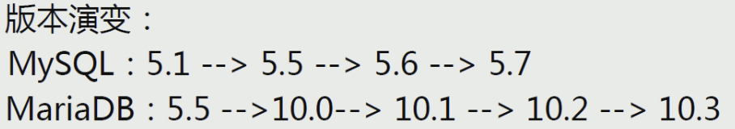
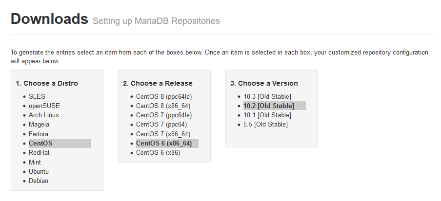

[TOC]

# 一，安装




## 1.1 源码安装

同mysql

## 1.2 二进制安装

同mysql

## 1.3 yum安装

参考地址：https://downloads.mariadb.org/mariadb/repositories/



yum配置：

```shell
[root@mysql_server ~]# vim /etc/yum.repo.d/mariadb.repo
"""
# MariaDB 10.2 CentOS repository list - created 2020-01-15 02:51 UTC
# http://downloads.mariadb.org/mariadb/repositories/
[mariadb]
name = MariaDB
baseurl = http://yum.mariadb.org/10.2/centos6-amd64
gpgkey=https://yum.mariadb.org/RPM-GPG-KEY-MariaDB
gpgcheck=1
"""

yum clean all
yum install -y MariaDB-server
```

注意：此安装方式对网络要求较高。


