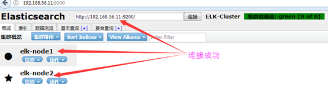
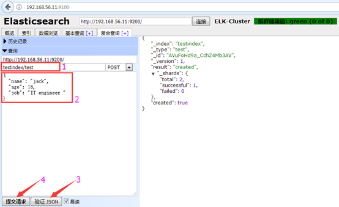
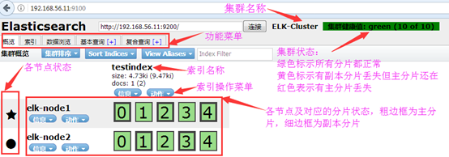
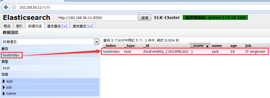

[TOC]

# 环境

参考博客：http://blogs.studylinux.net/?p=2586

系统：CentOS Linux release 7.7.1908 (Core)

hostname：elasticsearch-node01

IP：192.168.100.31

hostname：elasticsearch-node02

IP：192.168.100.32

# elasticsearch

高度可扩展的开源全文搜索和分析引擎，它可实现数据的实时全文搜索搜索、支持分布式可实现高可用、提供API接口，可以处理大规模日志数据，比如Nginx、Tomcat、系统日志等功能。

## 初始化系统环境

如果部署集群，所有节点主机操作如下：

```shell
[root@elasticsearch-node01 ~]# cat /etc/redhat-release
CentOS Linux release 7.7.1908 (Core)
[root@elasticsearch-node01 ~]# uname -r
3.10.0-1062.el7.x86_64
[root@elasticsearch-node01 ~]# getenforce
Disabled
[root@elasticsearch-node01 ~]# iptables -F
[root@elasticsearch-node01 ~]# hostname
elasticsearch-node01

[root@elasticsearch-node01 ~]# systemctl disable firewalld
[root@elasticsearch-node01 ~]# systemctl disable NetworkManager
[root@elasticsearch-node01 ~]# sed -i '/SELINUX/s/enforcing/disabled/' /etc/selinux/config
[root@elasticsearch-node01 ~]# echo "* soft nofile 65536" >> /etc/security/limits.conf
[root@elasticsearch-node01 ~]# echo "* hard nofile 65536" >> /etc/security/limits.conf
[root@elasticsearch-node01 ~]# wget -O /etc/yum.repos.d/epel.repo http://mirrors.aliyun.com/repo/epel-7.repo
[root@elasticsearch-node01 ~]# yum clean && yum makecache
[root@elasticsearch-node01 ~]# yum install -y net-tools vim lrzsz tree screen lsof tcpdump wget ntpdate
[root@elasticsearch-node01 ~]# cp /usr/share/zoneinfo/Asia/Shanghai  /etc/localtime
[root@elasticsearch-node01 ~]# echo "*/5 * * * *  /sbin/ntpdate time1.aliyun.com &> /dev/null && hwclock -w" >> /var/spool/cron/root
[root@elasticsearch-node01 ~]# systemctl  restart crond
```

如果是虚拟机做实现，初始化系统环境后记得做一份快照。

## 安装JAVA环境

二进制包下载地址：http://www.oracle.com/technetwork/java/javase/downloads/jdk8-downloads-2133151.html

```shell
# 方式一：直接使用yum安装openjdk
[root@elasticsearch-node01 ~]# yum install java-1.8.0-openjdk-devel -y

# 方式二：本地安装在oracle官网下载rpm安装包：
[root@elasticsearch-node01 ~]# yum  localinstall jdk-8u92-linux-x64.rpm

# 方式三：下载二进制包自定义profile环境变量：
[root@elasticsearch-node01 ~]# tar xvf jdk-8u121-linux-x64.tar.gz  -C /usr/local/
[root@elasticsearch-node01 ~]# ln -sv /usr/local/jdk1.8.0_121 /usr/local/jdk
[root@elasticsearch-node01 ~]# vim /etc/profile
export HISTTIMEFORMAT="%F %T `whoami` "
export JAVA_HOME=/usr/local/jdk
export CLASSPATH=.:$JAVA_HOME/jre/lib/rt.jar:$JAVA_HOME/lib/dt.jar:$JAVA_HOME/lib/tools.jar
export PATH=$PATH:$JAVA_HOME/bin

[root@elasticsearch-node01 ~]# source  /etc/profile
[root@elasticsearch-node01 ~]# java -version
```


## 安装elasticsearch

下载地址：https://www.elastic.co/downloads/elasticsearch

```shell
[root@elasticsearch-node01 ~]# yum –y localinstall elasticsearch-5.6.8.rpm
# or
[root@elasticsearch-node01 ~]# rpm -ivh elasticsearch-5.6.8.rpm
```

ElasticSearch 5的程序环境：

配置文件：
/etc/elasticsearch/elasticsearch.yml
/etc/elasticsearch/jvm.options
/etc/elasticsearch/log4j2.properties
Unit File：elasticsearch.service

程序文件：
/usr/share/elasticsearch/bin/elasticsearch
/usr/share/elasticsearch/bin/elasticsearch-keystore：
/usr/share/elasticsearch/bin/elasticsearch-plugin：管理插件程序		

搜索服务：
9200/tcp

集群服务：
9300/tcp

els集群的工作逻辑：
多播、单播：9300/tcp
关键因素：clustername

## elasticsearch配置

```shell
[root@elasticsearch-node01 ~]# grep "^[a-Z]" /etc/elasticsearch/elasticsearch.yml 
cluster.name: ELK-Cluster  # ELK的集群名称，名称相同即属于是同一个集群
node.name: elasticsearch-node01  # 本机在集群内的节点名称,建议和主机名一致
path.data: /elk/data  # 数据保存目录
path.logs: /elk/logs  # 日志保存目录
#bootstrap.memory_lock: true  # 服务启动的时候锁定足够的内存，防止数据写入swap,内存资源如果很少,不启用即可
network.host: 0.0.0.0  # 监听IP,向客户端提供服务
http.port: 9200  # 监听端口,
discovery.zen.ping.unicast.hosts: ["node01","node02"]  # 集群成员关系,单播,可以是主机名,ip地址等
gateway.recover_after_nodes: 1  # 集群中最少可以有几个主节点,使用9300端口判定,仅限集群内部,与对外服务无关

# 修改内存限制
[root@elasticsearch-node01 ~]# vim /usr/lib/systemd/system/elasticsearch.service
LimitMEMLOCK=infinity  # 去掉注释,可以最大化使用内存

[root@elasticsearch-node01 ~]# vim /etc/elasticsearchjvm.options
# 最小和最大内存限制
-Xms2g
-Xmx2g 

[root@elasticsearch-node01 ~]# mkdir /elk/{data,logs}
[root@elasticsearch-node01 ~]# chown -R elasticsearch.elasticsearch /elk/*
[root@elasticsearch-node01 ~]# systemctl start elasticsearch
[root@elasticsearch-node01 ~]# systemctl status elasticsearch
[root@elasticsearch-node01 ~]# systemctl enable elasticsearch
[root@elasticsearch-node01 ~]# ss -tnlp
[root@elasticsearch-node01 ~]# tail -f /elk/logs/ELK-Cluster.log 
[root@elasticsearch-node01 ~]# tail -f /elk/logs/
```

为什么最小和最大设置一样大？

参考：https://www.elastic.co/guide/en/elasticsearch/reference/current/heap-size.html

## 测试

URL：http://192.168.100.31:9200

### curl

```SHELL
curl -X<VERB> '<PROTOCOL>://<HOST>:<PORT>/<PATH>?<QUERY_STRING>' -d '<BODY>'
```

\<BODY\>：json格式的请求主体

\<VERB\>：GET，POST，PUT，DELETE

特殊PATH：/\_cat,  /\_search,  /\_cluster

\<PATH\>：/index_name/type/Document_ID/

创建文档：curl  -XPUT  

文档：{"key1": "value1", "key2": "value", ...}

```shell
# 获取集群健康状态
curl -XGET 'http://192.168.100.41:9200/_cluster/health?pretty=true'
```

获取到的是一个json格式的返回值，那就可以通过python对其中的信息进行分析，例如对status进行分析，如果等于green(绿色)就是运行在正常，等于yellow(黄色)表示副本分片丢失，red(红色)表示主分片丢失。

### python脚本

```python
#!/usr/bin/env python
#coding:utf-8

import smtplib
from email.mime.text import MIMEText
from email.utils import formataddr
import subprocess
body = ""
false="false"
obj = subprocess.Popen(
    ("curl -sXGET http://192.168.56.11:9200/_cluster/health?pretty=true"),
    shell=True,
    stdout=subprocess.PIPE
)
data = obj.stdout.read()
data1 = eval(data)
status = data1.get("status")
if status == "green":
    print(50)
else:
	print(100)
```

其他参数：

```shell
# 获取集群所有状态信息
curl -XGET 'http://192.168.100.41:9200/_cluster/stats?pretty=true'

# 获取当前节点信息
[root@elasticsearch-node01 ~]# curl -XGET 'http://192.168.100.41:9200/_cat/nodes?pretty'
192.168.100.41 7 82 0 0.00 0.01 0.05 mdi * elk.node01.com

# 获取当前节点健康状态信息
[root@elasticsearch-node01 ~]# curl -XGET 'http://192.168.100.41:9200/_cat/health?pretty'
1586862308 19:05:08 my-elk green 1 1 0 0 0 0 0 0 - 100.0%
```


# Elasticsearch-head

参考文档：

https://github.com/mobz/elasticsearch-head

http://mobz.github.io/elasticsearch-head/

elasticsearch-head是Web前端，用于浏览和与Elastic Search集群进行交互。

端口：9100

## 安装和运行
有多种方式安装启动elasticsearch-head

### 使用内置服务器运行

在elasticsearch 5.x版本以后不再支持直接安装head插件，而是需要通过启动一个服务方式，git地址：https://github.com/mobz/elasticsearch-head

```shell
[root@elasticsearch-node01 ~]# yum install -y npm git bzip2
[root@elasticsearch-node01 ~]# git clone git://github.com/mobz/elasticsearch-head.git
[root@elasticsearch-node01 ~]# cd elasticsearch-head
[root@elasticsearch-node01 ~]# npm install grunt -save
[root@elasticsearch-node01 ~]# npm run start &

[root@elasticsearch-node01 ~]# vim /etc/elasticsearch/elasticsearch.yml
"""
# 最下方添加
http.cors.enabled: true
http.cors.allow-origin: "*"
"""

[root@elasticsearch-node01 ~]# systemctl start elasticsearch
# or
[root@elasticsearch-node01 ~]# /etc/init.d/elasticsearch  start
```

URL: http://localhost:9100/

### 使用docker运行

```shell
# 对于Elasticsearch 5.x
[root@elasticsearch-node01 ~]# yum install docker -y
[root@elasticsearch-node01 ~]# systemctl start docker && systemctl enable docker
[root@elasticsearch-node01 ~]# 
[root@elasticsearch-node01 ~]# docker run -d -p 9100:9100 mobz/elasticsearch-head:5

# 对于Elasticsearch 2.x
[root@elasticsearch-node01 ~]# docker run -p 9100:9100 mobz/elasticsearch-head:2

# 对于Elasticsearch 1.x
[root@elasticsearch-node01 ~]# docker run -p 9100:9100 mobz/elasticsearch-head:1
```

URL: http://localhost:9100/

### 作为Elasticsearch的插件

```shell
# 对于Elasticsearch 5.x,6.x和7.x,不支持站点插件,作为独立服务器运行.

# 对于Elasticsearch 2.x
[root@elasticsearch-node01 ~]# sudo elasticsearch/bin/plugin install mobz/elasticsearch-head

# 对于Elasticsearch 1.x
[root@elasticsearch-node01 ~]# sudo elasticsearch/bin/plugin -install mobz/elasticsearch-head/1.x

# 对于Elasticsearch 0.x
[root@elasticsearch-node01 ~]# sudo elasticsearch/bin/plugin -install mobz/elasticsearch-head/0.9
```

URL：http://localhost:9200/_plugin/head/

这将自动从github下载合适版本的elasticsearch-head并将其作为插件运行在elasticsearch集群中。在这种模式下，elasticsearch-head自动连接到运行它的节点。

## 测试

URL: http://192.168.100.31:9100/

初始为localhost：


修改为ip地址：



重新连接


 


连接成功，提交测试数据：



刷新，验证索引是否存在：



验证数据：




## Master与Slave区别

Master的职责：统计各node节点状态信息、集群状态信息统计、索引的创建和删除、索引分配的管理、关闭node节点等。
Slave的职责：同步数据、等待机会成为Master

## 通用工具

elasticsearch-head具有三个主要操作。

- ClusterOverview，它显示集群的拓扑并允许您执行索引和节点级别的操作

- 几个搜索界面，使您可以查询集群以原始json或表格格式检索结果

- 几个快速访问选项卡，显示集群的状态

- 输入部分，允许对RESTful API进行任意调用。该界面包括多个选项，可以组合使用以产生有趣的结果。

  - 选择请求方法（获取，放置，发布，删除），json查询数据，节点和路径。

  - JSON验证器。

  - 能够在计时器上重复请求。

  - 能够使用javascript表达式转换结果。

  - 能够随时间（使用计时器）收集结果或比较结果。

  - 能够以简单的条形图（包括时间序列）绘制转换结果的图表。

    

*注意*，如果不小心，可能会破坏和破坏此接口中的数据
es-head会尝试记住使用html5功能连接到的节点，但这仅适用于http（s）。

如果要创建到特定集群的链接，请使用url形式

IP:PORT/elasticsearch-head/index.htmlbase_uri=http://cluster.example.com:9200/


# 监控插件 kopf

Git地址：https://github.com/lmenezes/elasticsearch-kopf

但是目前还不支持5.x版本的elasticsearch，但是可以安装在elasticsearc 1.x或2.x的版本。


