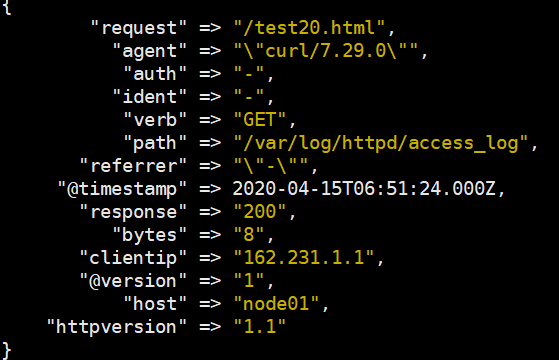
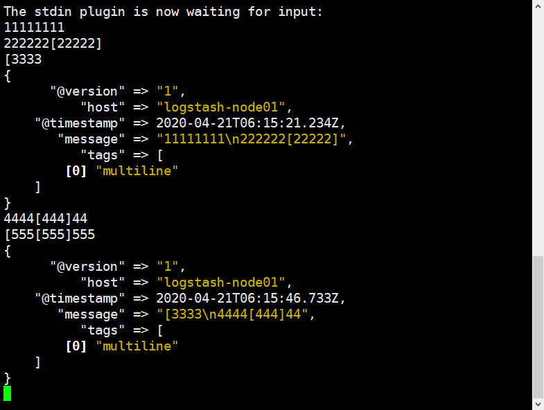

[TOC]

# 简介

Logstash是一个开源的数据收集引擎，可以水平伸缩，而且logstash整个ELK当中拥有最多插件的一个组件，其可以接收来自不同来源的数据并进行过滤处理，然后统一输出到指定的且可以是多个不同目的地。

可以通过插件实现日志收集和转发，支持日志过滤，支持普通log、自定义json格式的日志解析。

# 环境

系统：CentOS Linux release 7.7.1908 (Core)

hostname：logstash-node01

IP：192.168.100.33

## 初始化系统环境

```shell
[root@node01 ~]# cat /etc/redhat-release
CentOS Linux release 7.7.1908 (Core)
[root@node01 ~]# uname -r
3.10.0-1062.el7.x86_64
[root@node01 ~]# getenforce
Disabled
[root@node01 ~]# iptables -F
[root@node01 ~]# hostname
'''logstash-node01'''

[root@node01 ~]# systemctl disable firewalld
[root@node01 ~]# systemctl disable NetworkManager
[root@node01 ~]# sed -i '/SELINUX/s/enforcing/disabled/' /etc/selinux/config
[root@node01 ~]# echo "* soft nofile 65536" >> /etc/security/limits.conf
[root@node01 ~]# echo "* hard nofile 65536" >> /etc/security/limits.conf
[root@node01 ~]# cat /etc/hosts
[root@node01 ~]# wget -O /etc/yum.repos.d/epel.repo http://mirrors.aliyun.com/repo/epel-7.repo
[root@node01 ~]# yum clean && yum makecache
[root@node01 ~]# yum install -y net-tools vim lrzsz tree screen lsof tcpdump wget ntpdate
[root@node01 ~]# cp /usr/share/zoneinfo/Asia/Shanghai  /etc/localtime
[root@node01 ~]# echo "*/5 * * * *  /sbin/ntpdate time1.aliyun.com &> /dev/null && hwclock -w" >> /var/spool/cron/root
[root@node01 ~]# systemctl  restart crond
```

如果是虚拟机做实现，初始化系统环境后记得做一份快照。

## 安装JAVA环境

二进制包下载地址：http://www.oracle.com/technetwork/java/javase/downloads/jdk8-downloads-2133151.html

```shell
# 方式一：直接使用yum安装openjdk
[root@node01 ~]# yum install java-1.8.0-openjdk-devel -y

# 方式二：本地安装在oracle官网下载rpm安装包：
[root@node01 ~]# yum  localinstall jdk-8u92-linux-x64.rpm

# 方式三：下载二进制包自定义profile环境变量：
[root@node01 ~]# tar xvf jdk-8u121-linux-x64.tar.gz  -C /usr/local/
[root@node01 ~]# ln -sv /usr/local/jdk1.8.0_121 /usr/local/jdk
[root@node01 ~]# vim /etc/profile
'''
export HISTTIMEFORMAT="%F %T `whoami` "
export JAVA_HOME=/usr/local/jdk
export CLASSPATH=.:$JAVA_HOME/jre/lib/rt.jar:$JAVA_HOME/lib/dt.jar:$JAVA_HOME/lib/tools.jar
export PATH=$PATH:$JAVA_HOME/bin
'''
[root@node01 ~]# source  /etc/profile
[root@node01 ~]# java -version
```


# logstash

## 简介

日志收集工具，Logstash是一个开源的数据收集引擎，可以水平伸缩，而且logstash整个ELK当中拥有最多插件的一个组件，其可以接收来自不同来源的数据并统一输出到指定的且可以是多个不同目的地。

参考文档：https://www.elastic.co/guide/en/logstash/current/index.html

==需要JAVA环境。==


## 安装Logstash

下载地址：

https://www.elastic.co/cn/downloads/logstash

https://elasticsearch.cn/download/

```shell
[root@node01 ~]# rpm -ivh logstash-5.6.16.rpm
[root@node01 ~]# rpm -ql logstash | wc -l
'''11811'''
[root@node01 ~]# chown -R logstash.logstash /usr/share/logstash/data/queue
[root@node01 ~]# cd /etc/logstash/
[root@node01 logstash]# ls
conf.d       log4j2.properties  startup.options
jvm.options  logstash.yml
[root@node01 logstash]# rpm -ql logstash | grep logstash$
/usr/share/logstash/bin/logstash
/var/lib/logstash
/var/log/logstash
[root@node01 logstash]# vim /etc/profile.d/logstash.sh
export PATH=$PATH:/usr/share/logstash/bin
[root@node01 logstash]# exec bash
[root@node01 logstash]# logstash --help
```

logstash.yml是配置文件。

conf.d目录下所有文件都是配置输入输出和过滤插件。

logstash生成的文件特别多，命令的执行也很慢，仅用于测试。

## logstash命令

### 标准输入和输出

```shell
[root@node01 ~]# logstash  -e 'input { stdin{} } output { stdout{ codec => rubydebug }}'
'''
hello  # 交互式输入

# 下面为结果
{
	"@timestamp" => 2017-04-20T02:30:01.600Z, # 当前事件的发生时间，
	"@version" => "1", # 事件版本号，一个事件就是一个ruby对象
	"host" => "linux-host3.exmaple.com", # 标记事件发生在哪里
    "message" => "hello" # 消息的具体内容
}
'''
```


### 输出到文件

```shell
[root@node01 ~]# logstash  -e 'input { stdin{} } output { file { path => "/tmp/log-%{+YYYY.MM.dd}messages.gz"}}'

hello

11:01:15.229 [[main]>worker1] INFO logstash.outputs.file - Opening file {:path=>"/tmp/log-2017-04-20messages.gz"}

# 打开文件验证
[root@node01 ~]# tail /tmp/log-2017-04-20messages.gz 
```


### 输出到elasticsearch：

```shell
[root@node01 ~]# logstash  -e 'input { stdin{} } output { elasticsearch {hosts => ["192.168.100.31:9200"] index => "mytest-%{+YYYY.MM.dd}" }}'
```


### elasticsearch验证数据

```shell
[root@elasticsearch-node01 ~]# ll /data/elk/data/nodes/0/indices/
'''
total 0
drwxr-xr-x 8 elasticsearch elasticsearch 65 Apr 19 21:27 ifMqxX6QThyr3fmR64ddZw
drwxr-xr-x 8 elasticsearch elasticsearch 65 Apr 19 20:29 WkYS8IM1T_GbQr3Z7HCTfw
drwxr-xr-x 4 elasticsearch elasticsearch 29 Apr 19 21:14 -wSFOAfsTPS3DR-zaW22GQ
'''
```


# logstash插件

### 配置格式

```shell
input {
    ...
}

filter{
	...
}

output {
	...
}
```


### 输入输出

交互输入数据并在屏幕上显示

```shell
[root@node01 conf.d]# pwd
/etc/logstash/conf.d
[root@node01 conf.d]# vim stdin-stdout.conf
"""
input {
	stdin {}
}

output {
	stdout {
		codec => rubydebug  # 输出编码器格式为rubydebug,也可以指定为json格式
	}
}
"""

[root@node01 conf.d]# logstash -f stdin-stdout.conf -t  # 语法检测
[root@node01 conf.d]# logstash -f stdin-stdout.conf  # 执行
The stdin plugin is now waiting for input:
Hello Logstash  # 自定义标准输入
{
      "@version" => "1",
          "host" => "node01",
    "@timestamp" => 2020-04-15T05:48:58.510Z,
       "message" => "Hello Logstash"
}
```


### 文件插件

#### 收集单个日志文件

收集本地系统的messages日志文件内容，然后输出至本地/tmp目录下，前提需要logstash用户对被收集的日志文件有读的权限并对写入的文件有写权限。

```shell
[root@node01 conf.d]# cat /etc/logstash/conf.d/system-log.conf
'''
input {
	file {
		type => "messagelog"
		path => "/var/log/messages"
		start_position => "beginning"
	}
}

output {
	file {
		path => "/tmp/%{type}.%{+YYYY.MM.dd}"
	}
}
'''

# 语法检测
[root@node01 conf.d]# logstash -f /etc/logstash/conf.d/syslog.conf –t
[root@logstash-node01 conf.d]# logstash -f system-log.conf
[root@node01 conf.d]# chmod 644 /var/log/messages

# 生成数据,确保logstash已经处于运行状态
[root@node01 conf.d]# echo "test" >> /var/log/messages

# 验证是否生成文件,如果不能读,可能是权限问题
[root@node01 conf.d]# tail /var/log/logstash/logstash-plain.log
[root@node01 conf.d]# tail -100 /tmp/messagelog.2020.04.19
'''
看message是否是test
'''
```

刷新URL: http://192.168.100.31:9100查看索引

#### 收集多个日志文件

收集本地系统的messages日志和secure日志文件内容，然后输出至elasticsearch服务器中，前提需要logstash用户对被收集的日志文件有读的权限并对写入的文件有写权限。

```shell
[root@node01 conf.d]# cat /etc/logstash/conf.d/system-log.conf
'''
input {
	file {
		type => "systemlog"  # 自定义日志类型
		path => "/var/log/messages"  # 数据源
		start_position => "beginning"  # 第一次收集日志的位置
		stat_interval => "3"  # 日志收集的间隔时间
	}
	file {
		type => "securelog"
		path => "/var/log/secure"
		start_position => "beginning"
		stat_interval => "3"
	}
}

output {
	if [type] == "systemlog" {
		elasticsearch {
			hosts => ["http://192.168.100.31:9200","http://192.168.100.32:9200"]
			index => "system-log-%{+YYYY.DD.dd}"  # index用于elasticsearch识别
		}
	}
	if [type] == "securelog" {
		elasticsearch {
			hosts => ["http://192.168.100.31:9200","http://192.168.100.32:9200"]
			index => "secure-log-%{+YYYY.DD.dd}"
		}
	}
}
'''

[root@node01 conf.d]# chmod  644 /var/log/secure
[root@node01 conf.d]# chmod  644 /var/log/messages
[root@node01 conf.d]# systemctl  restart logstash
[root@node01 conf.d]# echo "test111" >> /var/log/secure
[root@node01 conf.d]# echo "test222" >> /var/log/messages
```

刷新URL: http://192.168.100.31:9100查看索引

在kibana界面添加[system-log-]YYYY.MM.DD索引和[secure-log-]YYYY.MM.DD索引

### 示例3:日志过滤插件grok

grok插件，允许支持正则等模式。

安装时已经内建了许多模式模板。使用 rpm -ql logstash | grep pattern

其grok的核心文件是：/usr/share/logstash/vendor/bundle/jruby/1.9/gems/logstash-patterns-core-4.1.2/patterns/grok-patterns，里面已经写好了一些常用的IP匹配模式，可以直接调用${HOSTNAME}。

另外针对一些常用的服务日志收集，也有现成的模版参考，可以直接在conf.d目录下创建自定义文件调用。比如/usr/share/logstash/vendor/bundle/jruby/1.9/gems/logstash-patterns-core-4.1.2/patterns/httpd，是针对httpd服务的日志文件进行提取过滤的。

#### 安装httpd服务

```shell
[root@test ~]# yum install httpd -y
[root@node01 html]# for i in {1..20}; do echo "Page $i" > ./test$i.html; done
[root@node01 html]# ls
```


#### 模拟客户端访问WEB服务

```shell
[root@node01 ~]# vim /etc/httpd/conf/httpd.conf
'''
# 修改如下:
LogFormat "%{X-Forwarded-For}i %l %u %t \"%r\" %>s %b \"%{Referer}i\" \"%{User-Agent}i\"" combined
'''
[root@node01 ~]# systemctl restart httpd.service
[root@node01 html]# while true; do curl -H "X-Forwarded-For:$[$RANDOM%223+1].$[$RANDOM%255].1.1" http://192.168.100.41/test$[$RANDOM%20+1].html; sleep 1; done
[root@node01 ~]# tail -f /var/log/httpd/access_log
```


#### 读取httpd日志

对httpd的日志文件进行加载，经grok过滤器插件过滤之后输出至标准输出。

```shell
input {
    file {
        path => ["/var/log/httpd/access_log"]
        start_position => "beginning"
    }
}

filter {
    grok {
        match => {
            "message" => "%{HTTPD_COMBINEDLOG}"
        }
    }
}

output {
    stdout {
        codec => rubydebug
    }
}
```

其中message字段就是被拆分的数据，可以使用remove_field插件删除掉

```shell
filter {
    grok {
        match => {
            "message" => "%{HTTPD_COMBINEDLOG}"
        }
        remove_field => "message"
    }
}
```

另外有两个时间字段，@timestamp和timestamp字段。带@的时间是日志被读取的时间点，不带@的是日志生成的时间点，而一般又是以带@的时间点为日志时间序列分析时所用，因此这个时间点需要是日志生成的时间点，而不是被读取时间。想办法替换一下，使用date filter插件。

```shell
filter {
        grok {
                match => {
                        "message" => "%{HTTPD_COMBINEDLOG}"
                }
                remove_field => "message"
        }
        date {
                match => ["timestamp","dd/MMM/YYYY:H:m:s Z"]
                remove_field => "timestamp"
        }
        
} 
```

显示如下：




### 示例4:IP地理插件geoip

使用MaxMind中的GEOIP插件GeoLite2 City 

下载地址：https://www.maxmind.com/en/accounts/275517/geoip/downloads

目前需要登录才能下载。

```shell
[root@node01 ~]# tar xf GeoLite2-City_20200414.tar.gz 
[root@node01 ~]# mkdir /etc/logstash/maxmind
[root@node01 ~]# mv GeoLite2-City_20200414 /etc/logstash/maxmind/
[root@node01 ~]# cd /etc/logstash/maxmind/
[root@node01 maxmind]# ln -sv GeoLite2-City_20200414/GeoLite2-City.mmdb ./
```

geoip插件

```shell
filter {
        grok {
                match => {
                        "message" => "%{HTTPD_COMBINEDLOG}"
                }
        }
        date {
                match => ["timestamp","dd/MMM/YYYY:H:m:s Z"]
        }
        mutate {
                rename => {
                        "agent" => "user_agent"
                }
        }
        geoip {
                source => "clientip"
                target => "geoip"
                database => "/etc/logstash/maxmind/GeoLite2-City.mmdb"
        }
}
```

要过滤某些字段使用fields，后跟数组

### 示例5:字段修改

The mutate filter allows you to perform general mutations on fields. You can rename, remove, replace, and modify fields in your events.

```shell
filter {
        grok {
                match => {
                        "message" => "%{HTTPD_COMBINEDLOG}"
                }
        }
        date {
                match => ["timestamp","dd/MMM/YYYY:H:m:s Z"]
        }
        mutate {
                rename => {
                        "agent" => "user_agent"
                }
        }
}
```

将grok过滤出来的字段中的agent字段重命名为user_agent

### 示例6:Redis插件

从redis加载数据，

```shell
# 从redis加载数据
input {
    redis {
        batch_count => 1
        data_type => "list"
        key => "logstash-list"
        host => "192.168.100.41"
        port => 6379
        threads => 5
    }
}
```

输出至redis

```shell
# 处理过后存入redis
output {
    redis {
        data_type => "channel"
        key => "logstash-%{+yyyy.MM.dd}"
    }
} 
```


### 示例7:Elasticsearch插件

输出至elasticsearch

```SHELL
output {
    elasticsearch {
        hosts => ["http://node1:9200/","http://node2:9200/","http://node3:9200/"]
        #user => ""
        #password => ""
        index => "logstash-%{+YYYY.MM.dd}"
        document_type => "httpd_access_logs"
    }
}
```

验证Elasticsearch

```shell
[root@node01 ~]# curl http://192.168.100.41:9200/_cat/indices
[root@node01 ~]# curl http://192.168.100.41:9200/logstash-*/_search?q=clientip:196.52.1.1 | jq .
[root@node01 ~]# curl http://192.168.100.41:9200/logstash-*/_search?q=response:404 | jq .
```

jq需要额外安装，用于对json格式做美观化输出。

### 示例8:收集elasticsearch日志

在elasticsearch服务器部署logstash，收集elasticsearch日志，日志路径：/data/elk/logs/ELK-Cluster.log

使用codec的multiline插件实现多行匹配，这是一个可以将多行进行合并的插件，而且可以使用what指定将匹配到的行与前面的行合并还是和后面的行合并。

参考文档：https://www.elastic.co/guide/en/logstash/current/plugins-codecs-multiline.html

先通过标准输入输出来看效果：

```shell
[root@elasticsearch-node01 ~]# chown logstash.logstash /usr/share/logstash/data/queue -R
[root@elasticsearch-node01 ~]# ll -d /usr/share/logstash/data/queue
[root@elasticsearch-node01 ~]# cd /etc/logstash/conf.d
[root@elasticsearch-node01 conf.d]# vim java.conf
input {
	stdin {
		codec => multiline {
            pattern => "^\["  # 当遇到[开头的行时候将多行进行合并
            negate => true  # true为匹配成功进行操作,false为不成功进行操作
            what => "previous"  # 与上面的行合并,如果是下面的行合并就是next
		}
	}
}

# 日志过滤，如果所有的日志都过滤就写这里，如果只针对某一个过滤就写在input里面的日志输入里面
filter { 
}

output {
	stdout {
		codec => rubydebug
	}
}

[root@elasticsearch-node01 conf.d]# logstash -f java.conf -t
[root@elasticsearch-node01 conf.d]# logstash -f java.conf
```

测试如下：




配置读取日志文件/data/elk/logs/ELK-Cluster.log，输出到els-node01-log.txt到文件

```shell
[root@elasticsearch-node01 conf.d]# vim java.conf
input {
	file {
		path => "/data/elk/logs/ELK-Cluster.log"
		type => "els-node01-log"
		start_position => "beginning"
		codec => multiline {
            pattern => "^\["  # 当遇到[开头的行时候将多行进行合并
            negate => true  # true为匹配成功进行操作,false为不成功进行操作
            what => "previous"  # 与上面的行合并,如果是下面的行合并就是next
		}
	}
}

# 日志过滤,如果所有的日志都过滤就写这里,如果只针对某一个过滤就写在input里面的日志输入里面
filter { 
}

output {
	if [type] == "els-node01-log" {
		elasticsearch {
			hosts => ["192.168.100.31:9200","192.168.100.32:9200"]
			index => "els-node01-log-%{YYYY.MM.dd}"
		}
	}
}

[root@elasticsearch-node01 conf.d]# logstash -f java.conf -t
[root@elasticsearch-node01 conf.d]# logstash -f java.conf
[root@elasticsearch-node01 conf.d]# systemctl restart elasticsearch
```

kibana界面添加[els-node01-log-]YYYY.MM.DD索引

生成数据：

```shell
[root@elasticsearch-node01 conf.d]# cat /elk/logs/ELK-Cluster.log >> /tmp/1
[root@elasticsearch-node01 conf.d]# cat /tmp/1 >> /elk/logs/ELK-Cluster.log
```

kibana界面验证数据


# 关于sincedb：

```shell
[root@linux-host1~]# cat /var/lib/logstash/plugins/inputs/file/.sincedb_1ced15cfacdbb0380466be84d620085a
'''
134219868 0 2064 29465  # 记录了收集文件的inode信息
'''

[root@linux-host1 ~]# ll -li /elk/logs/ELK-Cluster.log
134219868 -rw-r--r-- 1 elasticsearch elasticsearch 29465 Apr 21 14:33 /elk/logs/ELK-Cluster.log
```


# end