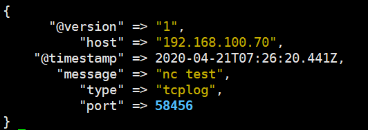
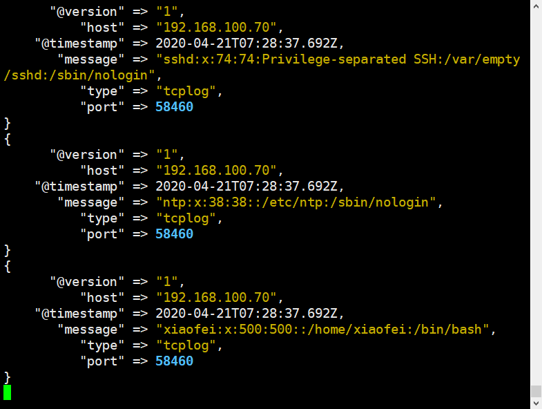
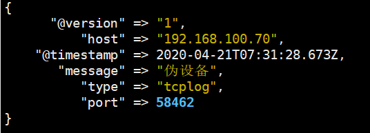

[TOC]

# 需求

通过logstash的tcp/udp插件收集日志，通常用于在向elasticsearch日志补录丢失的部分日志，可以将丢失的日志写到一个文件，然后通过TCP日志收集方式直接发送给logstash然后再写入到elasticsearch服务器。

参考文档：https://www.elastic.co/guide/en/logstash/5.6/input-plugins.html

本次演示在logstash服务器上。

# 使用logstash收集

```shell
[root@logstash-node01 conf.d]# vim tcp.conf
'''
input {
	tcp {
		port => 9889
		type => "tcplog"
		mode => "server"
	}
}

output {
	stdout {
		codec => rubydebug
	}
}
'''
[root@logstash-node01 conf.d]# logstash -f tcp.conf -t
[root@logstash-node01 conf.d]# logstash -f tcp.conf
# 另起终端,查看端口9889是否启动
[xiaofei@logstash-node01 ~]$ ss -tnlp
```


## 安装nc命令。

NetCat简称nc，在网络工具中有“瑞士军刀”美誉，其功能实用，是一个简单、可靠的网络工具，可通过TCP或UDP协议传输读写数据，另外还具有很多其他功能。

```shell
[root@tomcat-node01 ~]# yum install nc -y
[root@tomcat-node01 ~]# echo "nc test" | nc 192.168.100.33 9889
```

查看logstash是否接收到数据




## 通过nc命令发送一个文件

```shell
[root@tomcat-node01 ~]# nc 192.168.100.33 9889 < /etc/passwd
```

查看logstash接收到的数据




## 通过伪设备的方式发送消息

在类Unix操作系统中，块设备有硬盘、内存的硬件，但是还有设备节点并不一定要对应物理设备，我们把没有这种对应关系的设备是伪设备，比如/dev/null，/dev/zero，/dev/random以及/dev/tcp和/dev/upd等，Linux操作系统使用这些伪设备提供了多种不通的功能，tcp通信只是dev下面众多伪设备当中的一种设备。

```shell
[root@tomcat-node01 ~]# echo "伪设备" > /dev/tcp/192.168.100.33/9889
```

logstash验证数据




## 将输出改为elasticsearch

```shell
[root@logstash-node01 conf.d]# vim tcp.conf
'''
input {
	tcp {
		port => 9889
		type => "tcplog"
		mode => "server"
	}
}

output {
	elasticsearch {
		hosts => ["192.168.100.31","192.168.100.32"]
		index => "logstash-tcplog-%{+YYYY.MM.dd}"
	}
}
'''
[root@logstash-node01 conf.d]# logstash -f tcp.conf -t
[root@logstash-node01 conf.d]# logstash -f tcp.conf

# 通过nc命令或伪设备输入日志
[root@tomcat-node01 ~]# echo "伪设备1" > /dev/tcp/192.168.100.31/9889
[root@tomcat-node01 ~]# echo "伪设备2" > /dev/tcp/192.168.100.31/9889
```

kibana添加索引[logstash-tcplog-]YYYY.MM.DD

# 使用filebeat收集

