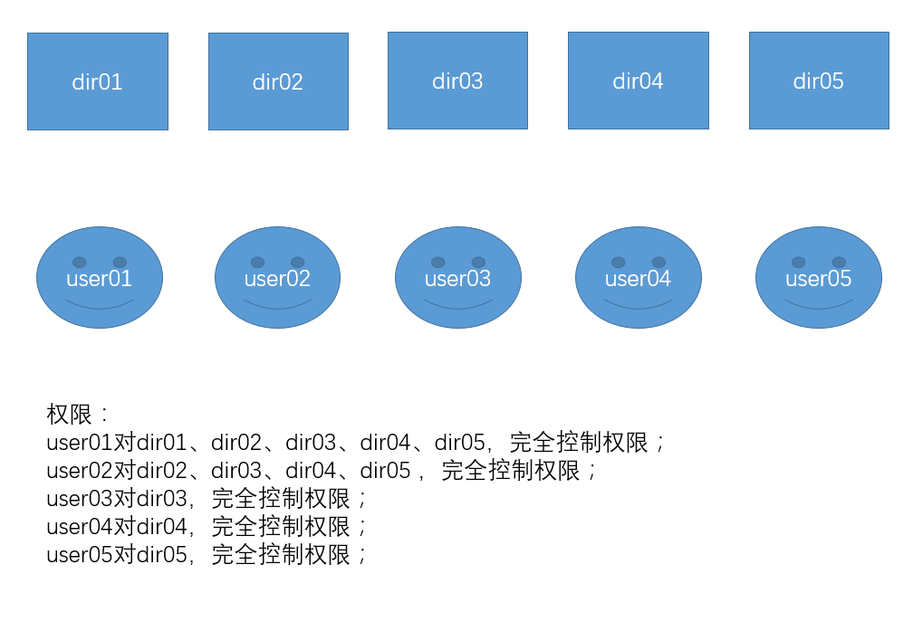

[TOC]

# vsftp简介

VSFTP，Very Security FTP。

CentOS默认自带的FTP就为VSFTP。

本文主要介绍下VFSTP的传输原理与搭建.

在主动模式下VSFTP会链接Client端的随机+1号端口，Client端显然不会将防火墙上所有随机端口开放；而在被动下问题同样的问题仍然会摆在Server端的防火墙面前，这就需要Server端的防火墙开启连接追踪功能，即放行与21号端口有关联的端口访问请求，这也就是为什么大部分情况下VSFTP是以被动模式工作.

根据工作模式的不同VSFTP分为主动模式和被动模式2种.

大多是情况VSFTP默认是工作在被动模式下.

# 安装配置

系统：CentOS release 6.9 (Final)

IP地址：192.168.100.4

FTP共享目录：/data/vsftp

MySQL数据存储目录：/data/mysql


使用虚拟用户方式，映射为系统用户vsftpuser，该系统用户禁止登录系统；

虚拟用户信息存储在关系型数据库中,这里以mysql为例, mysql搭建在本地；

根据下图要求来创建不同子目录dir01,dir02,dir03,dir04,dir05,分别对应不同的==虚拟用户==来访问：




## 新增一块硬盘作为数据盘

```shell
[root@ftpservers ~]# fdisk -l
[root@ftpservers ~]# fdisk /dev/sdb
n
p
1
# 默认大小
w
[root@ftpservers ~]# fdisk -l
[root@ftpservers ~]# mkfs.ext4 /dev/sdb1
[root@ftpservers ~]# mkdir -pv /data/{vsftp,mysql}
[root@ftpservers ~]# ll /data
```


## 安装通用二进制版本mysql

版本：MySQL-5.6/mysql-5.6.42-linux-glibc2.12-x86_64.tar.gz

```shell
[root@ftpservers src]# groupadd -r mysql
[root@ftpservers src]# useradd -g mysql -r -s /sbin/nologin -M -d /data/mysql/ mysql
[root@ftpservers src]# chown -R mysql:mysql /data/mysql
[root@ftpservers src]# yum -y install libaio numactl
[root@ftpservers src]# cd /usr/local/src
[root@ftpservers src]# wget https://cdn.mysql.com//Downloads/MySQL-5.6/mysql-5.6.42-linux-glibc2.12-x86_64.tar.gz
[root@ftpservers src]# tar xf mysql-5.6.42-linux-glibc2.12-x86_64.tar.gz -C ../
[root@ftpservers src]# cd ../
[root@ftpservers local]# ln -sv mysql-5.6.42-linux-glibc2.12-x86_64 mysql
[root@ftpservers local]# chown -R mysql:mysql mysql
[root@ftpservers local]# ll
[root@ftpservers local]# cd mysql
[root@ftpservers mysql]# scripts/mysql_install_db --user=mysql --datadir=/data/mysql/
[root@ftpservers mysql]# cp support-files/my-default.cnf /etc/my.cnf
[root@ftpservers mysql]# vim /etc/my.cnf
"""
port = 3306
basedir = /usr/local/mysql
datadir = /data/mysql
log-bin = mysql-bin
server_id = 4
"""

[root@ftpservers mysql]# cp support-files/mysql.server /etc/rc.d/init.d/mysqld
[root@ftpservers mysql]# vim /etc/rc.d/init.d/mysqld
"""
basedir="/usr/local/mysql"
datadir="/data/mysql"
"""

[root@ftpservers mysql]# chmod +x /etc/rc.d/init.d/mysqld
[root@ftpservers mysql]# chkconfig --add mysqld
[root@ftpservers mysql]# chkconfig mysqld on
[root@ftpservers mysql]# vim /etc/man.config
"""
# MySQL
MANPATH /usr/local/mysql/man
"""

[root@ftpservers mysql]# ln -sv /usr/local/mysql/include /usr/include/mysql
[root@ftpservers mysql]# echo "/usr/local/mysql/lib" > /etc/ld.so.conf.d/mysql.conf
[root@ftpservers mysql]# ldconfig
[root@ftpservers mysql]# ldconfig -p | grep mysql
[root@ftpservers mysql]# echo "export PATH=$PATH:/usr/local/mysql/bin" >> /etc/profile
[root@ftpservers mysql]# . /etc/profile
[root@ftpservers mysql]# echo $PATH
[root@ftpservers mysql]# service mysqld start
[root@ftpservers mysql]# ln -sv /tmp/mysql.sock /var/lib/mysql/
[root@ftpservers mysql]# cat /usr/local/mysql/logs/error.log
[root@ftpservers mysql]# mysqladmin -uroot password '123.com'
[root@ftpservers mysql]# mysql -uroot -p

mysql> select user,host,password from mysql.user;
mysql> DELETE FROM mysql.user WHERE user='';
mysql> DELETE FROM mysql.user WHERE host='::1';
mysql> USE mysql;
mysql> GRANT ALL PRIVILEGES ON *.* TO root@"localhost" IDENTIFIED BY "123.com";
mysql> GRANT ALL PRIVILEGES ON *.* TO root@"%" IDENTIFIED BY "123.com";
mysql> GRANT ALL PRIVILEGES ON *.* TO root@"127.0.0.1" IDENTIFIED BY "123.com";
mysql> FLUSH PRIVILEGES;
mysql> \q
```

服务启动后必须先给root设置一个密码才能登陆：

PLEASE REMEMBER TO SET A PASSWORD FOR THE MySQL root USER !
To do so, start the server, then issue the following commands:

  ./bin/mysqladmin -u root password 'new-password'
  ./bin/mysqladmin -u root -h ftpservers password 'new-password'

Alternatively you can run:

  ./bin/mysql_secure_installation

```shell
mysqladmin -uroot password '123.com'
```


## 安装vsftpd和pam_mysql

```shell
[root@ftpservers ~]# rpm -qa | grep vsftpd
[root@ftpservers ~]# yum -y install vsftpd pam_mysql mysql-devel
[root@ftpservers ~]# service vsftpd strat
[root@ftpservers ~]# ss -tnlp
```


## 创建数据库用户和表

```shell
mysql> create database vsftp;
Query OK, 1 row affected (0.00 sec)

mysql> grant select on vsftp.* to vsftp@"%" identified by "123.com";
Query OK, 0 rows affected (0.00 sec)

mysql> flush privileges;
Query OK, 0 rows affected (0.00 sec)

mysql> use vsftp;
mysql> create table users(id int unsigned auto_increment not null primary key, name varchar(48) binary not null, password char(48) binary not null);

mysql> desc users;
+----------+------------------+------+-----+---------+----------------+
| Field    | Type             | Null | Key | Default | Extra          |
+----------+------------------+------+-----+---------+----------------+
| id       | int(10) unsigned | NO   | PRI | NULL    | auto_increment |
| name     | varchar(48)      | NO   |     | NULL    |                |
| password | char(48)         | NO   |     | NULL    |                |
+----------+------------------+------+-----+---------+----------------+
3 rows in set (0.00 sec)

mysql> insert into users(name,password) values("user01",password("owbO4hCJ")),("user02",password("BBOuYCZ7")),("user03",password("3VlwJBPX")),("user04",password("mAydf1JH")),("user05",password("TVq0cr3N"));

mysql> select name,password from users;
```


## 建立pam认证文件

```shell
[root@ftpservers ~]# vim /etc/pam.d/vsftpd.mysql
"""
auth required /lib64/security/pam_mysql.so user=vsftp passwd=123.com host=192.168.100.4 db=vsftp table=users usercolumn=name passwdcolumn=password crypt=2
account required /lib64/security/pam_mysql.so user=vsftp passwd=123.com host=192.168.100.4 db=vsftp table=users usercolumn=name passwdcolumn=password crypt=2
"""
```

附： /etc/pam.d/vsftp.mysql内容简单说明

auth: 认证

required: 必须满足

pam_listfile.so: 使用的pam模块的位置

user: 认证的用户

passwd: 认证的密码

host: 用户信息存储在哪一台主机上

db: 用户信息存储在哪个数据库上

table: 用户信息存储在哪个表中

usercolumn: 用户名存储在表的哪个字段上

passwdcolumn: 用户密码存储在表的哪个字段上

crypt: 加密方法[0明文不加密; 1使用加密函数; 2使用mysql; 3使用MD5; 4使用SHA1;]

注意:由于mysql的安装方式不同，pam_mysql.so基于unix sock连接mysql服务器时可能会出问题，此时，建议授权一个可远程连接的mysql并访问vsftpd数据库的用户。

## 配置vsftp基于mysql认证

```shell
[root@ftpservers ~]# cd /data
[root@ftpservers data]# mkdir /data/vsftp
[root@ftpservers data]# useradd -s /sbin/nologin -d /data/vsftp vsftpuser
[root@ftpservers data]# tail /etc/passwd
[root@ftpservers data]# chmod go+rx /data/vsftp
[root@ftpservers data]# chown -R vsftpuser.vsftpuser /data/vsftp
[root@ftpservers data]# vim /etc/vsftpd/vsftpd.conf
[root@ftpservers data]# grep -v "^#" /etc/vsftpd/vsftpd.conf
"""
anonymous_enable=NO  # 匿名用户禁止访问
local_enable=YES  # 必须启用,本地用于允许访问
write_enable=YES
local_umask=022
anon_upload_enable=NO
anon_mkdir_write_enable=NO
dirmessage_enable=YES
xferlog_enable=YES
xferlog_file=/var/log/xferlog

connect_from_port_20=YES
xferlog_std_format=YES
idle_session_timeout=600
data_connection_timeout=120
ftpd_banner=Welcome to PHCF FTP service.
chroot_local_user=YES
listen=YES

pam_service_name=vsftpd.mysql  # pam认证文件,与上面文件名称一致
userlist_enable=YES
tcp_wrappers=YES
guest_enable=YES  # 启用虚拟用户
guest_username=vsftpuser  # 虚拟用户映射系统用户
user_config_dir=/etc/vsftpd/vusers  # 虚拟用户各自的权限配置文件

reverse_lookup_enable=NO  # DNS反向解析
ls_recurse_enable=NO  # 递归查询
"""

[root@ftpservers data]# service vsftpd start
[root@ftpservers data]# chkconfig vsftpd on
[root@ftpservers data]# ss -tnlp
```

测试

## 配置权限

vsftpd可以在配置文件目录中为每个用户提供单独的配置文件以定义其ftp服务访问权限，每个虚拟用户的配置文件名同虚拟用户的用户名。配置文件目录可以是任意未使用目录，只需要在vsftpd.conf指定其路径及名称即可。

```shell
[root@ftpservers ~]# vim /etc/vsftpd/vsftpd.conf
"""
user_config_dir=/etc/vsftpd/vusers
"""

[root@ftpservers ~]# mkdir /data/vsftp/user01/user02/user0{3,4,5}
[root@ftpservers ~]# chown -R vsftpuser.vsftpuser /data/vsftp
[root@ftpservers ~]# mkdir /etc/vsftpd/vusers
[root@ftpservers ~]# cd /etc/vsftpd/vusers

[root@ftpservers vsftp]# vim user01
"""
local_root=/data/vsftp/user01
download_enable=YES
anon_upload_enable=YES
anon_mkdir_write_enable=YES
anon_other_write_enable=YES
"""

[root@ftpservers vsftp]# vim user02
"""
local_root=/data/vsftp/user01/user02
download_enable=YES
anon_upload_enable=YES
anon_mkdir_write_enable=YES
anon_other_write_enable=YES
"""

[root@ftpservers vsftp]# vim user03
"""
local_root=/data/vsftp/user01/user02/user03
download_enable=YES
anon_upload_enable=YES
anon_mkdir_write_enable=YES
anon_other_write_enable=YES
"""

[root@ftpservers vsftp]# vim user04
"""
local_root=/data/vsftp/user01/user02/user04
download_enable=YES
anon_upload_enable=YES
anon_mkdir_write_enable=YES
anon_other_write_enable=YES
"""

[root@ftpservers vsftp]# vim user05
"""
local_root=/data/vsftp/user01/user02/user05
download_enable=YES
anon_upload_enable=YES
anon_mkdir_write_enable=YES
anon_other_write_enable=YES
"""
```


## 配置文件说明

文件说明:

### /etc/vsftpd/vsftpd.conf

vsftpd的核心配置文件,所有可配置选项必须顶格写，配置文件中#后面有空格的是注释说明，没有空格的是注释掉的配置选项;

### /etc/pam.d/vsftpd

认证配置文件,pam全称为 Plugable Authentication Module 插件式认证模块，该文件名必须和/etc/vsftpd/vsftpd.conf配置文件中pam_service_name后的文件名保持一致;

### /etc/vsftpd/ftpusers

黑名单.控制登陆系统用户的机制,用于指定哪些用户不能访问FTP服务器,出现在该文件中的用户不允许使用ftp服务器,这是在/etc/pam.d/vsftpd中定义的;

### /etc/vsftpd/user_list

白名单,指定允许使用vsftpd的用户列表文件.

### /etc/logrotate.d/vsftpd

滚动日志配置文件

### /etc/vsftpd/vsftpd_conf_migrate.sh

vsftpd操作的一些变量和设置

### /etc/rc.d/init.d/vsftpd

服务脚本文件

### /usr/bin/vsftpd

主程序

### /var/ftp

匿名用户家目录,ftp用户的家目录

### /var/ftp/pub

匿名用户的下载目录

## 配置文件格式说明

vsftpd.conf 的内容非常单纯，每一行即为一项设定。若是空白行或是开头为#的一行，将会被忽略.

内容的格式只有一种，如下所示

option=value

要注意的是，等号两边不能加空白  

### VSFTP的用户类型

VSFTP同样支持系统用户、匿名用户、和虚拟用户三种不同的登陆方式,下面分别以三种登录类型进行配置.

需要编辑主配置文件vsftpd.conf

规律:

开头为anony的选项是控制匿名用户的

没有的是一般是控制本地用户的

虚拟用户是存放在单独的文件中的

### 系统用户相关的配置项

系统用户即为存在于/etc/passwd中的用户,vsftp服务启动以后,默认即可使用系统用户访问服务,但因ftp的传输都是明文,登录信息很容易被窃取,很不安全,不推荐.

local_enable=YES/NO：控制是否允许本地用户登入,默认值为YES

local_root=/home/username：当本地用户登入时，将被更换到定义的目录下,默认值为各用户的家目录

write_enable=YES/NO：是否允许登陆用户有写权限,属于全局设置,默认值为YES

local_umask=022：本地用户新增文件的 umask 值,默认值为077

file_open_mode=0755：本地用户上传档案后的档案权限,与chmod 所使用的数值相同,默认值为0666

chown_uploads=YES/NO：上传文件(非目录)的属主,默认值为NO

chown_username=username：设置上传文件(非目录)的属主名,建议不要设置为root

chroot_local_user=YES：禁锢所有用户在自己的家目录中


chroot_list_enable=YES

chroot_list_file=/etc/vsftpd/chroot_list

禁锢指定的本地用户在其家目录中,只有写在该文件中的用户会被禁锢,chroot_list默认不存在,需自行创建.

注意:与chroot_local_user不能同时启用.

### 匿名用户相关的配置项

anonymous_enable=NO：关闭虚拟用户登录

anonymous_enable=YES：允许匿名用户登入

no_anon_password=NO：禁止匿名用户空密码登录

ftp_username=ftp：定义匿名映射为一个系统用户,默认值为ftp

anon_root=/var/ftp：定义匿名用户家目录,默认值为/var/ftp，注意ftp目录不能是777的权限属性，即匿名用户的家目录不能有777的权限。

anon_upload_enable=YES/NO：上传文件(非目录)的权限,只有在 write_enable=YES 时,此项才有效,当然,也受上层目录写权限限制,默认值为NO

anon_world_readable_only=YES/NO：下载可读取文件的权限(可以下载到本机阅读,不能直接在FTP服务器中打开阅读),默认值为YES

anon_mkdir_write_enable=YES/NO：新增目录的权限,只有在write_enable=YES时,此项才有效,当然,也受上层目录写权限限制,默认值为NO

anon_other_write_enable=YES/NO：上传或者建立目录之外的权限,譬如删除或者重命名.

anon_umask=077：设置新增或上传文件的umask值,默认umasl值为077,对应权限为700

deny_email_enable=YES/NO：若是启动这项功能，则必须提供一个档案/etc/vsftpd/banner_emails，内容为email address。若是使用匿名登入，则会要求输入email address，若输入的email address 在此档案内，则不允许进入。默认值为NO

banned_email_file=/etc/vsftpd/banner_emails：此文件用来输入email address，只有在deny_email_enable=YES时，才会使用到此档案。若是使用匿名登入，则会要求输入email address，若输入的email address 在此档案内，则不允许进入；

添加完后重启VSFTP服务，再次尝试发现结果和上次一样，原因是系统用户ftp对pub目录没有写入权限，更改pub目录权限后一切正常，所以最终生效的权限取决于服务权限与系统权限的交集.

通过上面知道匿名用户访问的文件目录为/var/ftp/pub，但是匿名用户自己却认为在/目录下，说明默认情况下匿名用户就是被chroot的，另外需要注意的一点是：更改系统权限的时候只能针对var/ftp/下的pub目录，如果更改的是/var下的ftp目录权限，此时就算配置文件中允许匿名用户登录，访问时依然会提示你输入用户名和密码。

### 虚拟用户相关的配置

无论是匿名用户还是系统用户,安全性上都存在一定隐患,所以对于安全性要求较高的场景可以使用虚拟用户的方式.

它是根据一个文件中存放的用户及密码进行认证,认证通过后再将其映射为一个指定的系统用户,访问的共享位置即为此系统账号的家目录.

各虚拟用户可被赋予不同的访问权限,可通过匿名用户的权限控制参数来进行指定.

虚拟用户账号的存储方式

可以存放在文件中,也可以存放在关系型数据库中.

1,自建文件,文件内容格式为:

奇数行为用户名

偶数行为密码

另外,此文件需要被编码为hash格式,才能使用,但这样的缺点也很明显,每次修改都需要先转换回来,很不方便.

2,存放在关系型数据库中[推荐]:

可即时查询数据库完成用户认证

可直接修改,即时生效.

一般推荐使用mysql数据库, 而vsftp服务又是基于pam来认证,所以pam要依赖于pam-mysql模块,默认pam不支持此模块,需要额外安装,在epel源中.


guest_enable=YES选项(默认没有此选项)

guest_username=ftp

它的作用是将一个非匿名用户重映射为系统用户,默认为ftp,或者可以指定映射的系统用户名,被指定的系统用户必须存在,且在/home/下有和该用户同名的目录.


关于虚拟用户登陆配置需要注意的2点是：

1,虚拟用户默认继承主配置文件中匿名用户的权限，只有在开启匿名用户权限情况下虚拟用户才有修改权限

2,虚拟用户是映射为一个系统用户，必须设置为local_enable=YES,否则当anonymous_enable=NO时将无法登陆，这点和当local_enable=NO时匿名用户仍可登录不一样，虽然匿名用户是映射为系统的ftp用户

### 其他配置项说明

fpd_banner=Welcome to blah FTP service：连接ftp服务器成功后显示的提示信息

\## 连接ftp服务器成功后显示的提示信息

dirmessage_enable=YES：切换目录时的提示信息,该提示信息存储在访问的目录下,文件名.message,里面是写明提示信息即可.

xferlog_enable=YES：是否开启上传下载日志

xferlog_std_format=YES：日志文件格式是否使用标准格式

xferlog_file=/var/log/xferlog：日志文件位置

ascii_upload_enable=YES

ascii_download_enable=YES：强制使用文本格式上传下载,默认禁用

pam_service_name=vsftpd：vsftpd使用pam完成用户认证时,用到的pam配置文件

userlist_enable=YES：是否启用控制用户登录的列表文件,默认为/etc/vsftpd/user_lis,YES则该文件为黑名单,NO则该文件为白名单,表示仅允许白名单用户登录.

userlist_deny=NO：是否拒绝用户登录的列表文件/etc/vsftpd/user_lis内的用户登录ftp

idle_session_timeout=600：会话空闲超时时长

data_connection_timeout=120：数据连接超时时长

max_clients=10：最大并发连接数

max_per_ip=3：每个ip可同时发起的并发连接数

local_max_rate=1000000：本地用户的最大传输速率,单位 byte/s

anon_max_rate=500000：匿名用户的最大传输速率,单位 字节/秒

受/etc/pam.d/vsftpd文件影响,默认/etc/vsftpd/ftpusers文件是一个黑名单,文件内的用户禁止访问ftp;


优化:

与ssh一样，vsftp的配置文件默认开启了DNS反向解析，这可能会造成用户在登陆到FTP服务器的时候奇慢无比，只要在配置文件中禁用DNS反向解析即可解决文件。

编辑/etc/vsftpd/vsftpd.conf

添加

reverse_lookup_enable=NO

ls_recurse_enable=NO：禁止递归查询