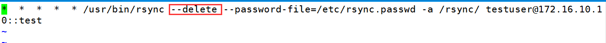

[TOC]

# rsync简介

远程同步工具(cp,scp)

rsync全称remote sync，是一种更高效、可以本地或远程同步的命令，之所以高效是因为rsync会对需要同步的源和目的进度行对比，只同步有改变的部分，所以比scp命令更高效，但是rsync本身是一种==非加密的传输==，可以借助==-e选项==来设置具备加密功能的承载工具进行加密传输.

## 特点

1，可镜像保存整个目录树或文件系统

2，较高的数据传输效率

3，可借助于ssh实现安全数据传输

4，支持匿名传输rsync介绍

## 工作模式

rsync有四种工作模式分为：

1、shell模式，也称作本地模式

2、远程shell模式，此时可以利用ssh协议承载其数据传输过程

3、列表模式，其工作方式与ls相似，仅列出源的内容：-nv

4、服务器模式，此时，rsync可以工作在守护进程xinetd，能够接收客户端的数据同步请求；在使用时，可以在客户端使用rsync命令把数据推送到服务器，也可以拉取服务器数据到本地。

## 命令选项

rsync --help

-n：同步测试，并不执行真正的同步过程，可加-v显示测试结果

-v：--verbose，详细输出模式，

-q：--quiet，静默模式，不显示同步信息

-c：--checksum，开启校验功能，强行对文件传输进行校验

-r：--recursive，递归复制

[notice：rsync命令使用中，如果源目录的末尾有斜线/，则会复制目录下的内容，而不复制目录本身，没有斜线/，则会复制目录本身及其内容，目标路径则不受影响。]

-a：--archives，归档，保留文件的原有属性，等同使用-rptlgoD命令组合

-p：--perms 保留文件的权限

-t：--times 保留文件的时间戳

-l：--links 保留文件的符号链接

-g：--group保留文件的属组

-o：--owner 保留文件的属主

-D：--devices 保留设备文件

-e ssh：使用ssh协议作为传输承载

-z：对文件压缩后传输

--progress：显示压缩进度条

--stats：显示如何执行压缩和传输

例如

把本机的/etc/pam.d目录以root的身份推送到远程主机172.16.100.8的/tmp/目录下，并起名为pam.d.1，保留其文件的权限，时间戳，属组属主，设备文件，符号链接文件

```shell
# rsync -rptgoDl --stats -e ssh --progress /etc/pam.d/ root@172.16.100.8:/tmp/pam.d.1
# rsync -a --stats --progress -z root@172.16.100.8:/etc/pam.d /tmp/
```

注意：

推送的源目录后面有/，推送的是pam.d目录下的所有内容，而不是这个pam.d的目录本身

如果删除/tmp/pam.d.1/目录下的一些文件，再次同步时，则只会同步被删除的文件，其他已存在的不会同步。

如果使用命令时只指定源而不指定目标，仅会将源以列表的形式显示而不同步


# rsync + crontab

在中小企业的生产环境中经常有这么一种需求，A服务器上的某些重要文件需要每天备份到B服务器上，此时就可以使用rsync+crontab来进行备份。

## 安装xinetd

配置rsync服务器端，rsync是瞬时守护进程，需要安装超级守护进程xinetd

```shell
# yum -y install xinetd
# chkconfig rsync on
```

## 启用rsync服务

安装完成以后，可在/etc/xinetd.d/目录下找到rsync服务文件找到并启用

```shell
# default: off
# description: The rsync server is a good addition to an ftp server, as it \
#       allows crc checksumming etc.
service rsync
{
        disable = yes  <-------yes改为no
        flags           = IPv6
        socket_type     = stream
        wait            = no
        user            = root
        server          = /usr/bin/rsync
        server_args     = --daemon
        log_on_failure  += USERID
```

## rsync配置文件

rsync默认没有自己的配置文件，所以需要手动建立其配置文件/etc/rsyncd.conf，并定义参数。可参考帮助文档/usr/share/man/man5/rsyncd.conf.5.gz，来查看man rsyncd.conf配置参数：

配置文件分为全局配置段和模块配置段

全局配置段：1个

共享配置段：多个

常用配置示例：

```shell
###Global Parameters###
uid = rsync
gid = rsync
use chroot = no
max connections = 10
timeout = 300
strict modes = yes
pid file = /var/run/rsyncd.pid
log file = /var/log/rsyncd.log
lock file = /var/run/rsyncd.lock
###Module Parameters###
[rsync]
path = /backup
read only = false
write only = false
auth users = rtest
secrets file = /etc/rsyncd.password
ignore errors = yes
hosts allow = 192.168.100.0/24
hosts deny = *
list = false 
```


### GLOBAL PARAMETERS

uid和gid两个选项的作用是指定在运行rsync时以哪个用户来替代root，nobody是系统默认值，不存在于系统中，如果此处设置为nobody，则需在模块配置段中指定一个系统用户来运行rsync。

max Connections = 10 允许最大连接数为10

ignore errors = yes	是否忽略错误

list = false 是否允许列出文件

### MODULE PARAMETERS

[shared]    ：服务器模式下rsync目的名称（DES）使用的是模块名称

path = /data ：同步的目录

uid = root

gid = root

如果全局配置段的uid和gid设置时不是nobody而是使用的一个系统账户，在模块配置段这两个选项可以不添加这两个选项

max connections = 5	最大连接用户数

timeout = 300	超时时间

read only = false	只读，适用于Client端pull场景

write only = false	只写，适用于Client端push场景

auth users = usertest   允许链接该模块的用户，该用户必须是rsyncd.password文件定义的用户

secrets file = /etc/rsyncd.passwd  用户密码（auth user）的存放文件

strict modes = yes	检查secrets file文件的权限是否满足要求必须为600或400

use chroot = no	是否禁锢用户家目录

max connections = 4	最大连接数

hosts allow = ipaddress/netmask  白名单

hosts deny = ipaddress/netmask  黑名单

此处需要注意：

（1）默认规则为允许访问，二者都不出现时

（2）只出现hosts allow：定义白名单；但没有被匹配到的由默认规则处理，即为允许

（3）只出现hosts deny：定义黑名单；出现在名单中的都被拒绝

（4）二者同时出现，先检查hosts allow,如果匹配就allow，否则，检查hosts deny 如果匹配则拒绝，如二者均无匹配，则使用默认的，即允许

## 创建用于连接的用户

为auth user用户创建secrets file文件存放账号和密码，权限必须为600或400

```
# echo "rtest:123.com" >> /etc/rsyncd.password    账号可以不存在，密码可以任意设置
# chmod 600 /etc/rsync.password
```

## 开机启动

将rsync服务设为开机启动并启动该服务，rsync侦听在873端口

```
# chkconfig rsync on
# service xinetd restart
# netstat -tnlp
```

在rsync client上启动xinetd和rsync服务

## 测试

使用命令测试是否可以正常同步

根据同步的方向不同，分为推、拉两种方式，其命令用法为：


首先在rsync server上创建 /data目录

在client端，把/etc/pam.d到server端的/data目录下

```
#rsync /etc/pam.d testuser@172.16.10.10::data
或者
#rsync /etc/pam.d rsync://testuser@172.16.10.10/data
```

在server上拉取pull client端的/etc/at.deny文件到本地的/data目录下

```
#rsync -a testuser@172.16.10.20::/etc/pam.d /data
或者
#rsync -a rsync://testuser@172.16.10.20/etc/pam.d /data
```

testuser与password就是步骤4中定义在rsync.passwd文件中的用户和密码，/data目标则是Module Parameters中定义的模块名称

使用password-file文件登录

## 结合crontab

大部分的备份我们需要结合crontab来执行自动备份此时就需要rsync在使用时结合password-file文件来免密码登录，操作步骤为：

1、vim /etc/rsync.passwd	创建存放密码的password-file文件来，此处注意的是该文件内容不同于服务器端，仅保存使用rsync命令时的用户的密码

2、安全起见还是需要修改/etc/rsync.passwd文件权限

chmod 600 /etc/rsync.pass

3、再次进行测试，使用--password-file指明存放密码的文件位置，步骤1中的密码此时就是testuser的密码，该用户名和密码需要与服务器端/etc/rsync.passwd文件中的用户名和密码匹配

[](http://s3.51cto.com/wyfs02/M02/88/FB/wKioL1gEMvnAYu1OAAA4l7WpVqo632.png)

4、使用crontab -e 命令设置周期性任务，周期性任务保存在/var/spool/cron/user_name文件中，或者使用crontab -l可以查看[](http://s1.51cto.com/wyfs02/M00/88/FE/wKiom1gEMvqScYwBAAAVhdfYMow896.png)

如果没有 --delete 选项，源服务器上已删除的部分再执行下一次周期任务时依然会继续保留在目标服务器上，目标服务器只同步源服务器新增的部分[](http://s1.51cto.com/wyfs02/M01/88/FB/wKioL1gEMvqh-mI0AAA9U9Nx9IY607.png)

增加 --delete 选项会将源和目标服务器上有差异的部分删除掉

[](http://s1.51cto.com/wyfs02/M00/88/FB/wKioL1gEMvrgohclAAA05ZTAP5E001.png)

http://arkling.blog.51cto.com/2844506/1862567


# rsync + inotify  

## 实验目标：配置rsync+inotify实现实时同步

inotify：在server端，可用于定义监控指定的目录下的所有文件，一旦元数据发生改变，即会通知客户端来来取数据。

## rsync 远程同步

   一款快速增量备份工具 Remote Sync，远程同步 支持本地复制，或者与其他SSH、rsync主机同步。

   作用：做数据备份

备份方式：

   完全备份

   增量备份

rsync 远程同步：


rsync客户端 好处：

优点：第一次同步时 rsync 会复制全部内容，但在下一次只传输修改过的文件。支持增量备份。

​     选择性的保持 ： 符号链接，硬链接，文件属性，权限 及时间 等。

​     传输前执行压缩。适用于异地备份 ，镜像服务器等应用 。

​     安全，使用ssh做为传输端口。 sftp ，ssh 

官网：http://rsync.samba.org

首先认识同步数据的方式：

   推：一台主机负责把数据传给其它主机。服务器开销大。适合后端服务器比较少

  拉： 所有主机定时去找一主机拉数据 。 可能会导致数据同步缓慢。好处，节省服务器开销。


方法二：


## 常见的选项：

-a，--archive(存档) 归档模式，表示以递归的方式传输文件，并且保持文件属性，等同于加了参数-rlptgoD

-z , --compress 表示压缩传输

-P 显示传输进度

--delete 删除那些目标位置有而原始位置没有的文件


## 服务器端配置：

检查内核版本（2.6.13+）

安装依赖库gcc，gcc-c++

安装xinetd和rsync

```
#mkdir /test/                                                    ##创建服务器对外同步的目录，用于测试
#useradd -s /sbin/nologin rsync -M                               ##创建一个系统用户rsync，不创建家目录
#chown -R rsync.rsync /test/                                     ##修改/test目录的属组属主为rsync
#echo "rsync_backup:redhat" >> /etc/rsyncd.passwd                ##创建虚拟用户的密码文件rsyncd.passwd，并写入虚拟用户的用户名和密码，冒号分割开
#chmod 600 /etc/rsyncd.passwd                                        ##修改密码文件的权限为600
#vim /etc/rsyncd.conf                                            ##编辑配置文件
###rsync.conf###
uid = rsync                                                      ##定义远程客户端连接到服务器时的同步身份
gid = rsync        
use chroot = no                                                  ##关闭chroot功能
max connections = 100                                            ##允许的连接数为100
timeout = 300                                                    ##超时300秒
pid file = /var/run/rsyncd.pid                                   ##定义pid文件，进程启动后的进程号存放路径
lock file = /var/run/rsyncd.lock                                 ##定义锁文件，服务的启动停止会用到锁文件
log file = /var/log/rsyncd.log                                   ##定义日志文件位置
[test]                                                           ##模块名，可任意，一般定义为路径名，见名知意
path = /test/                                                    ##同步路径，客户端存放或者服务器从客户端下载
ignore erroes = yes                                              ##忽略错误
read only = false                                                ##只读为假，表示可上传下载，如果为真，则只允许下载
#write only = false                                              ##写为假，表示只读，只能下载，不能上传
auth users = rsync_backup                                        ##授权用户，虚拟，用于客户端远程连接所需
secrets file = /etc/rsyncd.passwd                                ##上面的虚拟用户的密码文件
list = false                                                     ##不允许列出列表
hosts allow = 192.168.100.0/24                                   ##允许192.168.100.0/24网段的主机同步
hosts deny = *                                                   ##禁用所有
#
#vim /etc/xinetd.d/rsync
改disabled = yes 为no
#rsync --daemon --config=/etc/rsyncd.conf
#service xinetd start                                            ##启动服务
#netstat -tnlp                                                   ##查看端口是否被监听
#whereis rsync
#echo "/usr/bin/rsync" >> /etc/rc.local                          ##添加到开机启动脚本中，实现开机执行
```


## 客户端配置

安装xinetd，rsync

```
#vim /etc/xinetd.d/rsync
改disable =yes为no
#echo “redhat” >> /etc/rsyncd.passwd                            ##创建存放密码的文件，必须与服务器端一致，注意，这里无须用户名，仅保存密码即可
#cat /etc/rsyncd.passwd
#chmod 600 /etc/rsyncd.passwd
```


## 测试

下载（拉取）

```
#rsync -azP rsync_backup@192.168.100.7::test --password-file=/etc/rsyncd.passwd /test/
```

上传（推送）

```
#rsync -azP /test/* root@192.168.100.7:/test
```

注意：ip::后面的test是模块名，而不是目录名，一般我们都定义同样的名字，以便见名知意


## 配置rsync+inotify实现实时同步

inotify是建立在rsync服务的基础上配置

notify概述：

Linux内核从2.6.13版本开始提供了inotify通知接口，用来监控文件系统的各种变化情况，如文件存取、删除、移动等。利用这一机制，可以非常方便地实现文件异动告警、增量备份，并针对目录或文件的变化及时作出响应。inotify必须必须安装在内容发布节点上即客户端，在需要同步的节点上安装rsync，即服务器端。

数据同步的过程，就是从客户端向服务器发送数据的过程。

使用rsync工具与inotify机制相结合，可以实现触发式备份（实时同步），只要原始位置的文档发生变化，则立即启动增量备份操作，否则处于静态等侍状态，这样一来，就避免了按固定周期备份进存在的延迟性、周期过密等问题。

在客户端上，向服务器节点同步文件测试：

```
#rsync -avzP /etc/fstab rsync_backup@192.168.100.7::test --password-file=/etc/rsyncd.passwd
```

inofity-tools是epel源，需要下载，便已安装

```
#tar xf tar xf inotify-tools-3.14.tar.gz
#cd inotify-tools-3.14
#./configure
#make && make install
```

inotifywait

常用参数：

-e 用来指定要监控哪些事件。这些事件包括：

​     creat：创建动作

​     move：移动

​     delete：删除

​     modify：修改文件内容

​     attrib：属性更改。

​     close_write：修改真实文件的内容

  

-m 表示持续监控

-r 表示递归整个目录

-q 表示简化输出信息。

--format：指定输出的格式

--timefmt：指定时间输出格式

在客户端上测试，持续监视本地的/test目录的变化，发生变化即会同步上传到服务器端的/test/目录中

脚本文件

```
#!/bin/bash
#
bakip=192.168.100.7
srcdir=/backup
desdir=/backup
user=rtest
passfile=/etc/rsyncd.passwd
/usr/local/bin/inotifywait -mrq --timefmt '%d-%m-%y %H:%M' --format '%T%w%f%e' -e create,delete,modify,attrib,move,close_write $srcdir
| while read files
do
        /usr/bin/rsync -az --delete --progress --password-file=$passfile $srcdir $user@$bakip::$desdir
        echo "${files} was rsynced." >> /tmp/rsync.log 2>&1
done
# echo "/root/myshell/rsync.sh" >> /etc/rc.local
# echo "/root/myshell/inotify.sh" >> /etc/rc.local
```

总结：

1，先高清需求，是要备份服务器端的某个目录到客户端上，还是想要在客户端上同步到服务端。

2，熟记rsync配置文件常用参数和格式

3，password文件权限必须为600