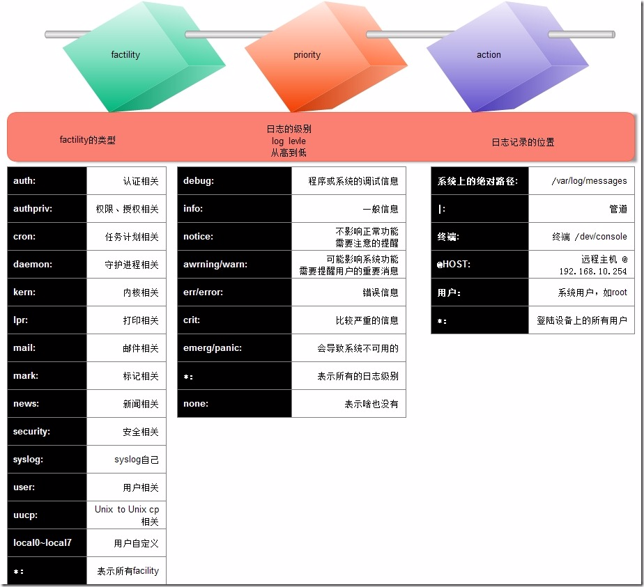

[TOC]

# 日志

Linux系统拥有非常灵活和强大的日志功能,可以保存几乎所有的操作记录,并可以从中检索出我们需要的信息.

大部分Linux发行版默认的日志守护进程为syslog(后续升级rsyslog),位于/etc/syslog或/etc/syslogd,默认配置文件为/etc/syslog.conf,任何希望生成日志的程序都可以向syslog发送信息.

Linux系统内核和许多程序会产生各种错误信息、警告信息和其他的提示信息,这些信息对管理员了解系统的运行状态是非常有用的,所以应该把它们写到日志文件中去.完成这个过程的程序就是syslog.

syslog可以根据日志的类别和优先级将日志保存到不同的文件中,例如,为了方便查阅,可以把内核信息与其他信息分开,单独保存到一个独立的日志文件中.默认配置下,日志文件通常都保存在“/var/log”目录下.

# 日志文件

系统日志是由一个名为syslog的服务管理的,如以下日志文件都是由syslog日志服务驱动的:

- /var/log/syslog

  只记录警告信息,常常是系统出问题的信息,使用==lastlog==查看;

  Centos,Fedora默认不生成该日志文件,但可以配置/etc/syslog.conf让系统生成该日志文件；

  它和/etc/log/messages日志文件不同,它只记录警告信息,常常是系统出问题的信息,所以更应该关注该文件；

  要让系统生成该日志文件,在/etc/syslog.conf文件中加上: *.warning /var/log/syslog.该日志文件就能记录当用户登录时login记录下的错误口令、Sendmail的问题、su命令执行失败等信息;

  该日志文件记录最近成功登录的事件和最后一次不成功的登录事件,由login生成,在每次用户登录时被查询,该文件是二进制文件,需要使用lastlog命令查看,根据UID排序显示登录名、端口号和上次登录时间.如果某用户从来没有登录过,就显示为"**Never logged in**".该命令只能以root权限执行.

- /var/log/wtmp

  该日志文件永久记录每个用户登录、注销及系统的启动、停机的事件,使用last命令查看;

- /var/run/utmp

  该日志文件记录当前正在登陆系统的每个用户的信息,默认由who、w、users、finger等记录当前用户信息,就需要访问这个文件,只保留当时联机的用户记录,不会为用户保留永久的记录,uptime记录系统启动时间;

  扩展：==lastlog==命令,显示当前系统每个用户最近一次的登录记录

- /var/log/btmp

  记录Linux登陆失败的用户、时间以及远程IP地址,使用lastb命令查看;

- /var/log/boot.log

  记录了系统在引导过程中发生的事件,就是Linux系统开机自检过程显示的信息;

- /var/log/lastlog

  记录最后一次用户成功登陆的时间、登陆IP等信息;

- /var/log/messages

  记录Linux操作系统常见的系统和服务错误信息;

- /var/log/secure

  Linux系统安全日志,记录用户和工作组变坏情况、用户登陆认证情况;

- /var/log/syslog

  存储所有的全局系统活动数据,包括开机信息,基于Debian的系统如Ubuntu;

- /var/log/messages

  存储所有的全局系统活动数据,包括开机信息,基于RedHat的系统如RHEL或CentOS;

- /var/log/auth.log

  存储来自可插拔认证模块(PAM)的日志,包括成功的登录,失败的登录尝试和认证方式;Ubuntu和 Debian;

- /var/log/secure

  存储来自可插拔认证模块(PAM)的日志,包括成功的登录,失败的登录尝试和认证方式;RedHat和 CentOS;

总结

[](http://img1.51cto.com/attachment/201306/3/1028430_1370250028EPL5.jpg)


# rsyslog

rsyslog是一个快速处理收集系统日志的程序,提供了高性能,安全功能和模块化设计.是syslog的升级版,它将多种来源输入输出转换结果到目的地,剧官网介绍,现在可处理100万条信息.

rsyslog是一个C/S架构的服务,可监听与某套接字,帮其它主机记录日志信息.

与CentOS6之前的syslog对比,有以下特性:

- 多线程

- 支持TCP,SSL,TLS,RELP等协议,实现远程数据传输

- 支持mysql,pgsql,oracle等多种关系型数据库

- 支持强大的过滤器，可实现过滤日志信息中的任意部分

- 支持自定义输出格式  

- 适用于企业级别日志记录需求

- 模块化


## \*\*ELK\*\*

ELK是三个系统：

Elasticsearch,是一个实时分布式和开源的全文搜索和分析引擎.

logstash,一个日志收集工具.

kibana,前端展示工具.

后面会详细介绍。


## rsyslog相关文件

```shell
rpm -qi rsyslog
rpm -ql rsyslog
"""
/etc/rsyslog.conf  # 配置文件
/sbin/rsyslogd  # 主程序
/etc/rc.d/init.d/rsyslog  # 服务脚本
/lib64/rsyslog/*  # 此处为rsyslog所支持的扩展模块,im开头的表示与input相关,om表示与output相关
"""
```


### rsyslog.conf

大概分为三部分:

`grep "^###" /etc/rsyslog.conf`

- MODULES

  用于装载模块

- RULES

  用于指定如何指定日志

  格式: 

  ```shell
  # 类型.级别 处理目标
  facility.priority  [-]targe
  ```

  ==**facility**==，设施,从功能或程序上对日志进行分类。

  见的日志类型：

  auth：用户认证时产生的日志,如login命令、su命令

  authpriv：与auth类似,但是只能被特定用户查看

  console：针对系统控制台的消息

  cron：系统定期执行计划任务时产生的日志

  daemon：某些守护进程产生的日志

  ftp：FTP服务

  kern：系统内核消息

  local0.local7：由自定义程序使用

  lpr：与打印机活动有关

  mail：邮件日志

  news：网络新闻传输协议(nntp)产生的消息

  ntp：网络时间协议(ntp)产生的消息

  user：用户进程

  uucp：UUCP子系统

  mark：产生时间戳,系统每隔一段时间向日志文件中输出当前时间,每行的格式类似于 "May 26 11:17:09 rs2 -- MARK --",可以由此推断系统发生故障的大概时间。

  ==**priority**==，日志级别。

  级别按照从重到轻如下:

  emerg,panic(红色警报)：紧急情况,系统不可用(例如系统崩溃),一般会通知所有用户,还有一种同级别称为

  alert(黄色警报)：需要立即修复,例如系统数据库损坏

  crit(critical蓝色警报)：危险情况,例如硬盘错误,可能会阻碍程序的部分功能

  err(error)：一般错误消息

  warn(warning)：警告

  notice：不是错误,但是可能需要处理

  info：通用性消息,一般用来提供有用信息

  debug：调试程序产生的信息

  none：没有优先级,不记录任何日志消息

  指定方式:

  *: 所有级别

  none: 没有级别

  priority: 表示指定级别以及高于此级别的日志信息, 加等号'='表示仅指定级别。

  ==**target**==：

  可以是文件路径,记录于指定的日志文件中,通常存放于/var/log/目录下,减号'-'表示异步写入,一般用于日志信息量很大但又非关键的类型。

## 文件记录的日志格式:

日期 主机 进程 事件

还有一种二进制日志格式,无法直接用cat,vim等查看,如/var/log/wtmp,/var/log/btmp等,也可以使用utmpdump命令将二进制文件转换成文本格式,编辑后再导入回去.

如:

```
utmpdump /var/log/utmp > tmp_output.txt  #导出文件信息
# <使用文本编辑器修改 tmp_output.txt>
utmpdump -r tmp_output.txt > /var/log/utmp  #导入到源文件中
```

\- 可以是用户,将日志通知给指定用户,星号'*'表示所有用户

\- 可以是日志服务器,格式为 @HOST ,host必修要监听在tcp或udp协议的514端口上提供服务

\- 可以是管道,格式为 |COMMAND ,由这个命令来处理或过滤日志

排除: *.日志类型1;日志类型2.none;日志类型3.none

意思是除了日志类型2和日志类型3不记录日志,其他所有类型的info级别以上的信息都记录到日志.

facility1,facility2.priority  [-]LOG_PATH

说明: 多个factility可以用逗号隔开,表示多种格式使用同一种级别

在配置文件中还可以使用叹号'!',取反的意思,如:

```
mail.info # mail记录info以上的所有级别的日志信息
mail=info # 只记录info信息
mail.!=error # 记录error之外的所有信息
mail.!error # 记录与mail.error相反
mail.cron.info # 记录cron与mail的info以上的日志信息
```

localN(N=1-7).*

说明:可自行定义某个程序的日志记录在哪个目录下.举个例子就明白了:

```
# 以ssh为例,编辑sshd.conf配置文件
"""
SyslogFacility local2
"""
service sshd restart
# 修改rsyslog.conf配置文件
"""
# 添加一行:
local2.*    /var/log/sshd.log
"""
service rsyslog restart  # rsyslog不支持reload
# 重新通过ssh连接一次
cat /var/log/sshd.log
"""
Jun 26 21:10:51 centos6 sshd[1249]: Accepted password for root from 172.16.0.254 port 52056 ssh2
"""
```

\#### GLOBAL DIRECTIVES ####

这部分主要用来配置模板,模板的作用是指定你希望在日志文件中保存的格式

默认配置为:

```
# Use default timestamp format
$ActionFileDefaultTemplate RSYSLOG_TraditionalFileFormat
# 模板示例:
# 这里第一列(为了方便显示,参数写成了一列)是模板,即日志服务器记录到日志文件的格式
# 第二列是指定需要使用的模板myFormat,这个名字可以自己定义
$template myFormat,"%TIMESTAMP% host=%HOSTNAME%,
　　　　　　　　　　　　　　　　　　 relayHost=%FROMHOST%,
　　　　　　　　　　　　　　　　　　 tag=%syslogtag%,
　　　　　　　　　　　　　　　　　　 programName=%programname%,
                                  procid=%PROCID%,
                                  facility=%syslogfacility-text%,
                                  sev=%syslogseverity-text%,
                                  appName=%APP-NAME%,
                                  msg=%msg%\n"
$ActionFileDefaultTemplate myFormat
# 模板额外说明
# 在rsyslog7 和更高版本使用以下格式：
template(name="scalaLogFormat" type="list") {
        property(name="timestamp" dateFormat="rfc3339")
        constant(value=" host=")
        property(name="hostname")
        constant(value=", relayHost=")
        property(name="fromhost")
        constant(value=", tag=")
        property(name="syslogtag")
        constant(value=", programName=")
        property(name="programname")
        constant(value=", procid=")
        property(name="procid")
        constant(value=", facility=")
        property(name="syslogfacility-text")
        constant(value=", sev=")
        property(name="syslogseverity-text")
        constant(value=", appName=")
        property(name="app-name")
        constant(value=", msg=")
        property(name="msg" )
        constant(value="\n")
        }
```

\### begin forwarding rule ###

主要定义转发功能

```
#$WorkDirectory /var/lib/rsyslog # where to place spool files
#$ActionQueueFileName fwdRule1 # unique name prefix for spool files
#$ActionQueueMaxDiskSpace 1g   # 1gb space limit (use as much as possible)
#$ActionQueueSaveOnShutdown on # save messages to disk on shutdown
#$ActionQueueType LinkedList   # run asynchronously
#$ActionResumeRetryCount -1    # infinite retries if host is down
# remote host is: name/ip:port, e.g. 192.168.0.1:514, port optional
#*.* @@remote-host:514
```

分为4个部分:

[模块.等级] [转发协议][日志服务器地址]:[日志服务器端口]

其中转发协议的参数@@为TCP协议,对应的接收端也需要配置接受TCP协议;

@为UDP协议;

注:使用TCP协议,若地址错误或不能连同的情况,转发的协议会写入缓存,但是不用担心会卡死服务器,当到达一定限度后会自动转存到硬盘,这个不是我们应该关心的部分,使用就好了.

说明：

针对rsyslog.conf配置文件的所有操作都需要重启服务生效(service rsyslog restart)

在新版本的rsyslog中,对日志发送有默认限速,如果有集中大量推送日志的情况,需要在配置文件中加上参数$SystemLogRateLimitInterval 0

(具体位置没有影响，但通常写在GLOBAL DIRECTIVES模块)

通常来说,日志推送到服务器的协议使用UDP.

\### end of the forwarding rule ###


# 示例:rsyslog服务器

方法:打开指定模块,让其监听在套接字上即可

$ModLoad imudb

$UDPServerRun 514

环境:

服务端:Centos6.9 x86_64  172.16.1.1

客户端:Centos6.9 x86_64  172.16.1.2

服务器端：

```
# 这里默认选择udp端口,也可选择tcp.
vim /etc/rsyslog.conf
"""
# Provides UDP syslog reception
$ModLoad imudp
$UDPServerRun 514
"""
service rsyslog restart
ss -tunlp
```

客户端

```
hostname
vim /etc/rsyslog.conf
"""
*.info;mail.none;authpriv.none;cron.none                 @172.16.1.1
"""
service rsyslog restart
yum install vsftpd -y
```

在服务端查看/var/log/messages记录

记录已存在:

Jun 26 22:17:04 node1 yum[2261]: Installed: vsftpd-2.2.2-24.el6.x86_64


# 示例:基于MySQL存储rsyslog日志

rsyslog支持将日志存储在关系型数据库中,如MySQL.

## 环境

服务端:Centos6.9 x86_64  172.16.1.20

客户端:Centos6.9 x86_64  172.16.1.60

## 安装rsyslog-mysql模块

在服务器端安装rsyslog-mysql模块

```shell
yum list all rsyslog*
yum install rsyslog-mysql
rpm -ql rsyslog-mysql
"""
/lib64/rsyslog/ommysql.so  # 模块
/usr/share/doc/rsyslog-mysql-5.8.10  # 帮助文档
/usr/share/doc/rsyslog-mysql-5.8.10/createDB.sql  # 创建mysql日志数据库的脚本
"""
```


## 安装mysql

创建mysql用户syslog,密码为syslogpass,导入createDB.sql脚本创建即可.

```shell
mysql
> SHOW DATABASES;
> USE Syslog
> GRANT ALL ON Syslog.* TO rsyslog@172.16.%.% IDENTIFIED BY 'rsyslogpass';
> GRANT ALL ON Syslog.* TO rsyslog@localhost IDENTIFIED BY 'rsyslogpass';
> FLUSH PRIVILEGES;
mysql -ursyslog -p < /usr/share/doc/rsyslog-mysql-5.8.10/createDB.sql
mysql
SHOW DATABASES;
USE Syslog;
SHOW TABLES;
```


## 配置rsyslog指定数据库

编辑rsyslog配置文件,指定日志送往mysql数据库中去

```shell
vim /etc/rsyslog.conf
"""
###MODULES###
Log event to MySQL
$ModLoad ommysql  # 指明要加载的mysql模块
###RULES###
*.info;mail.none;authpriv.none;cron.none    :ommysql:127.0.0.1,Syslog,rsyslog,rsyslogpass
# 把所有的日志通过ommysql这个模块送给127.0.0.1这个主机上的mysql的Syslog数据库中,使用的帐号密码是rsyslog和rsyslogpass
"""
service rsyslog restart
```


## WEB GUI配置

通过webGUI展示日志信息

模块:loganalyzer,基于lamp平台

```shell
yum install httpd php php-mysql php-gd mysql-server
vim /var/www/html/index.php
"""
<?php
    $conn = mysql_connect('127.0.0.1','rsyslog','rsyslogpass');
    if ($conn)
        echo "OK";
    else
        echo "Failure";
?>
"""
service httpd restart
tar xf loganalyzer-3.6.5.tar.gz
cd loganalyzer-3.6.5/
cp src /var/www/html/log
cp contrib/* /var/www/html/log/
cd /var/www/html/log/
chmod +x configure.sh secure.sh
./configure.sh
./secure.sh
chmod 666 config.php
chown apache.apache * -R
```

然后打开浏览器,先执行http://172.16.1.20/log/install.php进行安装配置


# 总结

## rsyslog服务器配置

\# Provides UDP syslog reception

$ModLoad imudp

$UDPServerRun 514

\# Provides TCP syslog reception

$ModLoad imtcp

$InputTCPServerRun 514

## 基于MySQL存储日志

配置使用基于mysql存储日志信息

1,准备好mysql服务器,创建用于日志存储的mysql用户,授权其对Syslog数据库的全部访问权限

2,安装rsyslog-mysql程序包

3,导入rsyslog-mysql依赖的数据库createDB.sql

4,配置rsyslog使用ommysql模块: $ModLoad ommysql

5,指定facility.priority   :ommysql:DB_HOST,DB_NAME,DB_USER,DB_USER_PWD

6,web端:loganalyzer

# 附:基于Socket日志Python脚本

最后附一个使用socket实现syslog日志的py脚本

```python
#!/usr/bin/python
# -*- coding:utf-8 -*-
import re
import json
import time
import os
import traceback
import thread
import socket
import ConfigParser
"""
功能：完成推送日志到syslog服务器，兼容了日志转存的情况
"""
# 配置文件地址
CONF_PATH = "config.conf"
# Facility constants
LOG_KERN = 0
LOG_USER = 1
LOG_MAIL = 2
LOG_DAEMON = 3
LOG_AUTH = 4
LOG_SYSLOG = 5
LOG_LPR = 6
LOG_NEWS = 7
LOG_UUCP = 8
LOG_CRON = 9
LOG_AUTHPRIV = 10
LOG_LOGTP = 11
LOG_NTP = 12
LOG_AUDIT = 13
LOG_ALERT = 14
LOG_CLOCK = 15
LOG_LOCAL0 = 16
LOG_LOCAL1 = 17
LOG_LOCAL2 = 18
LOG_LOCAL3 = 19
LOG_LOCAL4 = 20
LOG_LOCAL5 = 21
LOG_LOCAL6 = 22
LOG_LOCAL7 = 23
# Severity ants Names reasonably shortened
LOG_EMERG = 0
LOG_ALERT = 1
LOG_CRIT = 2
LOG_ERR = 3
LOG_WARNING = 4
LOG_NOTICE = 5
LOG_INFO = 6
LOG_DEBUG = 7
class FileManage(object):
    """
    文件控制类
    """
    def __init__(self):
        # 当前行位置
        self.currline = 0
        # 文件夹路径
        self.logpath = "/var/log/app/"
        # 读取增量
        self.plusline = 100
        # 最新转存文件名
        self.rotate_name = self.get_last_file()
        # 日志文件名
        self.logname = "app.log"
    def get_log(self):
        """
        获取日志
        @return list<str> 日志列表
        """
        list_log = list()
        if self.is_log_rotate():
            ########## 测试功能使用，实际应该删除
            self.currline = 0
            # 先获取转存日志中未读取部分
            list_log.extend(self.get_data_by_line(self.logpath + self.rotate_name))
            self.currline = 0
            self.rotate_name = self.get_last_file()
        list_log.extend(self.get_data_by_line(self.logpath + self.logname))
        return list_log
    def get_last_file(self):
        """
        获取最新的转存文件名
        @return <str> 文件名
        """
        # 获取路径下所有文件名
        files = os.listdir(self.logpath)
        repo = r"(?P<name>\bapp.log)-(?P<date>\d{8}\b)"
        file_list = list()
        for each in files:
            # 匹配结果
            re_result = re.match(repo, each)
            if str(re_result) == "None":
                continue
            file_list.append(re_result.groupdict())
        file_list.sort(key=lambda dict: dict['date'], reverse=True)
        # 返回最新文件名
        return file_list[0]['name'] + '-' + file_list[0]['date']
    def get_data_by_line(self, filepath):
        """
        获取需要推送的日志
        @param <int> 开始文件行数
        @param <int> 截止文件行数
        @return list<str> 获取到的日志列表
        """
        log_list = list()
        # 文件不存在返回空列表
        if os.path.exists(filepath):
            with open(filepath, "r") as fobj:
                log_data = fobj.read().splitlines(False)
        else:
            return list()
        log_list = log_data[self.currline:len(log_data)]
        self.currline = len(log_data)
        return log_list
    def is_log_rotate(self):
        """
        判断日志是否被转存
        @return True：已经被转存
                False：未被转存
        """
        return False if self.rotate_name == self.get_last_file() else True
class Transform(object):
    """
    日志内容处理基类
    """
    def __init__(self):
        # 输入字符串
        self.input_str = ""
    def transform_str(self, input_str):
        pass
class JsonFormat(Transform):
    """
    将日志字符串处理成json字符串
    """
    def __init__(self):
        """记录参数"""
        self.facility = LOG_USER
        self.severity = LOG_INFO
    def transform_str(self, input_str):
        """将日志字符串解析成json格式"""
        # 字典key为time,host,owner,pid,level,other,msg
        # ()? 有日志存在Oct__9 10:10:10情况
        repo = r"(?P<time>\w+ ( )?\d+ \d{2}:\d{2}:\d{2}) (?P<host>\w+) (?P<owner>\w+):( +)?(?P<pid>(\[\d+\])?)(?P<level>(\[\w+\])?) ?(?P<other>(\[\w+\])?) ?(?P<msg>(.*))"
        re_result = re.match(repo, input_str)
        if re_result:
            re_dict = re_result.groupdict()
        # 没有匹配到，返回空字符串
        else:
            return str()
        self.facility, self.severity = self.confirm_leave(re_dict['owner'], re_dict['level'])
        # 计算日志等级pri
        pri = self.facility + self.severity
        # syslog协议日志头e.g:Oct 9 22:33:20 localhost
        header = re_dict['time'] + " " + re_dict['host']
        # 进程号
        pid = re_dict['pid']
        # 日志模块
        owner = re_dict['owner']
        # 日志消息
        msg = re_dict['msg']
        return json.dumps(
            dict(PRI=str(pri), HEADER=header, PID=pid, OWNER=owner, MSG=msg),
            sort_keys=True)
    def confirm_leave(self, owner, level):
        """
        根据日志中的owner,level两个信息，确定facility,severity
        """
        # 给定默认值
        facility = LOG_USER
        severity = LOG_INFO
        # as日志级别对应syslog协议级别
        level_info = dict(INFO=LOG_INFO, WARN=LOG_WARNING,
                          ERROR=LOG_ERR, DEBUG=LOG_DEBUG)
        if level in level_info.keys():
            severity = level_info[level]
        # 判定级别
        if owner in ['ecms_troubleshoot']:
            severity = LOG_EMERG
        return facility, severity
class UDPClient(object):
    """UDP 传输"""
    def __init__(self, ip, port):
        """UDP 消息"""
        self._addr = socket.getaddrinfo(ip, port)[0][4]
        self._sock = socket.socket(socket.AF_INET, socket.SOCK_DGRAM)
    def __del__(self):
        """析构函数"""
        self._sock.close()
class SyslogManage(UDPClient):
    """ """
    def __init__(self, ip="127.0.0.1", port=514):
        """
        给定默认日志等级
        """
        super(SyslogManage, self).__init__(ip=ip, port=port)
        self.facility = LOG_USER
        self.severity = LOG_INFO
        self.message = ""
    def push_log_to_server(self):
        """推送日志"""
        try:
            # 单次日志大小超过 128 * 1024 会被不记录该条日志，因此将日志切分记录
            step = 1024
            for i in xrange(0, len(self.message), step):
                self.sendlog(self.message)
        except BaseException:
            traceback.print_exc()
        # print self.message
    def sendlog(self, msg):
        data = "<%d>%s" % (self.severity + (self.facility << 3), msg)
        self._sock.sendto(data.encode(), self._addr)
def logthread(cycle):
    """
    操作线程函数:从app.log文件中读取日志，并推送到服务器
    @param filelog(FileManage) 文件操作对象
    @param trans(JsonFormat) 处理字符串对象
    @param sendlog(SyslogManage) 日志发送对象
    @param cycle 推送周期,默认10秒
    """
    ######### 测试功能使用
    global count
    count = 0
    filelog = FileManage()
    trans = JsonFormat()
    sendlog = SyslogManage(ip="192.168.136.189", port=514)
    while True:
        # 从本地获得推送日志
        list_log = filelog.get_log()
        # 遍历所有日志，进行格式解析和转换
        for each in list_log:
            sendlog.message = trans.transform_str(each)
            # 跳过空字符串
            if len(sendlog.message) == 0:
                continue
            sendlog.facility = trans.facility
            sendlog.severity = trans.severity
            sendlog.push_log_to_server()
            count = count + 1
        # 等待时间：推送周期
        time.sleep(int(cycle))
        ############ 测试功能使用
        # filelog.currline = 0
def set_cycle():
    """从配置文件获取推送周期"""
    obj = ConfigParser.ConfigParser()
    obj.read(CONF_PATH)
    return obj.get("syslog", "time")
def main():
    """
    对于每一个推送功能创建对应的线程
    """
    # 线程列表
    thread_list = list()
    logthread_id = thread.start_new_thread(logthread, (set_cycle(),))
    thread_list.append(logthread_id)
    ############ 测试功能使用
    # try:
    while True:
        pass
    # except KeyboardInterrupt:
        # print "发送日志条数:",count
if __name__ == '__main__':
    main()
```