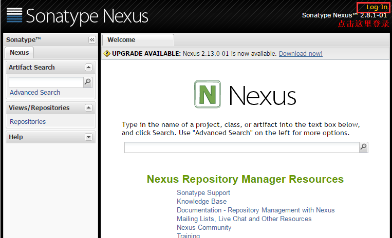
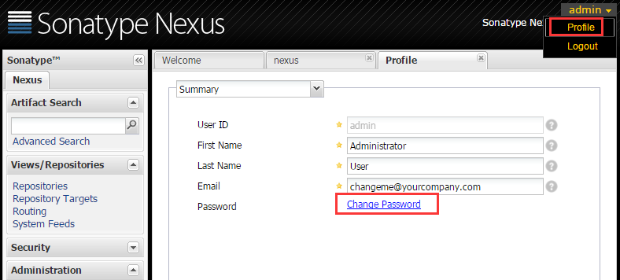
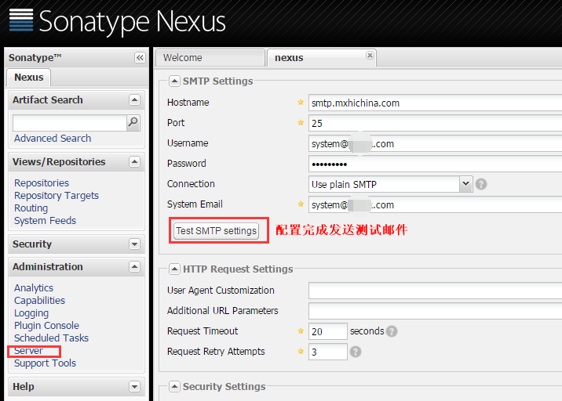
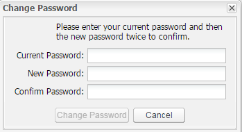
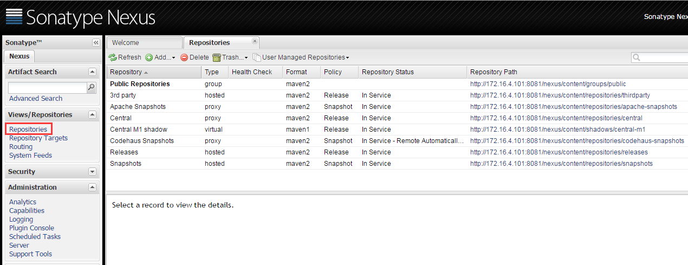
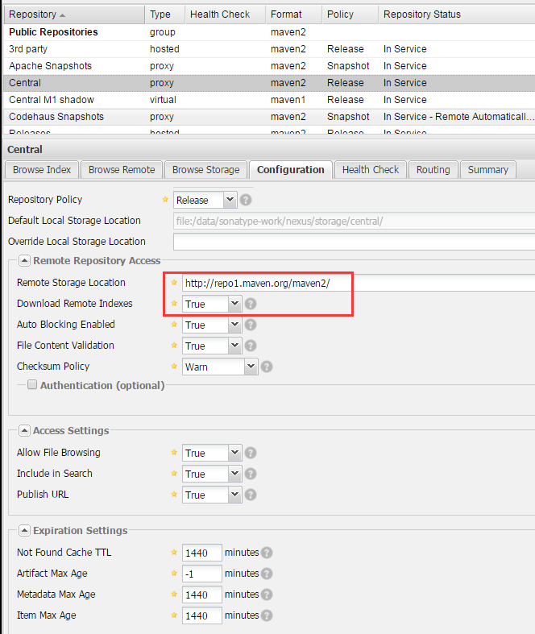

[TOC]

## *1.*Maven介绍

Maven是款平台的项目管理工具。主要服务于基于java平台的项目构建，依赖管理和项目信息管理。

项目构建介绍：

我们都知道，Java源代码如果需要在应用服务器上面运行，需要经过编译（也就是java源码变成class文件的过程），只有class文件才能运行在jvm虚拟机之上。Mavne说白了就是把java源代码变成class文件的过程，使用maven编译java源码会生成一个war包，只需要把war解压到tomcat这类应用服务器的应用根目录，然后重启tomcat重新加载类文件，就算完成了一次部署。

Maven项目构建优点：

- 拥有约定的目录结构，知道你的代码在哪里，放到哪里去。
- 只需要执行一个maven install就可以自动执行编译、测试、打包等构建过程。
- 只需要定义一个xml，然后把源码放到默认的目录，Maven帮你处理其他事情。
- 拥有依赖管理，仓库管理

IDE项目构建缺点：

- 手工操作多，编译、测试、部署等工作都是独立的，很难一步完成。
- 每个人的IDE配置不同，很容易出现本地代码换个地方编译就出错。

依赖管理介绍：

Java程序员在写代码的时候会用到一些jar包，这些jar包就可以理解为依赖包，我们可以使用maven对这个依赖包进行管理。

Maven对依赖包的管理主要体现在两个方面：

- 对第三方依赖包的管理，可以连接互联网来下载依赖包
- 对我们自己开发的依赖包的管理

## *2.*Maven私服介绍：

Maven的依赖包通常都放在国外的中央仓库：http://repo2.maven.org/maven2/

中央仓库缺点如下：

1、从国外下载速度慢，而且maven仓库很多都是小文件，这样就使得从maven中央仓库下载依赖包更慢

2、无法将第三方jar包及自己编写的jar包上传至中央仓库

私有仓库介绍：这里使用nexus作为maven的私服

- 可以在公司内网搭建nexus作为maven的私服，然后把中央仓库的所有jar包镜像到本地，这样本地开发依赖jar包就可以直接从公司内网下载，提高下载速度。
- 可以通过代理的方式连接到中央仓库：如果私服的maven仓库本地没有依赖包，就从代理的中央仓库下载，中央仓库下载完成之后会把依赖包下载到本地，以后再次下载会从私服直接提供依赖包。

3、nexus可以创建内部项目的仓库，把第三方还有自己开发的jar包上传到nexus仓库，提供给其他人使用。

## *3.*私服搭建

环境介绍：

系统：Centos 6.8 64位、Jdk：1.8、maven：3.3.9、Nexus：2.5

## *4.*JDK环境安装

Jdk下载：http://www.oracle.com/technetwork/java/javase/downloads/jdk8-downloads-2133151.html

Jdk安装：

```
tar` `xf jdk-8u65-linux-x64.``tar``.gz -C ``/usr/local/``cd` `/usr/local/``ln` `-s jdk1.8.0_65/ jdk``echo` `"JAVA_HOME=/usr/local/jdk"` `> ``/etc/profile``.d``/java``.sh``echo` `"export PATH=\$JAVA_HOME/bin:\$PATH"` `>> ``/etc/profile``.d``/java``.sh ``source` `/etc/profile``.d``/java``.sh``java -version
```

## *5.*maven环境安装

maven下载地址：http://maven.apache.org/download.html

1、安装maven

```
tar` `xf apache-maven-3.3.9-bin.``tar``.gz -C ``/usr/local/``cd` `/usr/local/``ln` `-s apache-maven-3.3.9/ maven
```

2、设置maven环境变量

```
[root@node1 ~]``# vim /etc/profile.d/maven.sh``export` `M2_HOME=``/usr/local/maven/``export` `PATH=$M2_HOME``/bin``:$PATH``[root@node1 ~]``# source /etc/profile.d/maven.sh
```

3、验证安装

```
[root@node1 ~]``# mvn -version``Apache Maven 3.3.9 (bb52d8502b132ec0a5a3f4c09453c07478323dc5; 2015-11-11T00:41:47+08:00)``Maven home: ``/usr/local/maven``Java version: 1.8.0_65, vendor: Oracle Corporation``Java home: ``/usr/local/jdk1``.8.0_65``/jre``Default locale: en_US, platform encoding: UTF-8``OS name: ``"linux"``, version: ``"2.6.32-504.el6.x86_64"``, arch: ``"amd64"``, family: ``"unix"
```

## *6.*安装nexus

Nexus下载地址：http://www.sonatype.com/download-oss-sonatype

1、 解压安装包

```
mkdir` `/data/nexus/` `-p``tar` `xf nexus-latest-bundle.``tar``.gz -C ``/data/nexus/``cd` `/data/nexus/``ln` `-s nexus-2.8.1-01/ nexus
```

2、修改配置文件，修改端口，监听地址，以及work目录等配置，如果没有特殊需求保持默认即可。

```
[root@node1 ~]``# vim /data/nexus/nexus/conf/nexus.properties``# Jetty section``application-port=80          ``application-host=0.0.0.0       ``nexus-webapp=${bundleBasedir}``/nexus``nexus-webapp-context-path=``/nexus` `# Nexus section``nexus-work=${bundleBasedir}/..``/sonatype-work/nexus``runtime=${bundleBasedir}``/nexus/WEB-INF
```

3、 配置启动脚本：设置启动用户为root

```
[root@node1 ~]``# vim /data/nexus/nexus/bin/nexus``RUN_AS_USER=root
```

4、 启动nexus

```
/data/nexus/nexus/bin/nexus` `start
```

5、 在浏览器打开http://172.16.4.101:8081/nexus/，然后登录，用户名admin，密码admin123



## *7.*Nexus配置

（1）修改用户密码：在右上角，用户名，然后点击profile就看到了change password选项了
 
 配置邮箱服务器，用于忘记密码找回
 
 [](http://www.fblinux.com/wp-content/uploads/2016/09/image0041.png)

## *8.*仓库管理

（1）仓库操作：登录nexus之后在左侧侧边栏，点击Repositories就可以看到所有仓库了，可以选择添加或者删除仓库，也可以修改仓库的配置
 [](http://www.fblinux.com/wp-content/uploads/2016/09/image0051.png)
 （2）仓库类型介绍（通常情况下一个group仓库就可以满足需求了）
 Group仓库：nexus通过仓库组的概念统一管理多个仓库，这样我们在项目中直接请求仓库组即可以请求到仓库组管理的多个仓库。
 Hosted 属主仓库：主要用于发布内部项目构件或第三方项目构件。
 Proxy 代理仓库：代理公共的远程仓库
 Virtual 虚拟仓库：用于适配maven 1
 Hosted 仓库类型说明：
 Release 内部的模块中release模块的发布仓库
 Snapshots 发布内部的SNAPSHOT模块的仓库
 3rd party第三方依赖的仓库，这个数据通常是由内部人员自行下载之后发布上去。

（3）设置proxy代理仓库，准许远程下载，以及远程仓库地址，这样本地私服没有的包就会从中央仓库下载，并缓存到本地

[](http://www.fblinux.com/wp-content/uploads/2016/09/image0061.png)

## *9.*下载maven中央仓库所有包到本地

有时候会有一些特殊需求，就是把整个maven的中央仓库镜像到本地，以后下载就从本地下载，不使用代理缓存，可以通过如下wget命令把中央仓库所有jar包下载到本地：

本地仓库路径/data/sonatype-work/nexus/storage/

```
wget --no-check-certificate -U "Mozilla/5.0 (Windows NT 10.0; Win64; x64) AppleWebKit/537.36 (KHTML, like Gecko) Chrome/52.0.2743.116 Safari/537.36" -r -e robots=off -nH -c -np http://repo.maven.apache.org/maven2/
```