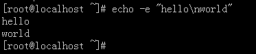
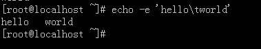
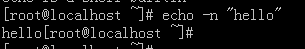
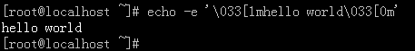
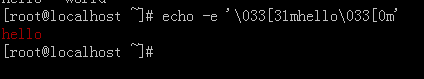
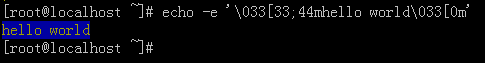

[TOC]

**echo**

打印输出内容,吃什么吐什么

 

```
#echo 123
123
#echo 'user sadfds sdfsdfsda dfsadwer23423'
user sadfds sdfsdfsda dfsadwer23423
```

 

```
#echo 123
123
#echo 'user sadfds sdfsdfsda dfsadwer23423'
user sadfds sdfsdfsda dfsadwer23423
```

选项：

echo -e “\033[30m 黑色字 \033[0m” 

　　echo -e “\033[31m 红色字 \033[0m” 

　　echo -e “\033[32m 绿色字 \033[0m” 

　　echo -e “\033[33m 黄色字 \033[0m” 

　　echo -e “\033[34m 蓝色字 \033[0m” 

　　echo -e “\033[35m 紫色字 \033[0m” 

　　echo -e “\033[36m 天蓝字 \033[0m” 

　　echo -e “\033[37m 白色字 \033[0m”

echo -e “\033[40;37m 黑底白字 \033[0m” 

　　echo -e “\033[41;37m 红底白字 \033[0m” 

　　echo -e “\033[42;37m 绿底白字 \033[0m” 

　　echo -e “\033[43;37m 黄底白字 \033[0m” 

　　echo -e “\033[44;37m 蓝底白字 \033[0m” 

　　echo -e “\033[45;37m 紫底白字 \033[0m” 

　　echo -e “\033[46;37m 天蓝底白字 \033[0m” 

　　echo -e “\033[47;30m 白底黑字 \033[0m”

​    \33[0m 关闭所有属性 

　　\33[1m 设置高亮度 

　　\33[4m 下划线 

　　\33[5m 闪烁 

　　\33[7m 反显 

　　\33[8m 消隐 

　　\33[30m — \33[37m 设置前景色 

　　\33[40m — \33[47m 设置背景色 

　　\33[nA 光标上移n行 

　　\33[nB 光标下移n行 

　　\33[nC 光标右移n行 

　　\33[nD 光标左移n行 

　　\33[y;xH设置光标位置 

　　\33[2J 清屏 

　　\33[K 清除从光标到行尾的内容 

　　\33[s 保存光标位置 

　　\33[u 恢复光标位置 

　　\33[?25l 隐藏光标 

　　\33[?25h 显示光标

**
**

 **
**

**
**

****

**\033[3#mhello world\033[0m**

​    **单个数字：控制字体，比如粗体，斜体等
**

**
**

​    **3#：#是一个数字，3表示控制其前景色
**

​    **4#：#是一个数字，4表示控制其背景色
**

​    **3#；4#   组合使用时，彼此间用；分隔
**

​    **m：    是固定格式
**

​    **\033[0m; 结束符，表示至此结束**

**
**

**
**

**echo $?**

**查看命令是否执行成功**