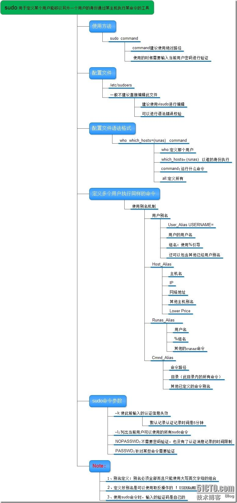

[TOC]

# sudo

sudo是允许系统管理员让普通用户执行一些或者全部的root命令的一个工具，减少了root用户的登陆和管理时间，提高了安全性。Sudo不是对shell的一个代替，它是面向每个命令的。

[](http://img1.51cto.com/attachment/201306/3/1028430_1370243105xRpG.jpg)

sudo能做什么？

1，限制指定用户在指定主机上运行指定的管理命令

2，详细记录用户基于sodu执行的命令的相关日志信息

3，‘检票系统’：用户第一次执行sudo会被要求输入密码（自己的），用户会获得一个有固定时长的‘入场券’：默认5分钟超时

如何实现：

配置文件：/etc/sudoers 只能由管理员编辑实现授权

专用编辑器：visudo   锁定，语法检测

格式：

| who      | which_host | COMMAND                             |
| -------- | ---------- | ----------------------------------- |
| zhangsan | ALL=(root) | /usr/sbin/useradd,/usr/sbin/usermod |
| lisi     | ALL=(root) | /usr/sbin/useradd,/usr/sbin/userdel |
| %GROUP   | HOST=(WHO) | COMMAND                             |

who可以定义别名：

   User_Alias ::= NAME ?.?.User_List

   Runas_Alias ::= NAME ?.?.Runas_List

   Host_Alias ::= NAME ?.?.Host_List

   Cmnd_Alias ::= NAME ?.?.Cmnd_List

可用man sudoers查看帮助

用户别名的格式：

用户：

  USERNAME，$GROUPNAME，# UID，#$GID，USER_Alias

语法格式：

  USER_Alias NAME = item1， item2 ： NAME = item3， item4

别名本身必须大写

主机别名格式：

   Host_Alias NAME = item1, item2, ...

item可用项：

   hostname， ip， network_address， host_alias

命令别名格式：

  Cmnd_Alias NAME = item1, item2, ...

item可用项：

  命令名， 目录， “sudoedit”， Cmnd_Alias

sudo

  -l：列出当前用户可以使用的所有sudo类命令

  -u 用户名 命令：指定以某个用户耳朵身份运行哪个命令

  -k：让‘入场券’失效，默认5分钟

  -b 命令：在后台运行指定命令

  -p 提示语：可以更改询问密码的提示语，%h变量，替换主机名

  -e 文件路径：修改指定的文件，而非执行命令

示例：

 

```
<span data-wiz-span="data-wiz-span" style="font-family: Consolas; font-size: 1rem;">使用visudo编辑/etc/sudoers文件，添加下面的一行
#tail -1 /etc/sudoers
  admin ALL=(root) /usr/sbin/useradd

切换用户进行测试
# su -l admin

创建新用户
$sudo /usr/sbin/useradd test

#在执行第一次验证的5分钟之内，不会在要求你输入密码验证
$sudo /usr/sbin/useradd test

查看结果
$tail-2 /etc/passwd
  test:x:1013:1013::/home/test:/bin/bash

如果我们使用未被授权的命令，将会提示下面的信息：
$sudo /usr/sbin/userdel test
Sorry, user admin is not allowed to execute '/usr/sbin/userdel admin' as root on localhost.localdomain.</span>
```


如果赋予的权限很多，可以利用命令的别名

 

```
<span data-wiz-span="data-wiz-span" style="font-family: Consolas; font-size: 1rem;">#visudo
  Cmnd_Alias UACMND /usr/sbin/useradd, /usr/sbin/userdel, /usr/sbin/usermod
  admin ALL = (ALL) UACMND</span>
```


在授权用户执行命令时不需要输入自己密码，则需添加NOPASSWD:

 

```
<span data-wiz-span="data-wiz-span" style="font-family: Consolas; font-size: 1rem;">#visudo
Cmnd_Alias PW = /usr/sbin/useradd, /usr/sbin/usermod, /usr/sbin/userdel, /usr/bin/passwd [a-zA-Z]*, !/usr/bin/passwd root
admin  ALL=(root) NOPASSWD: PW</span>
```