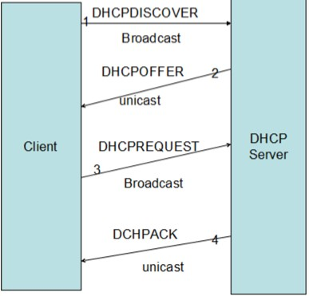

[TOC]

DHCP简介

DHCP运行方式

DHCP工作原理

DHCP相关术语

DHCP应用实例

DHCP配置文件


DHCP简介Dynamic Host Configuration Protocol动态主机配置协议
DHCP工作在OSI的应用层，可以帮助计算机从指定的DHCP服务器获取配置信息的协议;主要包括：ip地址，子网掩码，网关和dns等;

DHCP的运作方式：
客户端传输广播包给整个物理网络段内的所有主机，如局域网内有DHCP服务器时，才会响应客户端的IP参数要求，所以DHCP服务器与客户端应该在同一个物理网段内.

客户端与DHCP服务器之间连接的过程如下图：
1）客户端：利用广播包发送搜索DNCP服务器的包2）服务器端：提供客户端网络相关的租约选择
3）客户端：决定选择的DHCP服务器提供的网络参数租约并汇报给服务器
4）服务器端：记录这次租约并回报给客户端相关的封包信息

简单来说下DHCP工作原理：
(1)客户机寻找服务器：广播发送discover包，寻找dhcp服务器
(2)服务器响应请求：单播发送offer包，对客户机做出响应。提供客户端网络相关的租约以供选择其中服务器在收到客户端的请求后，会针对客户端的mac地址与本身的设定数据进行一下工作：
  a)到服务器的登录文件中寻找该用户之前曾经使用过的ip，若有且该ip目前没有人使用，这提供此ip为客户机
  b)若配置文件中有针对该mac提供额外的固定ip，且该ip没有被使用，则提供此ip给客户机
  c)如果没有符合以上两个条件，则随机取用目前没有被使用的ip参数给客户机并记录到leases文件中。
(3)客户机发送ip请求：广播request包，选择一个服务器提供的网络参数租约回报服务器。此外，客户机会发送一个广播封包给局域网内的所有主机，告知自己已经接受服务器的租约。
(4)服务器确认租约：单播Ack包，服务器与客户机确认租约关系并记录到服务器的leases文件中 。

接着说下DHCP几个概念：
DHCP Client：DHCP客户端，通过DHCP协议请求IP地址的客户端。DHCP客户端是接口级的概念，如果一个主机有多个以太接口，则该主机上的每个接口都可以配置成一个DHCP 客户端。交换机上每个Vlan接口也可以配置成一个DHCP客户端。
DHCP Server：DHCP 服务端，负责为DHCP客户端提供IP地址，并且负责管理分配的IP地址。
DHCP Relay：DHCP中继器，DHCP客户端跨网段申请IP地址的时候，实现DHCP报文的转发功能。
DHCP Security：DHCP安全特性，实现合法用户IP地址表的管理功能
DHCP Snooping：DHCP监听，记录通过二层设备申请到IP地址的用户信息 

一、发现阶段：
即DHCP客户端寻找DHCP服务端的过程，对应于客户端发送DHCP Discovery，因为DHCP Server对应于DHCP客户端是未知的，所以DHCP 客户端发出的DHCP Discovery报文是广播包，源地址为0.0.0.0目的地址为255.255.255.255。网络上的所有支持TCP/IP的主机都会收到该DHCP Discovery报文，但是只有DHCP Server会响应该报文。
如果网络中存在多个DHCP Server，则多个DHCP Server均会回复该DHCP Discovery报文。
如果同一个vlan内没有DHCP Server，而该VlanIf配置了DHCP Relay功能，则该Vlanif即为DHCP中继，DHCP中继会将该DHCP报文的源IP地址修改为该Vlanif的IP地址，而目的地址则为DHCP Relay配置的DHCP Server的IP地址。同时修改DHCP报文中，giaddress为VlanIf的IP地址。并以单播将DHCP Discovery发送到DHCP Server端。

二、DHCP Server 提供阶段：
DHCP Server提供阶段，即为DHCP Server响应DHCP Discovery所发的DHCP Offer阶段
DHCP Server收到DHCP Discovery报文后，解析该报文请求IP地址所属的Subnet。并从dhcpd.conf文件中与之匹配的subnet中取出一个可用的IP地址(从可用地址段选择一个IP地址后，首先发送ICMP报文来ping该IP地址，如果收到该IP地址的ICMP报文，则抛弃该IP地址，重新选择IP地址继续进行ICMP报文测试，直到找到一个网络中没有人使用的IP地址，用以达到防治动态分配的IP地址与网络中其他设备IP地址冲突，这个IP地址冲突检测机制，可配置)，设置在DHCP Discovery报文中yiaddress字段中，表示为该客户端分配的IP地址，并且为该Lease设置该Subnet配置的Option，例如默认leases租期，最大租期，router等信息。
DHCP从地址池中选择IP地址，以如下优先级进行选择：
  1）当前已经存在的Ip Mac的对应关系
  2）Client以前的IP地址
  3）读取Discovery报文中的Requested Ip Address Option的值，如果存在并且IP地址可用
  4）从配置的Subnet中选择IP地址：
DHCP Server解析DHCP Discovery请求的IP所属的Subnet，首先看该DHCP Discovery报文中giaddress是否有DHCP Relay，如果有，则从giaddress所述的subnet中可用IP地址段中获取，并分配IP。如果giaddress没有IP地址，则从该DHCP Server绑定的接口的IP地址所属的网段分配IP地址。

三、DHCP Client 选择阶段：
DHCP Client收到若干个DHCP Server响应的DHCP Offer报文后，选择其中一个DHCP Server作为目标DHCP Server。选择策略通常为选择第一个响应的DHCP Offer报文所属的DHCP Server。
然后以广播方式回答一个DHCP Request报文，该报文中包含向目标DHCP请求的IP地址等信息。之所以是以广播方式发出的，是为了通知其他DHCP Server自己将选择该DHCP Server所提供的IP地址。

四、DHCP Server确认阶段：
当DHCP Server收到DHCP Client发送的DHCP Request后，确认要为该DHCP Client提供的IP地址后，便想该DHCP Client响应一个包含该IP地址以及其他Option的报文，来告诉DHCP Client可以使用该IP地址了。然后DHCP Client即可以将该IP地址与网卡绑定。另外其他DHCP Server都将收回自己之前为DHCP Client提供的IP地址。

五、DHCP Client重新登录网络：
当DHCP Client重新登录后，发送一个以包含之前DHCP Server分配的IP地址信息的DHCP Request报文，当DHCP Server收到该请求后，会尝试让DHCP客户端继续使用该IP地址。并回答一个ACK报文。
但是如果该IP地址无法再次分配给该DHCP Client后，DHCP回复一个NAK报文，当DHCP Client收到该NAK报文后，会重新发送DHCP Discovery报文来重新获取IP地址。

六、DHCP Client更新租约：
DHCP获取到的IP地址都有一个租约，租约过期后，DHCP Server将回收该IP地址，所以如果DHCP Client如果想继续使用该IP地址，则必须更新器租约。更新的方式就是，当当前租约期限过了一半后，DHCP Client都会发送DHCP Renew报文来续约租期。

DHCP术语

作用域：一个完整的IP地址段，DHCP协议根据作用域来管理网络的分布、分配IP地址及其他配置参数。

超级作用域：用于管理处于同一个物理网络中的多个逻辑子网段。超级作用域中包含了可以统一管理的作用域列表。

排除范围：把作用域中的某些IP地址排除，确保这些IP地址不会分配给DHCP客户端。

地址池：在定义了DHCP的作用域并应用了排除范围后，剩余的用来动态分配给DHCP客户端的IP地址范围。

租约：DHCP客户端能够使用动态分配的IP地址的时间。

预约：保证网络中的特定设备总是获取到相同的IP地址。

配置文件

配置文件都放在/etc/dhcp目录下;

主配置文件为dhcpd.conf;

将/usr/share/doc/dhcp-4.1.1/dhcpd.conf.sample文件复制到配置文件目录下，并覆盖dhcpd.conf文件，即可获得主配置文件;

一个标准的配置文件应该包括全局配置参数、子网网段声明、地址配置选项以及地址配置参数。其中，全局配置参数用于定义dhcpd服务程序的整体运行参数；子网网段声明用于配置整个子网段的地址属性

配置文件常用配置参数说明:

ddns-update-style 类型	定义DNS服务动态更新的类型，类型包括：

none（不支持动态更新）、interim（互动更新模式）与ad-hoc（特殊更新模式）

allow/ignore client-updates	允许/忽略客户端更新DNS记录

default-lease-time 21600	默认超时时间

max-lease-time 43200	最大超时时间

option domain-name-servers 8.8.8.8	定义DNS服务器地址

option domain-name "domain.org"	定义DNS域名

range	定义用于分配的IP地址池

option subnet-mask	定义客户端的子网掩码

option routers	定义客户端的网关地址

broadcase-address 广播地址	定义客户端的广播地址

ntp-server IP地址	定义客户端的网络时间服务器（NTP）

nis-servers IP地址	定义客户端的NIS域服务器的地址

hardware 硬件类型 MAC地址	指定网卡接口的类型与MAC地址

server-name 主机名	向DHCP客户端通知DHCP服务器的主机名

fixed-address IP地址	将某个固定的IP地址分配给指定主机

time-offset 偏移差	指定客户端与格林尼治时间的偏移差

搞清楚下面几个问题：

1）如何知道客户机从哪个DNS Server获得ip地址？

windows中直接查看网络链接详细信息，有个dhcp服务器，可以看到服务器的ip地址。

linux下查看/var/lib/dhclient/dhclient.leases，这是个租约文件，服务器端的租约文件在/var/lib/dhcpd/dhcpd.leases。

2）服务器分配ip的顺序？

从小的ip开始分配

3）为何客户机在获得一个ip后，释放再获得ip时会获得以前使用的ip？

客户机内有一个租约文件存放自己曾经获得的ip地址，服务器端也有一个租约文件存放了自己已经分配的ip以及其对应的主机mac。

4）服务器会在哪些端口提供dhcp服务？

默认在任何端口提供dhcp服务。实际上只是在与dhcp同一网段的网卡上提供dhcp服务。 

5）如果租约到期，而服务器并没有续约，该如何处理？ 

会向其他服务器寻找dhcp服务

应用实例:

DHCP服务器：

域名:dhcp-server.com

ip:172.16.100.10

dhcpd监听udp的67号端口

dhclient监听在udp的68号端口

安装配置:

 

```
~]# yum install dhcp
~]# rpm -ql dhcp
~]# cp /usr/share/doc/dhcp-4.1.1/dhcpd.conf.sample /etc/dhcp/dhcpd.conf
~]# vim /etc/dhcp/dhcpd.conf
"""
## Global Setting ##
ddns-update-style none;  # 设置DNS服务不自动进行动态更新
ignore client-updates;  # 忽略客户端更新DNS记录

# 日志记录方式
log-facility local7;

## Subnet Setting ##
subnet 172.16.100.0 netmask 255.255.255.0 {  # 定义作用域为100.0网段
    range 172.16.100.1 172.16.100.9;  # 定义地址池范围
    option subnet-mask 255.255.255.0;  # 定义客户端掩码
    option routers 172.16.100.10;   # 定义客户端网关
    option domain-name "linux-probe.com";  # 定义默认搜索域
    option domain-name-servers 172.16.100.10;  # 定义客户端dns
    default-lease-time 3600;   # 定义默认租约时间,单位秒
    max-lease-time 7200;  # 定义最大租约时间
    
    # ip和mac绑定
    host servers {
        hardware ethernet 00:0c:29:27:c6:12;
        fixed-address 172.16.100.1;
    }
}
"""
~]# service dhcpd configtest  # 配置文件语法测试
~]# service dhcpd start
~]# netstat -unlp | grep dhcpd
~]# ss -unlp
~]# chkconfig --add dhcpd
~]# chkconfig --level 3 dhcpd on
~]# service dhcpd force-reload  # 重载配置文件
~]# tail /var/lib/dhcpd/dhcpd.leases  # 查看dhcp分配信息

# linux客户端获取dhcp地址,优先使用自己本段的域名和网关，如果自己没有，那么会从上级继承
~]# dhclient eth0
~]# dhclient -d eth0           # 前台显示获取过程
```

需要注意的是:

DHCP服务器地址要和子网地址同网段

客户端获取地址：

使用vmware，把服务器和客户端的网卡，设置成同一个自定义网络，然后让客户端自动获取即可注意服务器端防火墙iptables是否关闭