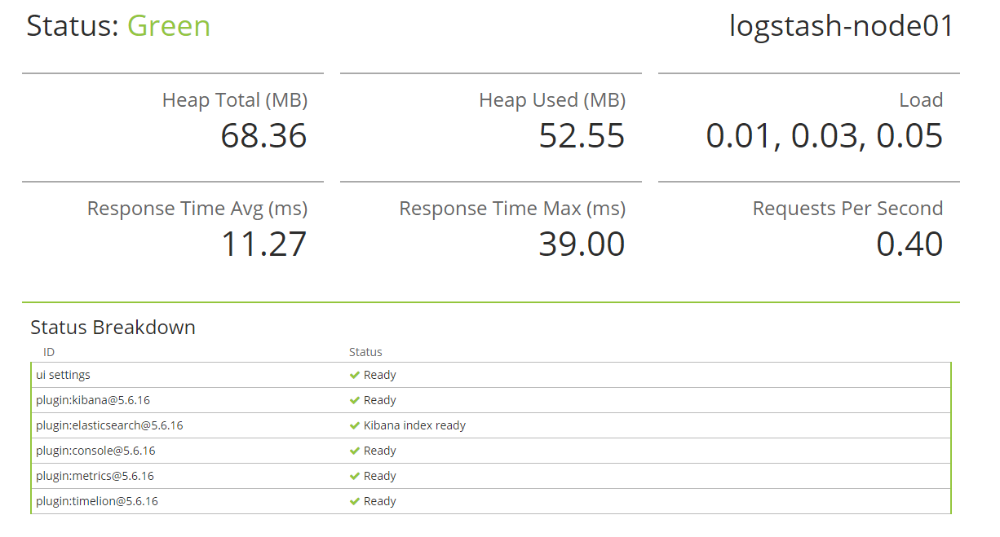
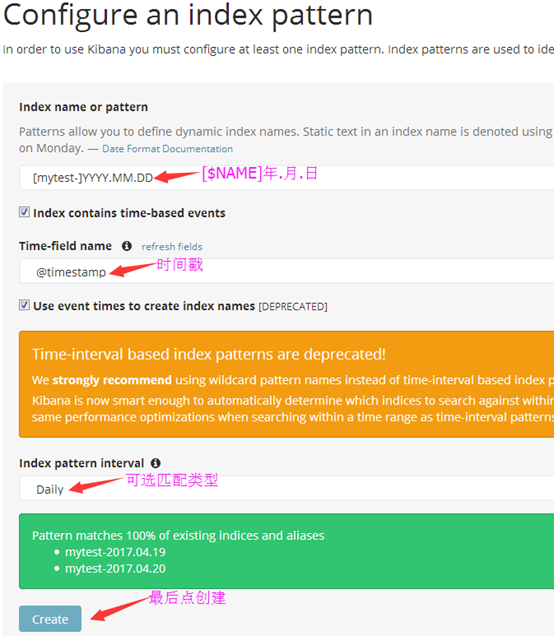
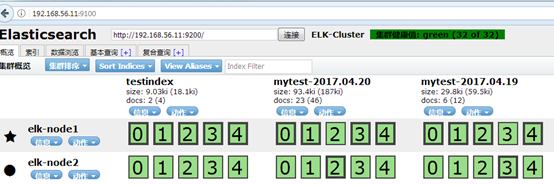

[TOC]

# 简介

Kibana是一个通过调用elasticsearch服务器进行图形化展示搜索结果的开源项目。主要是通过接口调用elasticsearch的数据，并进行前端数据可视化的展现。

# 安装

可以通过rpm包或者二进制的方式进行安装。

```shell
[root@node01 ~]# rpm -ivh kibana-5.6.16-x86_64.rpm
[root@node01 ~]# rpm -ql kibana | head
[root@node01 ~]# vim /etc/kibana/kibana.yml
'''
server.port: 5601  # 监听端口
server.host: "0.0.0.0"  # 监听地址
server.name: "logstash-node01"
elasticsearch.url: "http://192.168.100.31:9200"  # elasticsearch服务器地址
elasticsearch.preserveHost: true
kibana.index: ".kibana"
'''
[root@node01 ~]# systemctl start kibana
[root@node01 ~]# systemctl enable kibana
[root@node01 ~]# systemctl status kibana
[root@node01 ~]# ss -tnlp | grep 5601
```

URL:

http://192.168.100.41:5601/

http://192.168.100.41:5601/status




# 数据展示

## 添加索引数据

在logstash服务器上：

```shell
[root@node01 ~]# logstash  -e 'input { stdin{} } output { elasticsearch {hosts => ["192.168.100.31:9200"] index => "mytest-%{+YYYY.MM.dd}" }}'
'''
hello,world.
123123
'''
```

在kibana页面操作：




注意，YYYY.MM.dd中的dd在logstash是小写，在kibana中是大写DD。

如果默认没有显示柱状的图，可能是最近没有写入新的数据，可以查看较长日期当中的数据或者通过logstash新写入数据即可。

## head插件显示的索引状态

