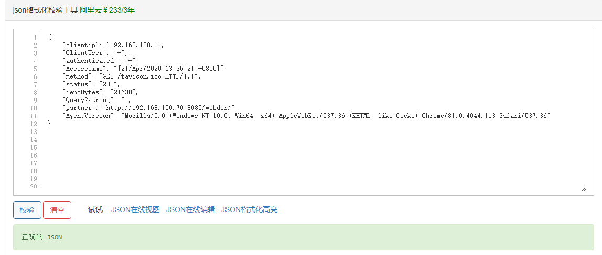

[TOC]

# 需求

收集Tomcat服务器的访问日志以及Tomcat错误日志进行实时统计，在kibana页面进行搜索展现。

tomcat --> filebeat ---> redis ---> logstash ---> elasticsearch ---> kibana

filebeat安装在tomcat(192.168.100.70)本机，收集tomcat的catalina.out日志和access日志数据，发送至redis服务器(192.168.100.21)；

logstash(192.168.100.33)从redis读取数据进行处理，然后发送至elasticsearch 服务器(192.168.100.31)；

kibana安装在elasticsearch 服务器本机上，读取elasticsearch收到的数据并展示到前端。


# 安装tomcat

安装JAVA环境，部署一个web界面进行测试.

系统：CentOS release 6.10 (Final)

hostname：tomcat-node01

IP：192.168.100.70

jdk: jdk-8u241-linux-x64.tar.gz

path: /usr/local/jdk

tomcat: apache-tomcat-8.5.51.tar.gz

path: /usr/local/tomcat

```shell
[root@tomcat-node01 ~]# cd /usr/local/src
[root@tomcat-node01 src]# tar xf jdk-8u241-linux-x64.tar.gz -C /usr/local/
[root@tomcat-node01 src]# tar xf apache-tomcat-8.5.51.tar.gz -C ../
[root@tomcat-node01 src]# cd ..
[root@tomcat-node01 local]# ln -sv /usr/local/jdk1.8.0_241 /usr/local/jdk
[root@tomcat-node01 local]# ll
[root@tomcat-node01 local]# llvim /etc/profile
'''
# jdk env
export JAVA_HOME=/usr/local/jdk
export PATH=$JAVA_HOME/bin:$JAVA_HOME/jre/bin:$PATH
export CLASSPATH=.$CLASSPATH:$JAVA_HOME/lib:$JAVA_HOME/jre/lib:$JAVA_HOME/lib/tools.jar
'''

[root@tomcat-node01 local]# source  /etc/profile && java -version

[root@tomcat-node01 local]# ln -sv /usr/local/apache-tomcat-8.5.51/ /usr/local/tomcat

[root@tomcat-node01 local]# cd tomcat/webapps
[root@linux-host6 webapps]# mkdir /usr/local/tomcat/webapps/webdir 
[root@linux-host6 webapps]# echo "Tomcat Page" > webdir/index.html 
[root@linux-host6 webapps]# ../bin/catalina.sh  start
[root@linux-host6 webapps]# ss -tnl | grep 8080
LISTEN     0      100         :::8080 
```

测试访问tomcat：

http://192.168.100.70:8080/webdir/

# tomcat日志转json

```shell
[root@tomcat-node01 tomcat]# vim conf/server.xml
'''
<Valve className="org.apache.catalina.valves.AccessLogValve" directory="logs"
               prefix="tomcat-node01_access_log" suffix=".log"
               pattern="{&quot;clientip&quot;:&quot;%h&quot;,&quot;ClientUser&quot;:&quot;%l&quot;,&quot;authenticated&quot;:&quot;%u&quot;,&quot;AccessTime&quot;:&quot;%t&quot;,&quot;method&quot;:&quot;%r&quot;,&quot;status&quot;:&quot;%s&quot;,&quot;SendBytes&quot;:&quot;%b&quot;,&quot;Query?string&quot;:&quot;%q&quot;,&quot;partner&quot;:&quot;%{Referer}i&quot;,&quot;AgentVersion&quot;:&quot;%{User-Agent}i&quot;}" />
'''
[root@tomcat-node01 tomcat]# ./bin/catalina.sh stop
[root@tomcat-node01 tomcat]# rm -rf logs/*  # 删除或清空之前的访问日志
[root@tomcat-node01 tomcat]# ./bin/catalina.sh start
[root@tomcat-node01 tomcat]# tail -f logs/tomcat-node01_access_log.2020-04-21.log
```

访问一下测试页面，查看日志。

```shell
{"clientip":"192.168.100.1","ClientUser":"-","authenticated":"-","AccessTime":"[21/Apr/2020:13:35:21 +0800]","method":"GET /favicon.ico HTTP/1.1","status":"200","SendBytes":"21630","Query?string":"","partner":"http://192.168.100.70:8080/webdir/","AgentVersion":"Mozilla/5.0 (Windows NT 10.0; Win64; x64) AppleWebKit/537.36 (KHTML, like Gecko) Chrome/81.0.4044.113 Safari/537.36"}
```

验证日志是否json格式，将日志内容复制到 http://www.kjson.com/ 进行验证。



json格式数据可以使用很多方法来提取指定字段，比如python。

# 收集tomcat日志

## 使用logstash收集

在tomcat服务器安装logstash收集tomcat和系统日志.

```shell
[root@tomcat-node01 ~]# yum install logstash-5.3.0.rpm  -y
[root@tomcat-node01 ~]# cat /etc/logstash/conf.d/tomcat.conf 
input {
  file {
    path => "/usr/local/tomcat/logs/tomcat-node01_access_log.*.log"
    start_position => "end"
    type => "tomcat-node01-access-log"
  }
  file { 
    path => "/var/log/messages"
    start_position => "end"
    type => "tomcat-node01-system-log"
  }
}

output {
  if [type] == "tomcat-node01-access-log" {
    elasticsearch {
      hosts => ["192.168.100.31:9200","192.168.100.32:9200"]
      index => "tomcat-node01-access-log-%{+YYYY.MM.dd}"
      codec => "json"
    }
  }

  if [type] == "tomcat-node01-system-log" {
    elasticsearch {
      hosts => ["192.168.100.31:9200","192.168.100.32:9200"]
      index => "tomcat-node01-system-log-%{+YYYY.MM.dd}"
	}
  }
}
```

重启logstash并确认

```shell
[root@tomcat-node01 ~]# chmod  644 /var/log/messages
[root@tomcat-node01 ~]# systemctl restart logstash  # 更改完配置文件重启logstash
[root@tomcat-node01 ~]# tail -f /var/log/logstash/logstash-plain.log  # 验证日志
```

访问tomcat，并向/var/log/messages写入一段测试日志

```shell
[root@tomcat-node01 ~]# echo "test for 2017-02-21" >> /var/log/messages
```

访问head插件验证索引

在kibana添加[tomcat-node01-access-log-]YYYY.MM.DD

在kibana添加[tomcat-node01-system-log-]YYYY.MM.DD

在其它服务器使用ab批量访问并验证数据

```shell
[root@tomcat-node01 ~]# yum install httpd-tools –y
[root@tomcat-node01 ~]# ab -n1000 -c100 http://192.168.100.70:8080/webdir/
```


## 使用filebeat收集

安装filebeat

```shell
[root@tomcat-node01 src]# rpm -ivh filebeat-5.6.16-x86_64.rpm
[root@tomcat-node01 src]# ab -n100 -c100 http://192.168.100.70:8080/web
[root@tomcat-node01 src]# tail -50 /usr/local/tomcat/logs/tomcat-node01_access_log.2020-04-21.log
'''
{"clientip":"192.168.100.70","ClientUser":"-","authenticated":"-","AccessTime":"[21/Apr/2020:16:26:02 +0800]","method":"GET /web HTTP/1.0","status":"404","SendBytes":"712","Query?string":"","partner":"-","AgentVersion":"ApacheBench/2.3"}
'''
```

配置filebeat收集数据并发送至redis

```shell
[root@tomcat-node01 src]# cd /etc/filebeat/
[root@tomcat-node01 filebeat]# cp filebeat.yml{,.bak}
[root@tomcat-node01 filebeat]# grep -v "#"  /etc/filebeat/filebeat.yml | grep -v "^$"
'''
filebeat.prospectors:
- input_type: log
  paths:
    - /usr/local/tomcat/logs/tomcat-node01_access_log.*.log
  document_type: tomcat-access-log

output.redis:
  enabled: true
  hosts: ["192.168.100.21:6379"]
  key: "tomcat-node01-access-log"
  password: "123.com"
  db: 1
  timeout: 5
  datatype: list
'''

[root@tomcat-node01 filebeat]# service filebeat start
```

在redis服务器上查看数据

```shell
[root@redis-node01 ~]# redis-cli -a 123.com
127.0.0.1:6379> KEYS *
(empty list or set)
127.0.0.1:6379> SELECT 1
OK
127.0.0.1:6379[1]> KEYS *
1) "tomcat-node01-access-log"
127.0.0.1:6379[1]> LLEN tomcat-node01-access-log
(integer) 114
127.0.0.1:6379[1]> RPOP tomcat-node01-access-log
```

配置logstash从redis取数据

在logstash服务器上操作

```shell
[root@logstash-node01 conf.d]# vim redis-els.conf
'''
input {
        redis {
                host => "192.168.100.21"
                port => "6379"
                password => "123.com"
                db => "1"
                key => "tomcat-node01-access-log"
                data_type => "list"
        }
}

output {
        elasticsearch {
                hosts => ["192.168.100.31:9200"]
                index => "tomcat-node01-access-log"
                document_type => "tomcat-node01-access-log"
        }
}
'''

[root@logstash-node01 conf.d]# logstash -f redis-els.conf -t
[root@logstash-node01 conf.d]# logstash -f redis-els.conf
```

在elasticsearch服务器上验证

```shell
[root@elasticsearch-node01 elasticsearch-head]# curl http://192.168.100.31:9200/_cat/indices

# or
[root@elasticsearch-node01 elasticsearch-head]# cd /usr/local/src/elasticsearch-head
[root@elasticsearch-node01 elasticsearch-head]# npm run start &
```

http://192.168.100.31:9100/

访问kibana：http://192.168.100.31:5601/

添加索引tomcat-node01-access-log

然后访问tomcat页面，验证数据。

