[TOC]

# 环境准备

 

```
# 系统版本
cat /etc/redhat-release
'''
CentOS Linux release 7.5.1804 (Core) 
'''

# 安装常用软件
yum install vim gcc gcc-c++ wget net-tools lrzsz iotop lsof iotop bash-completion -y

# 安装依赖包
yum install curl policycoreutils openssh-server openssh-clients postfix -y

# 安装epel源
wget -O /etc/yum.repos.d/epel.repo http://mirrors.aliyun.com/repo/epel-7.repo

# 关闭防火墙
systemctl disable firewalld

# 关闭selinux
sed -i '/SELINUX/s/enforcing/disabled/' /etc/sysconfig/selinux

# 设置主机名
hostnamectl set-hostname xxx.com.cn

# 更新yum源并重启
yum update –y && yum makecache && reboot
```

做快照

# 安装配置

官方下载地址：https://packages.gitlab.com/gitlab/gitlab-ce

清华镜像下载：https://mirrors.tuna.tsinghua.edu.cn/gitlab-ce/yum/

 

```
vim /etc/yum.repos.d/gitlab.repo
'''
[gitlab-ce]
name=gitlab-ce
baseurl=http://mirrors.tuna.tsinghua.edu.cn/gitlab-ce/yum/el7
repo_gpgcheck=0
gpgcheck=0
enabled=1
gpgkey=https://packages.gitlab.com/gpg.key
'''

yum install -y gitlab-ce

grep "^[a-Z]" /etc/gitlab/gitlab.rb
'''
external_url "http://19.87.2.12"   # web访问地址

# 邮件相关配置
gitlab_rails['smtp_enable'] = true
gitlab_rails['smtp_address'] = "smtp.163.com"
gitlab_rails['smtp_port'] = 25
gitlab_rails['smtp_user_name'] = "xinyixzy001@163.com"
gitlab_rails['smtp_password'] = "xf19870820"
gitlab_rails['smtp_domain'] = "163.com"
gitlab_rails['smtp_authentication'] = :login
gitlab_rails['smtp_enable_starttls_auto'] = true
gitlab_rails['smtp_tls'] = false  # 如果这里为true，则端口为465
gitlab_rails['gitlab_email_from'] = "xinyixzy001@163.com"
gitlab_rails['gitlab_email_display_name'] = 'Gitlab'
user["git_user_email"] = "xinyixzy001@163.com"
'''

# 初始化gitlib服务
gitlab-ctl reconfigure  # 修改完配置文件要执行此操作

# 测试发送邮件
gitlab-rails console

# 进入控制台，然后发送邮件
irb(main):003:0> Notify.test_email('1023668666@qq.com', 'hello,world', 'askdksafafkjslkfjlksjfl').deliver_now


# 服务重启操作
gitlab-ctl  start
gitlab-ctl  stop
gitlab-ctl  restart

# 验证端口及服务状态
ss -tnlp
gitlab-ctl status

# 80端口和8080端口是在初始化gitlib的时候启动的，因此如果之前的有程序占用会导致初始化失败或无法访问
lsof -i :80
lsof -i :8080
```

WEB访问：http://19.87.2.12

# 账户管理

默认用户为root，第一次登录会提示修改密码，最少8位。这里设置成12345678

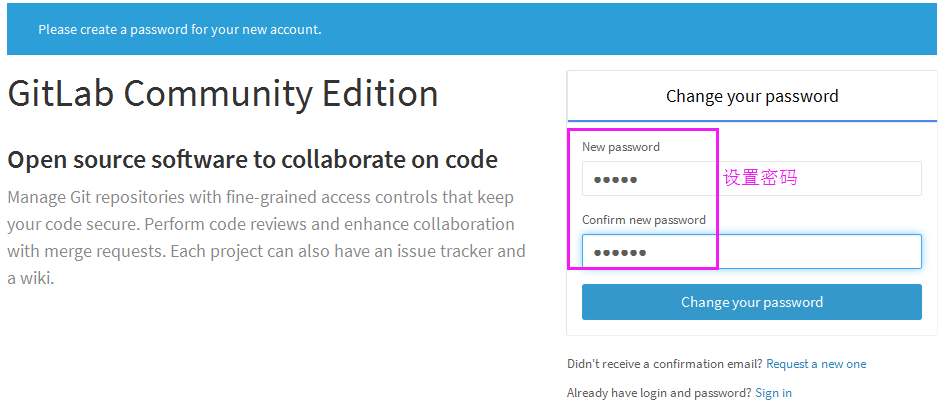

登陆后默认显示页面：

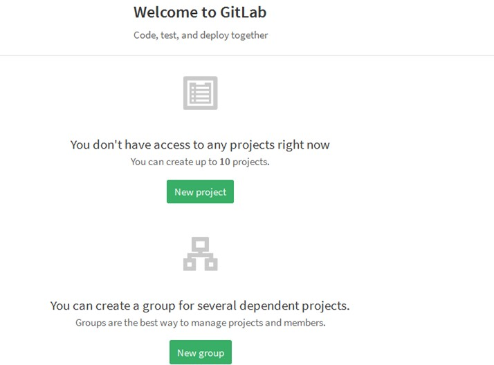

## 忘记root密码

 

```
gitlab-rails console production
'''
Loading production environment (Rails 4.2.5.2)
'''

irb(main):001:0> user = User.where(id: 1).first
# id为1的用户显示Administrator,别名是root

irb(main):002:0> user.password=12345678
=> 12345678

irb(main):003:0> user.password_confirmation=12345678
=> 12345678

irb(main):004:0> user.save!  # 注意最后叹号
true

irb(main):005:0> quit
```

默认开启账号注册功能，作为私有仓库，一般关闭此功能。

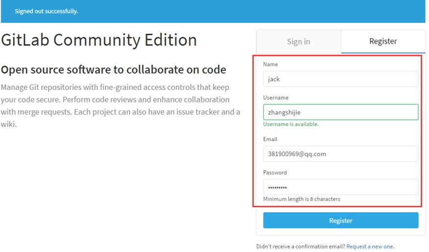

关闭注册功能：

1，以管理员身份登录进GitLab平台；

2，点击[Admin Area]

3，点击[Settings]

4，点击下面的[Settings]

5，在[Settings]页面控制[Sign-up Restrictions]，进入[Settings]页面如下图所示： 

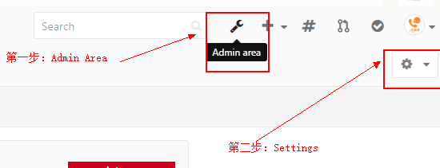

关闭账号注册功能，取消注册功能后记得save

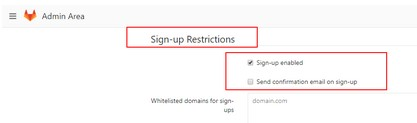

创建一个普通用户，名字为xiaofei

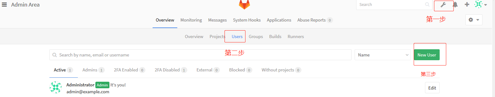

填写账户信息，如下图

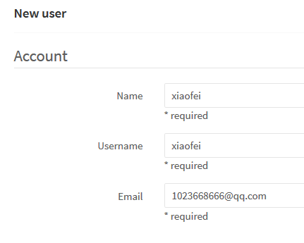

密码在创建时，无法设置密码。

可以在创建用户完成以后，在编辑用户，设置初始密码12345678。

或者在新用户登录时，通过邮箱重置自己的密码。

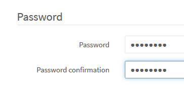

然后退出管理员账户，登录，新账号首次登陆会提示设置新密码

# 创建项目

创建组

创建项目前，需要先创建项目组，这样在创建新项目前直接归属于指定的组。

组里面可以有多个项目分支，可以将开发添加到组里面进行设置权限，不同的组就是公司不同的开发项目或者业务模块，不同的组添加不同的开发即可实现对开发设置权限的管理。

这里我们创建组myweb，并设置成私有，仅组内成员可见。

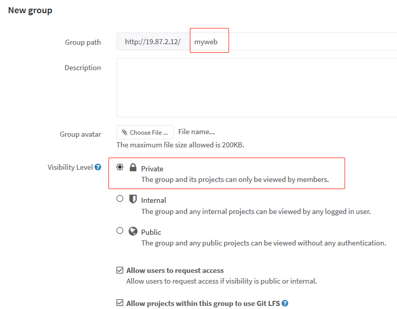

将指定用户添加到组

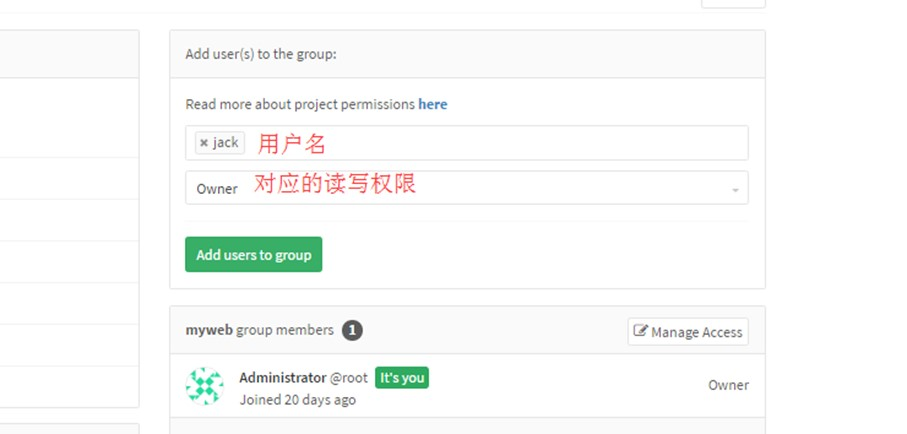

创建项目

使用管理员创建一个项目

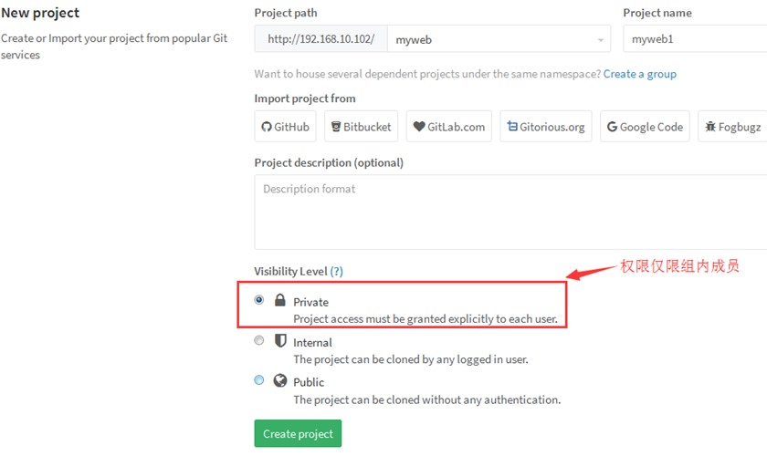

为项目创建一个index.html页面

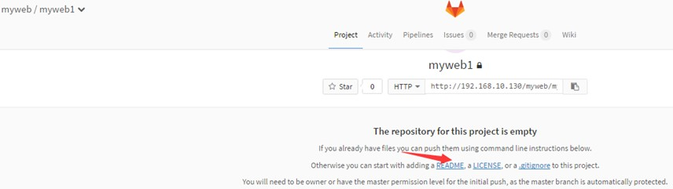

添加内容

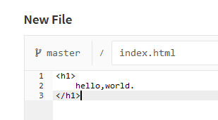


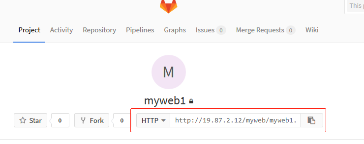

至此，服务端的环境配置的差不多了，接下来模拟使用git客户端拉取代码修改代码并上传代码

# Git客户端

 

```
yum install git –y

git config --global user.email "you@example.com"
git config --global user.name "Your Name"

mkdir  /source
cd /source/

# 拉取代码
git clone  http://19.87.2.12/myweb/myweb1.git
'''
Cloning into 'myweb1'...
Username for 'http://19.87.2.12': xiaofei  # git用户名
Password for 'http://xiaofei@19.87.2.12':   # 密码
remote: Counting objects: 3, done.
remote: Total 3 (delta 0), reused 0 (delta 0)
Unpacking objects: 100% (3/3), done.
'''

ls -l
'''
total 0
drwxr-xr-x 3 root root 36 Sep 21 15:32 myweb1
'''

cd myweb1/
ls
'''
index.html
'''

cat index.html
'''
<h1>
    hello,world.
</h1>
'''

# 修改代码
vim index.html 
'''
<h1>
    hello,world.
</h1>
<h1>
    11111111
</h1>
'''

git add index.html  # 提交到本地git暂存区
git commit -m "333"  # 提交到git工作区
git push  # 上传到git服务器
```

回到GitLab网页上查看验证index.html是否被更新

# Git常用命令

git config --global user.name “name“ #设置全局用户名，可以非真实账户

git config --global user.email  xxx@xx.com #设置全局邮箱，可以非真实邮箱

git config --global –list #列出用户全局设置

git  add index.html  #添加文件到暂存区

git commit -m  "V1" #提交文件到工作区

git status #查看工作区的状态

git push #提交代码到服务器

git pull  #获取代码到本地

git log #查看操作日志

vim  .gitignore  #定义忽略文件

git reset --hard  HEAD^  #git版本回滚， HEAD为当前版本，加一个^为上一个，^^为上上一个版本

git reflog # #获取每次提交的ID，可以使用--hard根据提交的ID进行版本回退

git reset --hard 5ae4b06 #回退到指定id的版本

git branch  #查看当前所处的分支

git checkout --  file  #从服务器更新某个那文件覆盖本地的文件