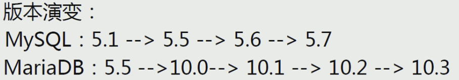
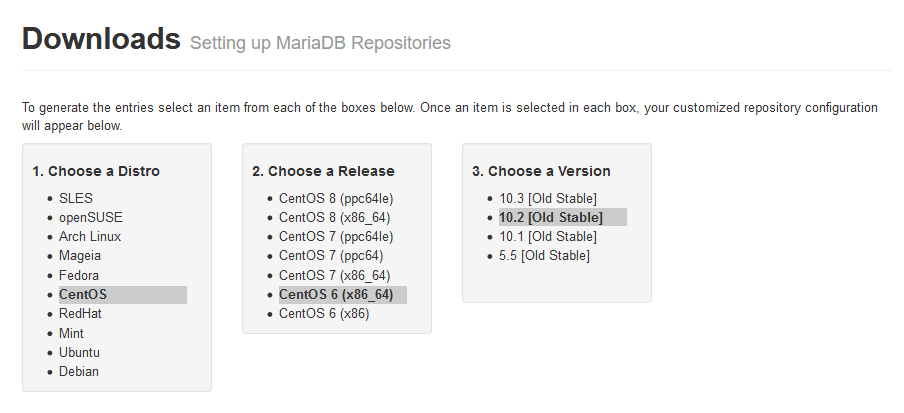

[TOC]

# 一，安装




## 1.1 源码安装

同mysql

## 1.2 二进制安装

同mysql

## 1.3 yum安装

参考地址：https://downloads.mariadb.org/mariadb/repositories/



yum配置：

```shell
[root@mysql_server ~]# vim /etc/yum.repo.d/mariadb.repo
"""
# MariaDB 10.2 CentOS repository list - created 2020-01-15 02:51 UTC
# http://downloads.mariadb.org/mariadb/repositories/
[mariadb]
name = MariaDB
baseurl = http://yum.mariadb.org/10.2/centos6-amd64
gpgkey=https://yum.mariadb.org/RPM-GPG-KEY-MariaDB
gpgcheck=1
"""

yum clean all
yum install -y MariaDB-server
```

注意：此安装方式对网络要求较高。


各版本说明

mariadb-10.2.11.tar.gz   源代码包，编译用的
Galera 25.3.22   搞mariadb集群用的，单机不需要


mariadb-10.2.11-winx64.msi
mariadb-10.2.11-winx64.zip
mariadb-10.2.11-win32.zip
mariadb-10.2.11-win32.msi   //这几个就不用说了吧，Windows上面用的。


//下面这个包是包含glibc的二进制包
mariadb-10.2.11-linux-glibc_214-x86_64.tar.gz (requires GLIBC_2.14+)  


//各linux发行版二进制通用包，比如centos6
mariadb-10.2.11-linux-x86_64.tar.gz


//支持systemd的二进制包， 比如centos7 systemd
mariadb-10.2.11-linux-systemd-x86_64.tar.gz (for systems with systemd)


//下面这几个是32位linux的包
mariadb-10.2.11-linux-i686.tar.gz
mariadb-10.2.11-linux-systemd-i686.tar.gz (for systems with systemd)
mariadb-10.2.11-linux-glibc_214-i686.tar.gz (requires GLIBC_2.14+)


//下面这两个是rpm包
Debian and Ubuntu Packages
Red Hat, Fedora, and CentOS Packages


