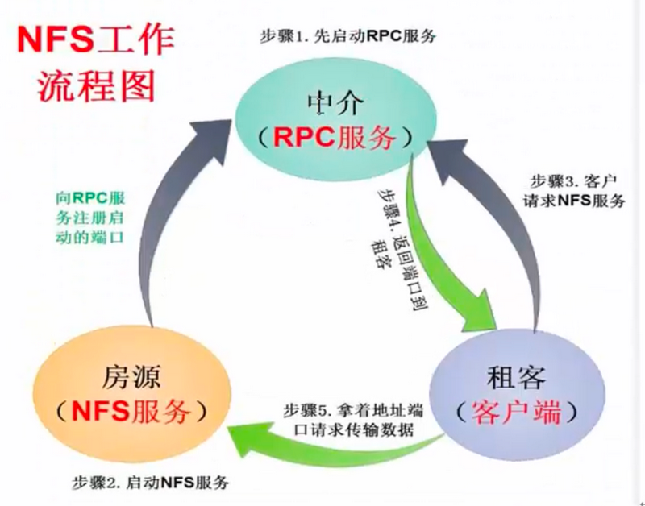
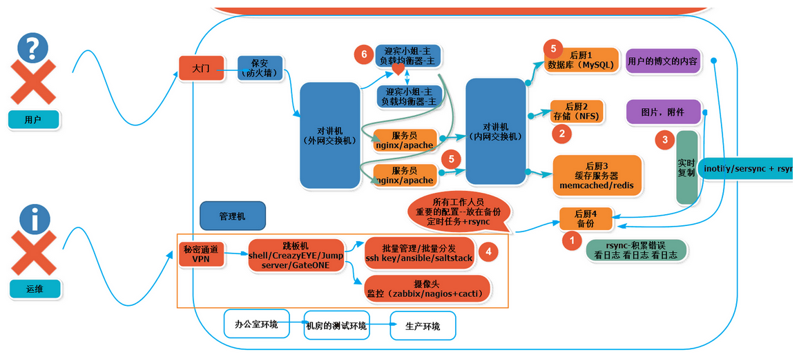
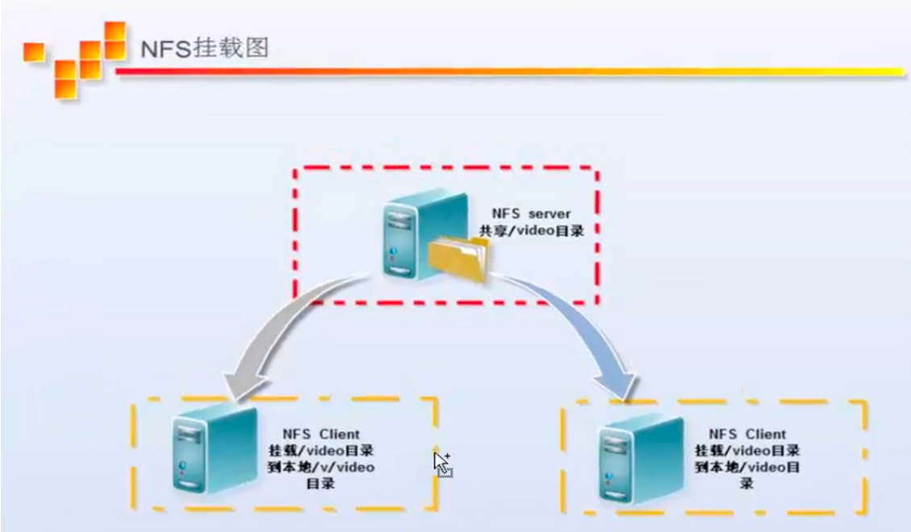
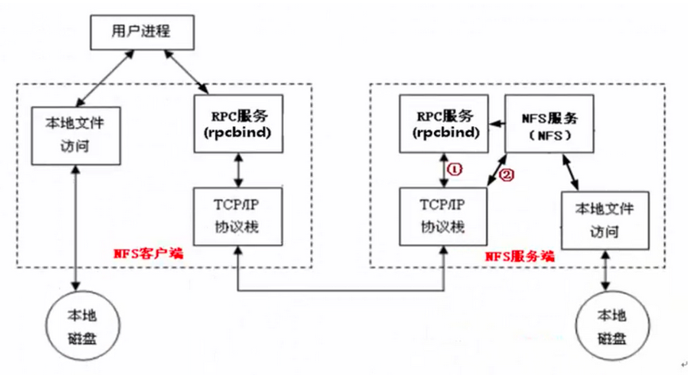
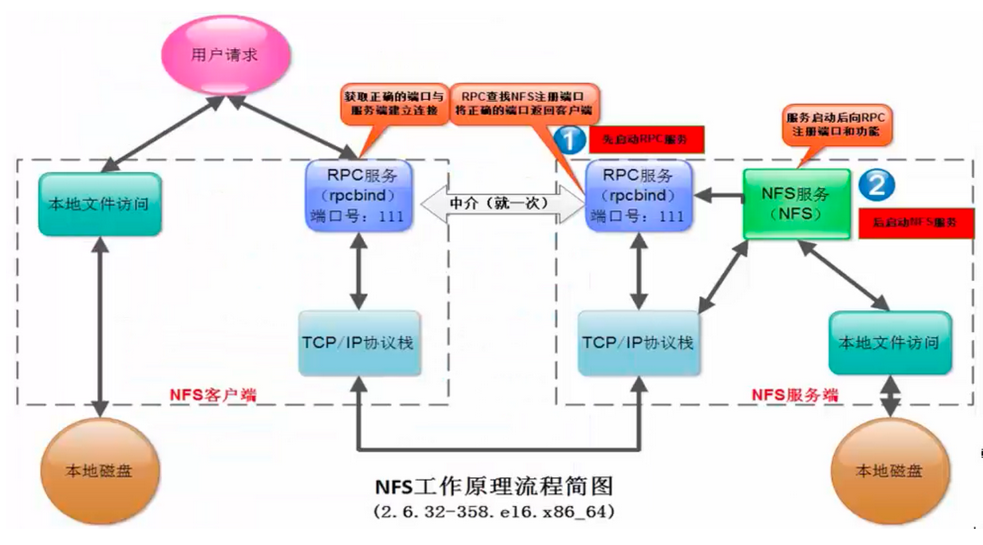
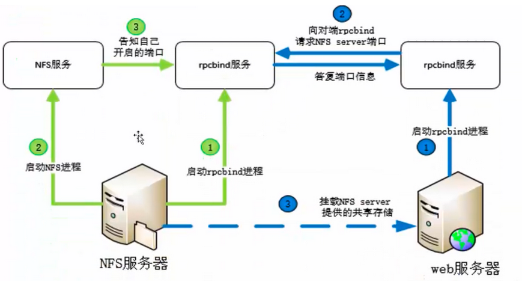
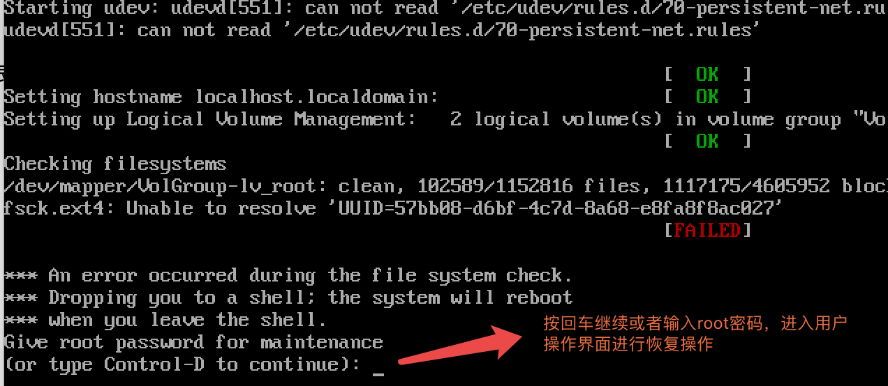
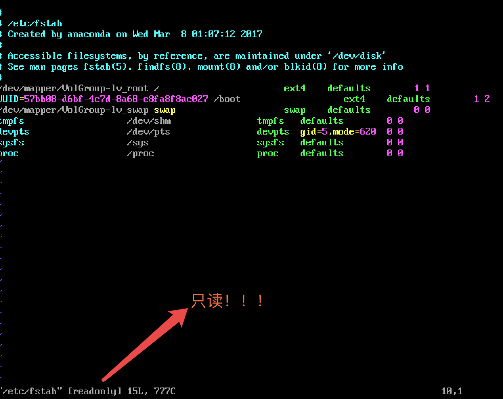
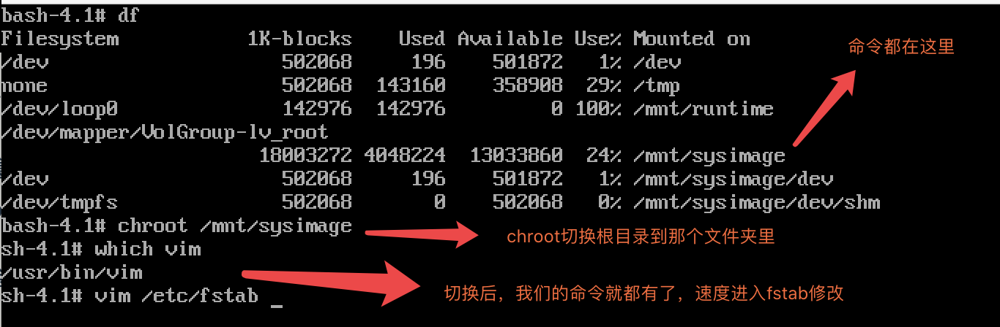

[TOC]

# NFS简介

NFS 是Network File System的缩写，即网络文件系统。一种使用于分散式文件系统的协定，由Sun公司开发，于1984年向外公布。功能是通过网络让不同的机器、不同的操作系统能够彼此分享个别的数据，让应用程序在客户端通过网络访问位于服务器磁盘中的数据，是在类Unix系统间实现磁盘文件共享的一种方法。NFS 的基本原则是“容许不同的客户端及服务端通过一组RPC分享相同的文件系统”，它是独立于操作系统，容许不同硬件及操作系统的系统共同进行文件的分享。

NFS客户端（一般为应用服务器，例如web）可以通过挂载（mount）的方式将NFS服务器端共享的数据目录挂载到NFS客户端本地系统中（就是某一个挂载点下）。从客户端本地看，NFS服务器端共享的目录就好像是客户端自己的磁盘分区或者目录一样，而实际上却是远端的NFS服务器的目录。

NFS网络文件系统很像Windows系统的网络共享，安全功能，网络驱动器影射，这也和Linux系统里的samba服务类似。只不过一般情况下，Windows网络共享服务或samba服务用于办公局域网共享，而互联网中小型网站集群架构后端常用NFS进行数据共享。

NFS在文件传送或信息传送过程中==依赖于RPC协议==。

## RPC

RPC，远程过程调用 (Remote Procedure Call) ，能使客户端执行其他系统中程序的一种机制。

因为NFS支持的功能相当多，而不同的功能都会使用不同的程序来启动，每启动一个功能就会启用一些端口来传输数据，因此，NFS的功能所对应的端口无法固定，它会随机取用一些未被使用的端口来作为传输之用，其中CentOS5.x的随机端口都小于1024，而CentOS6.x的随机端口都是较大的。

因为端口不固定，这样一来就会造成NFS客户端与NFS服务端的通信障碍，因为NFS客户端必须要知道NFS服务端的数据传输端口才能进行通信，才能交互数据。

要解决上面的困扰，就需要通过远程过程调用RPC服务来帮忙了，NFS的RPC服务最主要的功能就是记录每个NFS功能所对应的端口号，并且在NFS客户端请求时将该端口和功能对应的信息传递给请求数据的NFS客户端，从而确保客户端可以连接到正确的NFS端口上去，达到实现数据传输交互数据目的。

这个RPC服务类似NFS服务端和NFS客户端之间的一个中介。

可以这么理解RPC和NFS的关系：

NFS是一个文件系统，而RPC是负责负责信息的传输。

比如房东(nfs_ser) -- 中介(rpc) -- 租客(client)之间的关系：

假设我们要找房子，这里的我们就相当于NFS客户端，中介介绍房子，中介就相当于RPC服务，房子所有者房东就相当于NFS服务，租房的人找房子，就要找中介，中介要预先存有房子主人房东的信息，才能将房源信息告诉租房的人。



那么RPC服务又是如何知道每个NFS的端口呢？
这是因为，当NFS服务端启动服务时会随机取用若干端口，并主动向RPC服务注册取用的相关端口及功能信息，如此一来，RPC服务就知道NFS每个端口对应的NFS功能了，然后RPC服务使用固定的111端口来监听NFS客户端提交的请求，并将正确的NFS端口信息回复给请求的NFS客户端，这样一来，NFS客户端就可以与NFS服务端进行数据传输了。
在启动NFS SERVER之前，首先要启动RPC服务（CentOS5.x下为portmap服务，CentOS6.x下为rpcbind服务，下同），否则NFS SERVER就无法向RPC服务注册了。另外，如果RPC服务重新启动，原来已经注册好的NFS端口数据就会丢失，因此，此时RPC服务管理的NFS程序也需要重新启动以重新向RPC注册。要特别注意的是，一般修改NFS配置文件后，是不需要重启NFS的，直接在命令行执行/etc/init.d/nfs reload或exportfs -rv即可使修改的/etc/exports生效。

## 企业应用

- 在企业集群架构的工作场景中，NFS网络文件系统一般被用来存储共享视频，图片，附件等静态资源文件，通常网站用户上传的文件都会放到NFS共享里，例如：BBS产品的图片，附件，头像（注意网站BBS程序不要放NFS共享里），然后前端所有的节点访问这些静态资源时都会读取NFS存储上的资源。NFS是当前互联网系统架构中最常用的数据存储服务之一，前面说过，中小型网站公司应用频率更高，大公司或门户除了使用NFS外，还可能会使用更为复杂的分布式文件系统，比如Moosefs（mfs），GlusterFS，FastDFS等。


- 在企业生产集群架构中，NFS作为所有前端Web服务的共享存储，存储的内容一般包括网站用户上传的图片，附件，头像等，注意，网站的程序代码不要放NFS共享里，因为网站程序是开发运维人员统一发布的，不存在发布延迟问题，直接批量发布到Web节点提供访问比共享到NFS里访问效率更高。




## 企业生产集群为什么需要共享存储角色

这里通过图解给大家展示以下集群架构需要共享存储服务的理由。

例如：

A用户上传图片到Web1服务器，然后让B用户访问这张图片，结果B用户访问的请求分发到了Web2，因为Web2上没有这张图片，这就导致它无法看到A用户上传的图片，如果此时有一个共享存储，A用户上传图片的请求无论是分发到Web1还是Web2上，最终都会存储到共享存储上，而在B用户访问图片时，无论请求分发到Web1还是Web2上，最终也都会去共享存储上找，这样就可以访问到需要的资源了。这个共享存储的位置可以通过开源软件和商业硬件实现，互联网中小型集群架构会用普通PC服务器配置NFS网络文件系统实现。

当及集群中没有NFS共享存储时，用户访问图片的情况如下图所示：


上图是企业生产集群没有NFS共享存储访问的示意图。下图是企业生产集群有NFS共享存储的情况：


中小型互联网企业一般不会买硬件存储，因为太贵，大公司如果业务发展很快的话，可能会临时买硬件存储顶一下网站压力，当网站并发继续加大时，硬件存储的扩展相对就会很费劲，且价格成几何级数增加。

例如：淘宝网就曾替换掉了很多硬件设备，比如，用 lvs+haproxy 替换了 netscaler 负载均衡设备，用FastDFS，TFS配合PC服务器替换了netapp，emc等商业存储设备，去IOE正在成为互联网公司的主流。

## 原理

### 系统挂载结构图解与介绍

下图是企业工作中的NFS服务器与客户端挂载情况结构图：



可以看到NFS服务器端/video共享目录挂载到了两台NFS客户端上。在客户端查看时，NFS服务器端的/video目录就相当于客户端本地的磁盘分区或目录，几乎感觉不到使用上的区别，根据NFS服务端授予的NFS共享权限以及共享目录的本地系统权限，只要在指定的NFS客户端操作挂载/v/video或者/video的目录，就可以将数据轻松地存取到NFS服务器端上的/video目录中了。

客户端挂载NFS后，本地挂载基本信息显示如下：

```shell
[root@nfs01 ~]# df -h
Filesystem      Size    Used    Use%    Mounted on
/dev/sda1       1.1T    467G    544G    47% /
tmpfs           7.9G    0       7.9G    0%  /dev/shm
10.0.0.7:/video 1002G   59G     892G    7%  /video   #<==10.0.0.7为nfsserver的ip地址

"""
提示:mount 源 目标
mount 10.0.0.7:/video   /video
"""
```

从挂载信息来看，和本地磁盘分区几乎没什么差别，只是文件系统对应列的开头是以IP滴噢址开头的形式了。

经过前面的介绍，我们知道NFS系统是通过网络来进行数据传输的（所以叫做网络文件系统）因此，NFS会使用一些端口来传输数据，那么，NFS到底使用哪些端口来进行数据传输呢？NFS在传输数据时使用的端口会随机选择。可能有同学会纳闷，既然这样，NFS客户端是怎么知道NFS服务端使用的哪个端口呢？答案就是通过RPC（中文意思远程过程调用，英文Remote Procedure Call简称RPC）协议/服务来实现，这个RPC服务的应用在门户级的网站有很多，例如：百度等。

### 工作流程原理





当访问程序通过NFS客户端向NFS服务端存取文件时，其请求数据流程大致如下：

1）首先用户访问网站程序，由程序在NFS客户端上发出存取NFS文件的请求，这时NFS客户端（即执行程序的服务器）的RPC服务（rpcbind服务）就会通过网络向NFS服务器端的RPC服务（rpcbind服务）的111端口发出NFS文件存取功能的询问请求。

2）NFS服务端的RPC服务（rpcbind服务）找到对应的已注册的NFS端口后，通知NFS客户端的RPC服务（rpcbind服务）

3）此时NFS客户端获取到正确的端口，并与NFS daemon联机存取数据

4）NFS客户端把数据存取成功后，返回给前端访问程序，告知给用户存取结果，作为网站用户，就完成了一次存取操作。

因为NFS的各项功能都需要向RPC服务（rpcbind服务）注册，所以只有RPC服务（rpcbind服务）才能获取到NFS服务的各项功能对应的端口号（port number），PID，NFS在主机所监听的IP等信息，而NFS客户端也只能通过向RPC服务（rpcbind服务）询问才能找到正确的端口。也就是说，NFS需要有RPC服务（rpcbind服务）的协助才能成功对外提供服务。从上面的描述，我们不难推断，无论是NFS客户端还是NFS服务器端，当要使用NFS时，都需要首先启动RPC服务（rpcbind服务），NFS服务必须在RPC服务启动之后启动，客户端无需启动NFS服务，但需要启动RPC服务。

注意：
NFS的RPC服务，在CentOS5.X下名称为portmap，在CentOS6.x下名称为rpcbind

## 部署

### 资源规划

| 角色               | 主机名 | eth0（外网） | eth1（内网） |
| ------------------ | ------ | ------------ | ------------ |
| C1-NFS服务器端     | nfs01  | 10.0.0.31    | 172.16.1.31  |
| C2-Rsync存储服务器 | backup | 10.0.0.41    | 172.16.1.41  |
| B2-nginx web服务器 | web01  | 10.0.0.8     | 172.16.1.8   |


### NFS服务端配置

要部署NFS服务，需要安装下面的软件包：

- nfs-utils
  NFS服务的主程序，包括rpc.nfsd,rpc.mountd这两个daemons和相关文档说明，以及执行命令文件
- rpcbind
  CentOS6.X下面RPC的主程序。NFS可以视为一个RPC程序，在启动任何一个RPC程序之前，需要做好端口和功能的对应映射工作，这个映射工作就是由rpcbind服务来完成的。因此，在提供NFS服务之前必须先启动rpcbind服务才行。

```shell
[root@nfs01 ~]# yum -y install nfs-utils rpcbind
[root@nfs01 ~]# rpm -qa nfs-utils rpcbind

[root@nfs01 backup]# which rpcinfo # 查询命令绝对路径
[root@nfs01 backup]# rpm -qf /usr/sbin/rpcinfo # 查询某个命令属于已经安装的哪个rpm包
[root@nfs01 backup]# rpm -qf `which showmount`
```

因为NFS及其辅助程序都是基于RPC（remote Procedure Call）协议的（使用的端口为111），所以首先要确保系统中运行了rpcbind服务。启动的实际操作如下：

```shell
[root@nfs01 backup]# /etc/init.d/rpcbind status

# 启动rpcbind服务
[root@nfs01 backup]# /etc/init.d/rpcbind start

# 查看NFS服务向rpc服务注册的端口信息，因为NFS还没有启动，因此，没有太多注册的端口影射信息。
[root@nfs01 backup]# rpcinfo -p localhost

# 启动nfs服务
[root@nfs01 backup]# /etc/init.d/nfs start
```

如果不启动rpcbind服务直接启动nfs服务的会启动时失败。

从上面NFS服务启动过程可以看出，运行NFS服务默认需要启动的服务或进程至少有：

NFS quotas(rpc.rquotad)，NFS daemon(nfsd)，NFS mountd(rpc.mountd)。

可以通过执行如下命令查看启动NFS后，系统中运行的NFS相关进程：

```shell
[root@nfs01 ~]# ps -ef | egrep "rpc|nfs"
root       2179      2  0 07:38 ?        00:00:00 [rpciod/0]
rpc        2560      1  0 07:42 ?        00:00:00 rpcbind
root       2605      1  0 07:42 ?        00:00:00 rpc.rquotad #磁盘配额进程（remote quota server）
root       2610      1  0 07:42 ?        00:00:00 rpc.mountd #权限管理验证等（NFS mount daemon）
root       2617      2  0 07:42 ?        00:00:00 [nfsd4]
root       2618      2  0 07:42 ?        00:00:00 [nfsd4_callbacks]
root       2619      2  0 07:42 ?        00:00:00 [nfsd] #nfs主进程
root       2620      2  0 07:42 ?        00:00:00 [nfsd] #nfs主进程
root       2621      2  0 07:42 ?        00:00:00 [nfsd] #nfs主进程
root       2622      2  0 07:42 ?        00:00:00 [nfsd] #nfs主进程
root       2623      2  0 07:42 ?        00:00:00 [nfsd] #nfs主进程
root       2624      2  0 07:42 ?        00:00:00 [nfsd] #nfs主进程
root       2625      2  0 07:42 ?        00:00:00 [nfsd] #nfs主进程
root       2626      2  0 07:42 ?        00:00:00 [nfsd] #nfs主进程
root       2657      1  0 07:42 ?        00:00:00 rpc.idmapd #name mapping daemon
root       2728   1525  0 08:06 pts/0    00:00:00 egrep rpc|nfs
```

NFS服务的主要任务是共享文件系统数据，而文件系统数据的共享离不开权限问题。所以NFS服务器启动时最少需要两个不同的进程，一个是管理NFS客户端是否能够登入的rpc.nfsd主进程，另一个用于管理NFS客户端是否能够取得对应权限的rpc.mountd进程。如果还需要管理磁盘配额，则NFS还要再加载rpc.rquotad进程。

| 服务或进程名       | 用途说明                                                     |
| ------------------ | ------------------------------------------------------------ |
| nfsd(rpc.nfsd)     | rpc.nfsd主要功能是管理NFS客户端是否能够登入NFS服务端主机，其中还包含登入者的ID判别等 |
| mountd(rpc.mountd) | rpc.mountd的主要功能则是管理NFS文件系统。当NFS客户端顺利通过rpc.nfsd登入NFS服务端主机时，在使用NFS服务器提供数据之前，它会去读NFS的配置文件/etc/exports来比对NFS客户端的权限，通过这一关之后，还会经过NFS服务端本地文件系统使用权限（就是owner，group，other权限）的认证程序。如果都通过了，NFS客户端就可以取得使用NFS服务器端文件的权限。注意，这个/etc/exports文件也是我们用来管理NFS共享目录的使用权限与安全设置的地方，特别强调，NFS本身设置的是网络共享权限，整个共享目录的权限还和目录自身系统权限有关 |
| rpc.lockd(非必需)  | 可用来锁定文件，用于多客户端同时写入                         |


- 开机启动

  在很多大企业里，大都是统一按照运维规范将服务的启动命令放到/etc/rc.local文件里的，而不是用chkconfig管理的。把/etc/rc.local文件作为本机的重要服务档案文件，所有服务的开机自启动都必须放入/etc/rc.local。这样规范的好处是，一旦管理此服务器的人员离职，或者业务迁移都可以通过/etc/rc.local很容易的查看到服务器对应的相关服务，可以方便的运维管理。下面是把启动命令放入到/etc/rc.local文件中的配置信息，注意别忘了加上启动服务的注释。

```shell
[root@nfs01 ~]# tail -3 /etc/rc.local 
#start up nfs service by chensiqi at 20170309
/etc/init.d/rpcbind start
/etc/init.d/nfs start
```


- NFS服务端配置文件路径

  NFS服务的默认配置文件路径为：/etc/exports，并且默认是空的。

  提示：NFS默认配置文件/etc/exports其实是存在的，但是没有内容，需要用户自行配置。

- exports配置文件格式

  /etc/exports文件格式为：

  NFS共享的目录 NFS客户端地址1（参1，参2...）客户端地址2（参1，参2...）

  NFS共享的目录 NFS客户端地址（参1，参2...）

- 查看exports语法文件格式帮助的方法为：
  执行man exports命令，然后切换到文件结尾，可以快速看如下样例格式：

```shell
[root@nfs01 ~]# cat /etc/exports 
/data   172.16.1.0/24(rw,sync)
```

命令说明：
/data ：nfs的共享目录路径
172.16.1.0／24:允许挂载我的共享目录的IP地址段
（rw）：可读可写
（sync）：实时同步

```shell
# 修改配置文件以后，必须重启nfs服务
[root@nfs01 ~]# /etc/init.d/nfs reload
[root@nfs01 ~]# showmount -e  # 查看生效的nfs配置文件规则
Export list for nfs01:
/data 172.16.1.0/24

# 给共享目录更改属主属组为nfsnobady
[root@nfs01 ~]# grep nfs /etc/passwd
nfsnobody:x:65534:65534:Anonymous NFS User:/var/lib/nfs:/sbin/nologin

[root@nfs01 ~]# chown -R nfsnobody.nfsnobody /data
[root@nfs01 ~]# ll -d /data
drwxr-xr-x. 2 nfsnobody nfsnobody 4096 3月   9 09:43 /data

# 本地挂载
[root@nfs01 ~]# mount 172.16.1.31:/data /mnt
```

如果不授权属主属组，那么共享目录挂载以后将不遵循配置文件exports的设定好的读写规则。虽然也能正常挂载，但是会导致写入文件时提示没有权限。

当配置文件exports里设定了（rw，rsync）后，表示目录可读写，并且是实时同步的。也就是说，在其中任意一个挂载目录里改变了里面的内容信息，那么所有挂载目录包含源共享目录的内容信息同步改变。

### NFS客户端配置

回顾流程：



- 客户端必须安装nfs-utils软件

  ```shell
  [root@web01 ~]# yum -y install nfs-utils
  
  # 检查远端showmount
  [root@web01 ~]# showmount -e 172.16.1.31
  """
  Export list for 172.16.1.31:
  /data 172.16.1.0/24
  """
  
  mount -t nfs 172.16.1.31:/data /mnt  # -t nfs 可以省略
  ```

  提示：不安装则不能挂载nfs共享目录

- 进行文件读写及同步测试：

  ```shell
  [root@web01 ~]# ls /mnt
  a  b
  [root@web01 ~]# touch /mnt/chensiqi  #创建文件
  [root@web01 ~]# ls /mnt
  a  b  chensiqi
  [root@web01 ~]# ssh root@172.16.1.31 "ls /data" #远程看一下nfs服务器端共享目录
  root@172.16.1.31's password: 
  a
  b
  chensiqi
  ```


- 配置开机自动挂载nfs共享目录（/etc/fstab）

  配置客户端mount挂载命令使挂载开机自动执行，这里有两种方法，如下：

  第一种方法：将挂载命令放在/etc/rc.local里
  缺点：偶尔开机挂载不上，工作中除了开机自启动配置，还要对是否挂载做监控

  echo "mount -t nfs 172.16.1.31:/data /mnt"

  第二种方法，将挂载命令放在/etc/fstab里

  [root@web01 ~]# tail -1 /etc/fstab 
  172.16.1.31:/data   /mnt            nfs defaults        0 0


其实所谓配置方法，这里有一个误区，如下：

fstab会优先于网络被Linux系统加载。网络没启动时执行fstab会导致连不上NFS服务器端，无法实现开机挂载。而且，即使是本地的文件系统，也要注意，fstab最后两列要设置0 0.否则有可能导致无法启动服务器的问题。
因此，nfs网络文件系统最好不要放到fstab里实现开机挂载。
但是，如果是在开机自启动服务里设置并启动了netfs服务，放入fstab里也是可以开机挂载的。

例如：

[root@web01 ~]# chkconfig --list netfs
netfs           0:关闭    1:关闭    2:关闭    3:关闭    4:关闭    5:关闭    6:关闭
[root@web01 ~]# chkconfig netfs on
[root@web01 ~]# chkconfig --list netfs
netfs           0:关闭    1:关闭    2:启用    3:启用    4:启用    5:启用    6:关闭

如此一来，我们也可以通过fstab进行开机挂载了nfs网络文件系统了。

至此NFS客户端配置完毕。


## NFS配置权限设置常用参数说明
rw 	Read-write,表示可读写权限
ro 	Read-only，表示只读权限
sync 	（同步，实时）请求或吸入数据时，数据同步写入到NFS Server的硬盘后才返回
async 	（异步）写入时数据会先写到内存缓冲区，只到硬盘有空档才会写入磁盘，这样可以提升写入速率！风险为若服务器挂掉或不正常关机，会损失缓冲区中未写入磁盘的数据
no_root_squash 	访问NFS Server共享目录的用户如果是root，它对该共享目录具有root权限。
root_squash 	如果访问目录的是root，则它的权限将被压缩成匿名用户。
all_squash 	不管访问共享目录的用户身份如何，它的权限都被压缩成匿名用户。
anonuid 	指定共享文件夹里文件所有者的uid号：例如：（rw,squash,anonuid=12306,anongid=12306）
anongid 	指定共享文件夹里文件所有者的gid号：例如：（rw,squash,anonuid=12306,anongid=12306）


# NFS服务企业案例配置实践

## 实例一

 共享/data 目录给10.0.0.0/24整个网段可读可写。

## 实例二
 nfs服务器：172.16.1.31
 共享下面两个目录：
 /app/w :要求可读可写，同步数据，所有用户压缩为匿名用户
 /app/r：要求只读，同步数据，所有用户都压缩为匿名用户

客户端上面的要求：
 backup服务器，把nfs服务器的/app/r挂载到/data/r

web01服务器，把nfs服务器的/app/w挂载到/data/w


exports配置文件相关参数的说明

exports配置文件的相关参数，摘自man exports：

```
EXAMPLE
       # sample /etc/exports file
       /               master(rw) trusty(rw,no_root_squash)
       /projects       proj*.local.domain(rw)
       /usr            *.local.domain(ro) @trusted(rw)
       /home/joe       pc001(rw,all_squash,anonuid=150,anongid=100)
       /pub            *(ro,insecure,all_squash)
```

上述各个列的参数含义如下：

- [x] :NFS共享的目录：为NFS服务端要共享的实际目录，要用绝对路径，如（/data）。注意共享目录的本地权限，如果需要读写共享，一定要让本地目录可以被NFS客户端的用户（nfsnobody）读写。
- [x] :NFS客户端地址：为NFS服务端授权的可访问共享目录的NFS客户端地址，可以为单独的IP地址或主机名，域名等，也可以为整个网段地址，还可以用“*”来匹配所有客户端服务器，这里所谓的客户端一般来说是前端的业务服务器，例如：Web服务。
- [x] :权限参数集：对授权的NFS客户端的访问权限设置。参数具体说明见后文。
  - nfs权限（共享权限）
  - 本地文件系统权限，挂载目录的权限

| 客户端地址             | 具体地址            | 说明                                                         |
| ---------------------- | ------------------- | ------------------------------------------------------------ |
| 授权单一客户端访问NFS  | 10.0.0.30           | 一般情况，生产环境中此配置不多                               |
| 授权整个网段可访问NFS  | 10.0.0.0/24         | 其中的24等同于255.255.255.0，指定网段生产环境中常见的配置。配置简单，维护方便 |
| 授权整个网段可访问NFS  | 10.0.0.*            | 指定网段的另外写法（不推荐使用）                             |
| 授权某个域名客户端访问 | nfs.chensiqiedu.com | 此方法生产环境中一般不常用                                   |
| 授权整个余名客户端访问 | *.chensiqiedu.com   | 此方法生产环境中一般不常用                                   |

### 1.10 exports配置文件相关参数应用领域的详细解释 （NFS精华重点）

1）（rw,sync） :可读可写，同步传输
 2）（ro,async）:只读，异步传输。

> **详细说明**：
>  rw或者ro，主要控制的是所有客户端用户（包含root）的读写权限。如果设置成ro，就算root也只有读权限。它是NFS权限设置的第一道总闸阀门。
>  sync：同步传输，实时进行。
>  async:异步传输：攒一会在传输。

3）root_squash:将root账户在共享目录里的身份降低为匿名者（默认nfsnobody）身份
 4）no_root_squash:不降低root账户在共享目录的身份，身份还是root
 5）all_squash:将所有访问用户在共享目录里的身份都降低为匿名者（默认nfsnobody）身份

> **详细说明：**

> - 匿名者身份默认情况下就是NFS服务器端的虚拟账户角色，也就是nfsnobody。这是最低的身份，所有NFS客户端共享目录的访问者都被附加了这个身份，这也就意味者，如果文件的属主属组是nfsnobody的话，所有访问者对该文件都拥有全部所有权。
>
> - 所谓身份并不是访问权限，而是用户在共享目录里创建的文件的属主和属组。
>
> - 一旦身份被降低那么在共享目录里创建的文件的属主和属组就是变成了默认情况下的nfsnobody。这也就意味着，权限系统对你所创建的文件不做任何保护（任何访问者都可以查看，修改，删除）
>
> - [x] 
>
>   所谓root_squash
>
>   :
>
>   - 使用这个参数意味着root在共享目录里创建的任何文件都不受保护，任何人（所有用户）都可以读取，修改，删除)。
>   - 而非root用户则不降低权限，在共享目录里创建的文件的属主和属组统一为nobody（身份隐藏了），这种情况下，所有普通用户之间只能互相查看文件，并不能任意修改和删除并且你还无法知道是谁创建的文件，每个普通用户只能修改或删除自己创建的文件。
>   - root用户虽然被降低了身份，但是并没有降低他的管理者权限，也就是说它仍旧能对所有共享目录里的所有文件进行查看，修改，删除操作。
>   - 如果这类参数默认为空的话，那么NFS将默认使用这个参数。
>
> - [x] 
>
>   所谓no_root_squash
>
>   :
>
>   - 使用这个参数意味着不对root进行降低身份的操作，也就是说root在共享目录里创建的文件的属主属组仍旧为root（不能被普通用户修改和删除）。
>   - 非root用户同root_squash一样，并不降低权限。
>
> - [x] 
>
>   所谓all_squash
>
>   :
>
>   - 使用这个参数意味着对所有访问NFS共享目录的用户进行降低身份的操作。也就是说，所有用户只要在共享目录里创建文件，那么文件的属主属组就是默认情况下的nfsnobody。
>   - 在这个模式下，任何nfs客户端的任何访问用户都可以对共享目录里的任何文件进行查看，修改，删除操作

6）anonuid和anongid：指定NFS虚拟账户的uid或gid

> - 这两个参数主要用来修改NFS默认的虚拟账户nfsnobody。可以通过指定虚拟账户的uid和gid的方式修改默认的虚拟账户的账户名称和所属组。

# NFS企业级优化

## NFS配置文件优化

1）NFS客户端挂载后，往共享目录写入数据时卡住了
 2）NFS服务端，重启restart服务，客户端如果写入数据卡住了。

解答：
 1，nfs服务端重启之后，共享文件夹进入grace time（无敌时间）
 2，客户端在服务端重启后写入数据大概要等90秒
 3，nfs配置文件:/etc/sysconfig/nfs

```
[root@backup ~]# sed -n '45,55p' /etc/sysconfig/nfs
# When there are no active clients, changing these values 
# can be done in a single server restart.
#
#NFSD_V4_GRACE=90           # 无敌时间
#NFSD_V4_LEASE=90           # 无敌时间
#NLM_GRACE_PERIOD=90        # 无敌时间
#
#
#
# Optional arguments passed to rpc.mountd. See rpc.mountd(8)
#RPCMOUNTDOPTS=""

#说明：
NFSD_V4_GRACE=90    <===>/proc/fs/nfsd/nfsv4gracetime 
NFSD_V4_LEASE=90    <===>/proc/fs/nfsd/nfsv4leasetime  
NLM_GRACE_PERIOD=90 <===>/proc/fs/nfsd/nfsv4recoverydir
这三条是控制无敌时间的，去掉#直接修改时间即可，改后别忘了重启服务。一旦启用了这三条，/proc临时目录下便会生成对应的临时文件
```

## NFS客户端mount挂载深入

在NFS服务端可以通过cat /var/lib/nfs/etab 查看服务端配置参数的细节。在NFS客户端可以通过cat /proc/mounts查看mount的挂载参数细节。

### mount挂载说明

通过如下命令在NFS客户端测试挂载获取的默认挂载参数：

```
[root@backup ~]# grep mnt /proc/mounts
nfs01:/data/ /mnt nfs4 rw,relatime,vers=4,rsize=131072,wsize=131072,namlen=255,hard,proto=tcp,port=0,timeo=600,retrans=2,sec=sys,clientaddr=172.16.1.41,minorversion=0,local_lock=none,addr=172.16.1.31 0 0
```

**NFS Client mount 挂载参数列表**

| mount参数  | 参数功能                                                     | 默认参数  |
| ---------- | ------------------------------------------------------------ | --------- |
| fg；bg     | 当客户端挂载时，可以选择前台fg挂载或者后台bg挂载，后台挂载不影响前台其他操作，如果网络不稳建议bg比较妥当 | fg        |
| soft；hard | soft短挂载，当timeout出现时可能会造成资料丢失，不建议使用    | hard      |
| intr       | 当使用hard挂载的资源timeout后，若有指定intr参数，可以在timeout后把它中断掉，这避免出问题时系统整个被NFS锁死，建议使用intr | 无        |
| proto=udp  | 使用UDP协议来传输资料，在LAN中会有比较好的性能。若要跨越Internet的话，使用pro=tcp多传输的数据会有比较好的纠错能力 | proto=tcp |

**mount -o参数对应的选项：**

|参数|参数意义|系统默认值|
 |suid；nosuid|当挂载的文件系统上有任何SUID的程序时，只要使用nosuid就能够取消设置SUID的功能。|suid|
 |--|--|--|
 |rw;ro|可以指定文件系统是只读（ro）或可写（rw）|rw|
 |dev;nodev|是否可以保留装置文件的特殊功能？一般来说只有/dev才会有特殊的装置，因此可以选择nodev|dev|
 |exec；noexec|是否具有执行文件的权限？如果想要挂载的仅是普通资源数据区（例如：图片，附件），那么可以选择noexec|exec|
 |user；nouser|是否允许用户进行文件的挂载与卸载功能？如果要保护文件系统，最好不要提供用户进行挂载与卸载|nouser|
 |auto；noauto|这个auto指的是“mount -a”时会不会被卸载的项目，如果不需要这个分区随时被挂载，可以设置为noauto|auto|

### NFS 客户端mount挂载优化

某网友问：在企业生产环境中，NFS客户端挂载有没有必须要加的参数，比如，加noexec，nosuid，nodev，bg，soft，rsize，wsize等参数。

解答：
 这个问题属于mount挂载优化内容（有些参数也适合其他文件系统），一般来说要适当加挂载参数，但是，最好是先做好测试，用数据来说话，才能更好的确定到底是挂载还是不挂载。

### 有关系统安全挂载参数选项

在企业工作场景，一般来说，NFS服务器共享的只是普通静态数据（图片，附件，视频），不需要执行suid，exec等权限，挂载的这个文件系统只能作为数据存取之用，无法执行程序，对于客户端来讲增加了安全性，例如：很多木马篡改站点文件都是由上传入口上传的程序到存储目录，然后执行的。

因此在挂载的时候，用下面的命令很有必要：

```
mount -t nfs -o nosuid,noexec,nodev,rw 172.16.1.31:/data /mnt
```

### mount挂载性能优化参数选项

下面介绍几个在企业生产环境下，NFS性能优化挂载的例子。
 1）禁止更新目录及文件时间戳挂载，命令如下：

```
mount -t nfs -o noatime,nodiratime 172.16.1.31:/data /mnt
```

2)安全加优化的挂载方式如下：

```
mount -t nfs -o nosuid,noexec,nodev,noatime,nodiratime,intr,rsize=131072,wsize=131072 172.16.1.31:/data /mnt
```

3）默认的挂载方式如下：

```
mount -t nfs 172.16.1.31:/data /mnt
```

如果是本地文件系统，使用如下命令：

```
mount /dev/sdb1 /mnt -o defaults,async,noatime,data=writeback,barrier=0
```

> **注意：**
>  如果本地文件系统挂载时，如果加入nodiratime会报错

### NFS网络文件系统优化挂载的参数建议

在CentOS6.5 6.6 6.8等服务器端和客户端环境下，可使用如下命令参数：

```
mount -t nfs -o noatime,nodiratime,nosuid,noexec,nodev,rsize=131072 172.16.1.31:/data /mnt
```

经过实际测试，CentOS6.6 6.8默认的挂载参数性能还是不错的。

```
mount -t nfs 172.16.1.31:/data /mnt
```

**注意：非性能的参数越多，速度可能会变慢**

### NFS内核优化建议

**下面是优化选项说明：**

- [x] /proc/sys/net/core/rmem_default:该文件指定了接收套接字缓冲区大小的默认值（以字节为单位），默认设置：124928 **建议：8388608**
- [x] /proc/sys/net/core/rmem_max：该文件指定了接收套接字缓冲区大小的最大值（以字节为单位） **建议：16777216**
- [x] /proc/sys/net/core/wmem_default:该文件指定了发送套接字缓冲区大小的默认值（以字节为单位），默认设置：124928 **建议：8388608**
- [x] /proc/sys/net/core/wmem_max:该文件指定了发送套接字缓冲区大小的最大值（以字节为单位）。默认设置：124928. **建议：16777216**

### NFS系统应用的优缺点说明

NFS服务可以让不同的客户端挂载使用同一个共享目录，也就是将其作为共享存储使用，这样可以保证不同节点客户端数据的一致性，在集群架构环境中经常会用到。如果是windows和Linux混合环境的集群系统，可以用samba来实现。

**优点：**

- [x] 简单，容易上手，容易掌握
- [x] NFS 文件系统内数据是在文件系统之上的，即数据是能看得见的。
- [x] 部署快速，维护简单方便，且可控，满足需求的就是最好的。
- [x] 可靠，从软件层面上看，数据可靠性高，经久耐用。数据是在文件系统之上的。
- [x] 服务非常稳定

**局限：**

- [ ] 存在单点故障，如果NFS Server宕机了，所有客户端都不能访问共享目录。这个需要负载均衡及高可用来弥补
- [ ] 在大数据高并发的场合，NFS效率，性能有限（2千万/日以下PV(page view)的网站不是瓶颈，除非网站架构设计太差。）
- [ ] 客户端认证是基于IP和主机名的，权限要根据ID识别，安全性一般（用于内网则问题不大）。
- [ ] NFS数据是明文的，NFS本身不对数据完整性做验证。
- [ ] 多台客户机器挂载一个NFS服务器时，连接管理维护麻烦（耦合度高）。尤其NFS服务端出问题后，所有NFS客户端都处于挂掉状态（测试环境可使用autofs自动挂载解决，正式环境可修复NFS服务或强制卸载）
- [ ] 涉及了同步（实时等待）和异步（解耦）的概念，NFS服务端和客户端相对来说就是耦合度有些高。网站程序也是一样，尽量不要耦合度太高，系统及程序架构师的重要职责就是为程序及架构解耦，让网站的扩展性变得更好。

**应用建议：**

大中小型网站（参考点2000万/日PV以下）线上应用，都有用武之地。门户站也会有应用，生产场景应该多把数据的访问往前推，即尽量把静态存储里的资源通过CDN或缓存服务器提供服务，如果没有缓存服务或架构不好，存储服务器数量再多也是扛不住压力的，而且用户体验会很差。

## 附录1 【nfs挂载加入fstab案例】

NFS客户端实现fstab开机自启动挂载

现象：nfs开机挂载卸载了/etc/fstab中，结果无法开机自动挂载nfs

解答：
 1，nfs客户对岸挂载命令放在/etc/rc.local实现自动挂载
 2，开机自启动netfs服务，然后才能实现fstab的开机自动挂载nfs文件系统（linux开机时在加载网络之前就会加载/etc/fstab）

## 附录2 fstab误操作导致无法开机

1，fstab文件被错误修改，导致在开机启动linux时候出现错误，提示让你恢复系统设置。

1）开机时出现错误提示
 

2）输入root用户密码后，进入到用户操作界面
 

3）打开vim /etc/fstab 文件，我们发现fstab文件是只读的。也就是说目前只能看不能改。
 

4）退出/etc/fstab。在命令行输入命令

`mount -o remount,rw /` 的意思是将整个根目录已可读可写rw的方式重新挂载一边remount

5）我们再打开/etc/fstab 就会发现只读模式没了


6）赶紧修改fstab然后重启服务器。

2，光盘救援模式恢复（用linux光盘修复系统）
 1）调整开机bios设置光盘启动，然后挂载光盘


2）重启系统，进入光盘救援模式


3）一路回车，不加在网络模式
 

4）一路回车，选择第一个
 

进入这个页面
 

5）输入命令



北京IT职业教育培训中心，欢迎来校咨询。微信号：yinsendemogui（添加时请注明博客园）