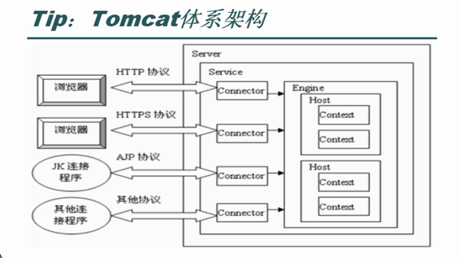
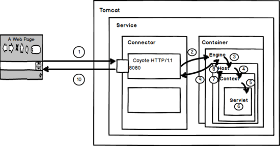
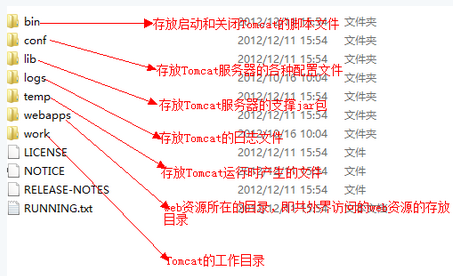
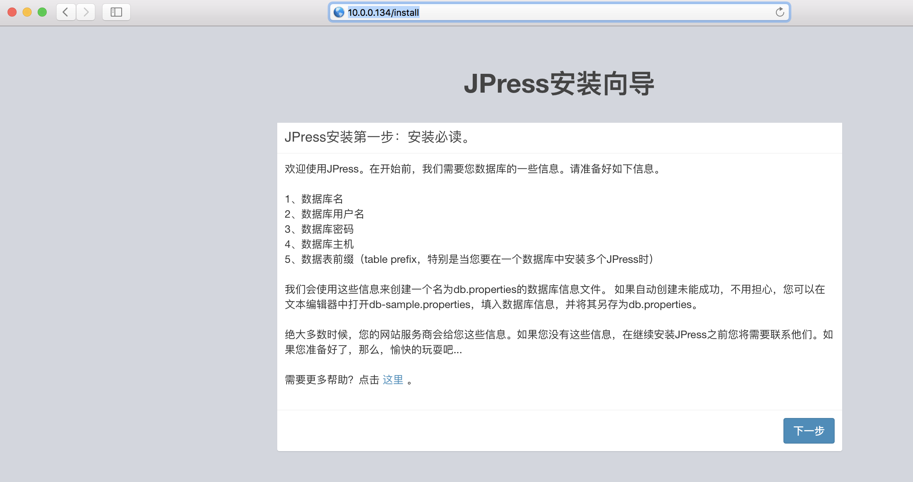

[TOC]

## 第一章 Tomcat简介

Tomcat是Apache软件基金会（Apache Software Foundation）的Jakarta项目中的一个核心项目，由Apache，Sun和其他一些公司及个人共同开发而成。

Tomcat服务器是一个免费的开放源代码的Web应用服务器，属于轻量级应用服务器，在中小型系统和并发访问用户不是很多的场合下被普遍使用，是开发和调试JSP程序的首选。

Tomcat和Nginx，APache（httpd），lighttpd等Web服务器一样，具有处理HTML页面的功能，另外它还是一个Servlet和JSP容器，独立的Servlet容器是Tomcat的默认模式。不过，Tomcat处理静态HTML的能力不如Nginx／Apache服务器。

目前Tomcat最新版本为9.0。Java容器还有resin，weblogic等。

tomcat体系架构：



tomcat请求过程：



描述：

1、用户点击网页内容，请求被发送到本机端口8080，被在那里监听的Coyote HTTP/1.1 Connector获得。

2、Connector把该请求交给它所在的Service的Engine来处理，并等待Engine的回应。

3、Engine获得请求localhost/test/index.jsp，匹配所有的虚拟主机Host。

4、Engine匹配到名为localhost的Host（即使匹配不到也把请求交给该Host处理，因为该Host被定义为该Engine的默认主机），名为localhost的Host获得请求/test/index.jsp，匹配它所拥有的所有的Context。Host匹配到路径为/test的Context（如果匹配不到就把该请求交给路径名为“ ”的Context去处理）。

5、path=“/test”的Context获得请求/index.jsp，在它的mapping table中寻找出对应的Servlet。Context匹配到URL PATTERN为*.jsp的Servlet,对应于JspServlet类。

6、构造HttpServletRequest对象和HttpServletResponse对象，作为参数调用JspServlet的doGet（）或doPost（）.执行业务逻辑、数据存储等程序。

7、Context把执行完之后的HttpServletResponse对象返回给Host。

8、Host把HttpServletResponse对象返回给Engine。

9、Engine把HttpServletResponse对象返回Connector。

10、Connector把HttpServletResponse对象返回给客户Browser。


## 第二章 Tomcat安装

### 2.1 软件准备

JDK下载：http://www.oracle.com/technetwork/java/javase/downloads/jdk8-downloads-2133151.html

Tomcat下载：http://tomcat.apache.org/

### 2.2 部署java环境jdk

```shell
# 通用格式安装
[root@localhost tomcat]# wget http://download.oracle.com/otn-pub/java/jdk/8u181-b13/96a7b8442fe848ef90c96a2fad6ed6d1/jdk-8u181-linux-x64.tar.gz

[root@localhost tomcat]# tar xf jdk-8u181-linux-x64.tar.gz  -C /usr/local/
[root@localhost tomcat]# ln -s /usr/local/jdk-8u181 /usr/local/jdk

[root@localhost tomcat]# vim /etc/profile.d/jdk.sh
'''
export JAVA_HOME=/usr/local/jdk
export PATH=$PATH:$JAVA_HOME/bin:$JAVA_HOME/jre/bin
export CLASSPATH=.:$JAVA_HOME/lib/dt.jar:$JAVA_HOME/lib/tools.jar
'''

[root@localhost tomcat]# source  /etc/profile.d/jdk.sh && java –version
"""
java version "1.8.0_181"
Java(TM) SE Runtime Environment (build 1.8.0_181-b13)
Java HotSpot(TM) 64-Bit Server VM (build 25.181-b13, mixed mode)
"""


```

环境变量说明：

PATH环境变量。作用是指定命令搜索路径，在shell下面执行命令时，它会到PATH变量所指定的路径中查找看是否能找到相应的命令程序。我们需要把 jdk安装目录下的bin目录增加到现有的PATH变量中，bin目录中包含经常要用到的可执行文件如javac/java/javadoc等待，设置好 PATH变量后，就可以在任何目录下执行javac/java等工具了。 

CLASSPATH环境变量。作用是指定类搜索路径，要使用已经编写好的类，前提当然是能够找到它们了，JVM就是通过CLASSPTH来寻找类的。我们 需要把jdk安装目录下的lib子目录中的dt.jar和tools.jar设置到CLASSPATH中，当然，当前目录“.”也必须加入到该变量中。 

JAVA_HOME环境变量。它指向jdk的安装目录，Eclipse/NetBeans/Tomcat等软件就是通过搜索JAVA_HOME变量来找到并使用安装好的jdk。

·找到jdk安装目录的_uninst子目录 
·在shell终端执行命令./uninstall.sh即可卸载jdk 

### 2.3 安装Tomcat

```shell
[root@localhost tomcat]# wget http://mirrors.shuosc.org/apache/tomcat/tomcat-8/v8.0.47/bin/apache-tomcat-8.0.47.tar.gz
[root@localhost tomcat]# tar xf apache-tomcat-8.0.47.tar.gz -C /usr/local
[root@localhost tomcat]# cd /usr/local
[root@localhost tomcat]# ln -sv apache-tomcat-8.0.47 tomcat
[root@localhost tomcat]# cd tomcat
[root@localhost tomcat]# vim /etc/profile.d/tomcat.sh
"""
export CATALINA_HOME=/usr/local/tomcat
export PATH=$CATALINA_HOME/bin:$PATH
"""

[root@localhost tomcat]# . /etc/profile.d/tomcat.sh
[root@localhost tomcat]# catalina.sh version
[root@localhost tomcat]# catalina.sh --help
[root@localhost tomcat]# ss -tnlp  # 检查8005,8009,8080端口是否被占用
[root@localhost tomcat]# catalina.sh start  # 启动服务
[root@localhost tomcat]# catalina.sh stop  # 关闭服务
[root@localhost tomcat]# ss -tnlp
[root@localhost tomcat]# ps aux
```

测试：ip:8080

服务的启动与关闭也可以这样：

启动程序：/usr/local/tomcat/bin/startup.sh
关闭程序：/usr/local/tomcat/bin/shutdown.sh


## 第三章 Tomcat的配置文件

### 3.1 Tomcat配置文件

tomcat主目录各文件

```shell
[root@localhost tomcat]# tree -L 1
"""
.
├── bin         # 用以启动，关闭Tomcat或者其他功能的脚本（.bat文件和.sh文件）
├── conf        # 用以配置Tomcat的XML及DTD文件
├── lib         # 存放web应用能访问的JAR包
├── LICENSE
├── logs        # Catalina和其他Web应用程序的日志文件
├── NOTICE
├── RELEASE-NOTES
├── RUNNING.txt
├── temp        # 临时文件
├── webapps     # Web应用程序根目录
└── work        # 用以产生有JSP编译出的Servlet的.java和.class文件

7 directories, 4 files
"""

[root@localhost tomcat]# cd webapps/
[root@localhost webapps]# ll
"""
total 20
drwxr-xr-x. 14 root root 4096 Oct 24 09:07 docs     # tomcat帮助文档
drwxr-xr-x.  6 root root 4096 Oct 24 09:07 examples # web应用实例
drwxr-xr-x.  5 root root 4096 Oct 24 09:07 host-manager # 管理
drwxr-xr-x.  5 root root 4096 Oct 24 09:07 manager      # 管理
drwxr-xr-x.  3 root root 4096 Oct 24 09:07 ROOT         # 默认网站根目录
"""
```

简单图示：



conf目录：

server.xml: Tomcat的主配置文件，包含Service, Connector, Engine, Realm, Valve, Hosts主组件的相关配置信息；

web.xml：遵循Servlet规范标准的配置文件，用于配置servlet，并为所有的Web应用程序提供包括MIME映射等默认配置信息；

tomcat-user.xml：Realm认证时用到的相关角色、用户和密码等信息；Tomcat自带的manager默认情况下会用到此文件；在Tomcat中添加/删除用户，为用户指定角色等将通过编辑此文件实现；

catalina.policy：Java相关的安全策略配置文件，在系统资源级别上提供访问控制的能力；

catalina.properties：Tomcat内部package的定义及访问相关控制，也包括对通过类装载器装载的内容的控制；Tomcat在启动时会事先读取此文件的相关设置；

logging.properties: Tomcat6通过自己内部实现的JAVA日志记录器来记录操作相关的日志，此文件即为日志记录器相关的配置信息，可以用来定义日志记录的组件级别以及日志文件的存在位置等；

context.xml：所有host的默认配置信息；


### 3.2 Tomcat后台管理

> **测试功能，生产环境不要用：**
>  Tomcat管理功能用于对Tomcat自身以及部署在Tomcat上的应用进行管理的Web应用。在默认情况下是处于禁用状态的。如果需要开启这个功能，就需要配置管理用户，即配置前面说过的tomcat-users.xml。

```shell
[root@localhost conf]# vim tomcat-users.xml
"""
# 在
<tomcat-users>
  ...  # 其他配置不动
  <role rolename="manager-gui"/>
  <role rolename="manager-script"/>
  <role rolename="manager-jmx"/>
  <role rolename="manager-status"/>
  <user username="tomcat" password="tomcat" roles="manager-gui,manager-script,manager-jmx,manager-status"/>
</tomcat-users>
"""

# 默认后台管理授权仅限127开头的地址访问,也就是仅允许本机访问后台状态,修改context.xml
[root@localhost tomcat]# vim webapps/host-manager/META-INF/context.xml
"""
<Valve className="org.apache.catalina.valves.RemoteAddrValve"
         allow="127\.\d+\.\d+\.\d+|::1|0:0:0:0:0:0:0:1" />  # 127改为\d+
"""
[root@localhost tomcat]# vim webapps/manager/META-INF/context.xml
"""
<Valve className="org.apache.catalina.valves.RemoteAddrValve"
         allow="127\.\d+\.\d+\.\d+|::1|0:0:0:0:0:0:0:1" />  # 127改为\d+
"""


# 重启tomcat服务
[root@localhost conf]# /usr/local/tomcat/bin/shutdown.sh
[root@localhost conf]# /usr/local/tomcat/bin/startup.sh
```

测试：IP:8080/manager/status

> 登陆验证信息：账号：tomcat 密码：tomcat


### 3.3 Tomcat主配置文件Server.xml详解

#### 3.3.1 Server.xml组件类别

> - 顶级组件：位于整个配置的顶层，如server。
> - 容器类组件：可以包含其他组件的组件，如service，engine，host，context
> - 连接器组件：连接用户请求至tomcat，如connector。
> - 被嵌套类组件：位于一个容器当中，不能包含其他组件，如Valve，logger。

```xml
<server>
     <service>
         <connector/>
         <engine>
             <host>
             	<context></context>
             </host>
             <host>
             	<context></context>
             </host>
         </engine>
     </service>
</server>
```

#### 3.3.2 组件详解

- engine:核心容器组件，catalina引擎，负责通过connector接收用户请求，并处理请求，将请求转至对应的虚拟主机host。

- host：类似于httpd中的虚拟主机，一般而言支持基于FQDN的虚拟主机。

- context：定义一个应用程序，是一个最内层的容器类组件（不能再嵌套）。配置context的主要目的指定对应对的webapp的根目录，类似于httpd的alias，其还能为webapp指定额外的属性，如部署方式等。

- connector：接收用户请求，类似于httpd的listen配置监听端口。

- service（服务）：将connector关联至engine，因此一个service内部可以有多个connector，但只能又一个引擎engine。service内部有两个connector，一个engine。因此，一般情况下一个server内部只有一个service，一个service内部只有一个engine，但一个service内部可以有多个connector。

- server：表示一个运行于JVM中的tomcat实例。
  Valve：阀门，拦截请求并在将其转至对应的webapp前进行某种处理操作，可以用于任何容器中，比如记录日志（access log valve），基于IP做访问控制（remote address filer valve）。

- logger：日志记录器，用于记录组件内部的状态信息，可以用于除context外的任何容器中。

- realm：可以用于任意容器类的组件中，关联一个用户认证库，实现认证和授权。可以关联的认证库有两种：UserDatabaseRealm，MemoryRealm和JDBCRealm。

- UserDatabaseRealm：使用JNDI自定义的用户认证库。

- MemoryRealm：认证信息定义在tomcat-users.xml中。

- JDBCRealm：认证信息定义在数据库中，并通过JDBC连接至数据库中查找认证用户。

#### 3.3.3 配置文件注释

server.xml

```xml
<?xml version='1.0' encoding='utf-8'?>
<!--
<Server>元素代表整个容器,是Tomcat实例的顶层元素.由org.apache.catalina.Server接口来定义.它包含一个<Service>元素.并且它不能做为任何元素的子元素.
port指定Tomcat监听shutdown命令端口.终止服务器运行时,必须在Tomcat服务器所在的机器上发出shutdown命令.该属性是必须的.
shutdown指定终止Tomcat服务器运行时,发给Tomcat服务器的shutdown监听端口的字符串.该属性必须设置
-->
<Server port="8005" shutdown="SHUTDOWN">
  <Listener className="org.apache.catalina.startup.VersionLoggerListener" />
  <Listener className="org.apache.catalina.core.AprLifecycleListener" SSLEngine="on" />
  <Listener className="org.apache.catalina.core.JreMemoryLeakPreventionListener" />
  <Listener className="org.apache.catalina.mbeans.GlobalResourcesLifecycleListener" />
  <Listener className="org.apache.catalina.core.ThreadLocalLeakPreventionListener" />
  <GlobalNamingResources>
    <Resource name="UserDatabase" auth="Container"
              type="org.apache.catalina.UserDatabase"
              description="User database that can be updated and saved"
              factory="org.apache.catalina.users.MemoryUserDatabaseFactory"
              pathname="conf/tomcat-users.xml" />
  </GlobalNamingResources>
  <!--service服务组件-->
  <Service name="Catalina">
    <!--
        connector：接收用户请求，类似于httpd的listen配置监听端口.
        port指定服务器端要创建的端口号，并在这个端口监听来自客户端的请求。
        address：指定连接器监听的地址，默认为所有地址（即0.0.0.0）
        protocol连接器使用的协议，支持HTTP和AJP。AJP（Apache Jserv Protocol）专用于tomcat与apache建立通信的， 在httpd反向代理用户请求至tomcat时使用（可见Nginx反向代理时不可用AJP协议）。
        minProcessors服务器启动时创建的处理请求的线程数
        maxProcessors最大可以创建的处理请求的线程数
        enableLookups如果为true，则可以通过调用request.getRemoteHost()进行DNS查询来得到远程客户端的实际主机名，若为false则不进行DNS查询，而是返回其ip地址
        redirectPort指定服务器正在处理http请求时收到了一个SSL传输请求后重定向的端口号
        acceptCount指定当所有可以使用的处理请求的线程数都被使用时，可以放到处理队列中的请求数，超过这个数的请求将不予处理
        connectionTimeout指定超时的时间数(以毫秒为单位)
    -->
    <Connector port="8080" protocol="HTTP/1.1"
               connectionTimeout="20000"
               redirectPort="8443" />
    <Connector port="8009" protocol="AJP/1.3" redirectPort="8443" />
    <!--
        engine,核心容器组件,catalina引擎,负责通过connector接收用户请求,并处理请求,将请求转至对应的虚拟主机host
        defaultHost指定缺省的处理请求的主机名，它至少与其中的一个host元素的name属性值是一样的
    -->
    <Engine name="Catalina" defaultHost="localhost">
      <!--Realm表示存放用户名，密码及role的数据库-->
      <Realm className="org.apache.catalina.realm.LockOutRealm">
        <Realm className="org.apache.catalina.realm.UserDatabaseRealm"
               resourceName="UserDatabase"/>
      </Realm>
      <!--
        host表示一个虚拟主机
        name指定主机名
        appBase应用程序基本目录，即存放应用程序的目录.一般为appBase="webapps" ，相对于CATALINA_HOME而言的，也可以写绝对路径。
        unpackWARs如果为true，则tomcat会自动将WAR文件解压，否则不解压，直接从WAR文件中运行应用程序
        autoDeploy：在tomcat启动时，是否自动部署。
        xmlValidation：是否启动xml的校验功能，一般xmlValidation="false"。
        xmlNamespaceAware：检测名称空间，一般xmlNamespaceAware="false"。
      -->
      <Host name="localhost"  appBase="webapps"
            unpackWARs="true" autoDeploy="true">
        <!--
            Context表示一个web应用程序，通常为WAR文件。
            docBase应用程序的路径或者是WAR文件存放的路径,也可以使用相对路径，起始路径为此Context所属Host中appBase定义的路径。
            path表示此web应用程序的url的前缀，这样请求的url为http://localhost:8080/path/****。
            reloadable这个属性非常重要，如果为true，则tomcat会自动检测应用程序的/WEB-INF/lib 和/WEB-INF/classes目录的变化，自动装载新的应用程序，可以在不重启tomcat的情况下改变应用程序
        -->
        <Context path="" docBase="" debug="" reloadable="true"/>
        <Valve className="org.apache.catalina.valves.AccessLogValve" directory="logs"
               prefix="localhost_access_log" suffix=".txt"
               pattern="%h %l %u %t &quot;%r&quot; %s %b" />
      </Host>
    </Engine>
  </Service>
</Server>
```


## 第四章 WEB站点部署

上线的代码有两种方式：

第一种方式是直接将程序目录放在webapps目录下面；

第二种方式是使用开发工具将程序打包成war包，然后上传到webapps目录下面；

### 4.1 使用war包部署web站点

```
# 部署war包
[root@localhost ~]# cp memtest.war /usr/local/tomcat/webapps/
[root@localhost ~]# ls /usr/local/tomcat/webapps/
[root@localhost ~]# /usr/local/tomcat/bin/startup.sh 
[root@localhost ~]# netstat -antup | grep java

# 查看war包的解压缩情况,war包已经被解压出来了
[root@localhost webapps]# ls /usr/local/tomcat/webapps/
```

浏览器访问：http://ip:8080/memtest/meminfo.js

### 4.2 自定义默认网站目录

上面访问的网址为：http://ip:8080/memtest/meminfo.js
 现在我想访问格式为：http://ip:8080/meminfo.js

**方法一：**

将meminfo.jsp或其他程序放在tomcat/webapps/ROOT目录下即可。因为默认网站根目录为tomcat/webapps/ROOT

**方法二：**

```shell
[root@localhost tomcat]# vim conf/server.xml
"""
      <Host name="localhost"  appBase="webapps"
            unpackWARs="true" autoDeploy="true">
         <Context path="" docBase="memtest" debug="0" reloadable="true" crossContext="true"/>
"""

[root@localhost tomcat]# /usr/local/tomcat/bin/shutdown.sh
[root@localhost tomcat]# /usr/local/tomcat/bin/startup.sh
```

再次测试：http://ip:8080/meminfo.js

## 第五章 Tomcat多实例及集群架构

### 5.1 Tomcat多实例

#### 5.1.1：多个tomcat程序不同端口访问

 复制Tomcat目录

```shell
[root@localhost ~]# cd /usr/local/
[root@localhost local]# ls
[root@localhost local]# cp -a apache-tomcat-8.0.27 tomcat8_1
[root@localhost local]# cp -a apache-tomcat-8.0.27 tomcat8_2
```

修改多实例配置文件

```shell
# 创建多实例的网页根目录
[root@localhost local]# mkdir -p /data/www/www/ROOT

# 将网页程序拷贝到，多实例根目录ROOT下
[root@localhost local]# cp /usr/local/tomcat/webapps/memtest/meminfo.jsp /data/www/www/ROOT/

# 修改多实例配置文件的以下三行
[root@localhost local]# cat -n /usr/local/tomcat/conf/server.xml | sed -n '22p;69p;123p'
"""
    22  <Server port="8005" shutdown="SHUTDOWN">    #管理端口及停止命令
    69      <Connector port="8080" protocol="HTTP/1.1"  #对外提供服务的端口
   123        <Host name="localhost"  appBase="webapps" #网站域名及网页根目录路径
"""

# 修改第一个多实例配置文件
[root@localhost local]# sed -i '22s#8005#8011#;69s#8080#8081#;123s#appBase=".*"#appBase="/data/www/www"#' /usr/local/tomcat8_1/conf/server.xml 

[root@localhost local]# sed -n '22p;69p;123p' /usr/local/tomcat8_1/conf/server.xml
"""
<Server port="8011" shutdown="SHUTDOWN">
    <Connector port="8081" protocol="HTTP/1.1"
      <Host name="localhost"  appBase="/data/www/www"
"""

# 修改第二个多实例配置文件
[root@localhost local]# sed -i '22s#8005#8012#;69s#8080#8082#;123s#appBase=".*"#appBase="/data/www/www"#' /usr/local/tomcat8_2/conf/server.xml 

[root@localhost local]# sed -n '22p;69p;123p' /usr/local/tomcat8_2/conf/server.xml
"""
<Server port="8012" shutdown="SHUTDOWN">
    <Connector port="8082" protocol="HTTP/1.1"
      <Host name="localhost"  appBase="/data/www/www"
"""
```

启动多实例

```
# 启动多实例服务
[root@localhost ~]# /usr/local/tomcat8_1/bin/startup.sh 
[root@localhost ~]# /usr/local/tomcat8_2/bin/startup.sh 
[root@localhost ~]# netstat -antup | grep java
```

浏览器可以分别访问http://10.0.0.134:8081/meminfo.jsp和http://10.0.0.134:8082/meminfo.jsp

####  5.1.2 同一个tomcat程序不同配置文件

主tomcat程序/usr/local/tomcat

项目存放位置/usr/local/tomcat-projects

因为各项目使用各自不同的tomcat配置文件，所以主程序配置文件无需改动.

```shell
[root@localhost ~]# mkdir /usr/local/tomcat-projects
[root@localhost ~]# cd /usr/local/tomcat-projects
# 第一个实例
[root@localhost tomcat-projects]# mkdir test1
[root@localhost tomcat-projects]# cp -a /usr/local/tomcat/{conf,logs,temp,webapps,work} ./test1/

[root@localhost tomcat-projects]# vim test1/conf/server.xml
"""
<Server port="8010" shutdown="SHUTDOWN">
<Connector port="8011" protocol="HTTP/1.1"
               connectionTimeout="20000"
               redirectPort="8443" />
<Connector port="8012" protocol="AJP/1.3" redirectPort="8443" />
<Context path="" docBase="/usr/local/tomcat-projects/test1/webapps" reloadable="true" />
"""

[root@localhost tomcat-projects]# vim test1/start.sh
"""
#!/bin/bash
export CATALINA_HOME=/usr/local/tomcat
export CATALINA_BASE=/usr/local/tomcat-projects/test1
cd $CATALINA_HOME
./bin/catalina.sh start
"""

[root@localhost tomcat-projects]# vim test1/stop.sh
"""
#!/bin/bash
export CATALINA_HOME=/usr/local/tomcat
export CATALINA_BASE=/usr/local/tomcat-projects/test1
cd $CATALINA_HOME
./bin/catalina.sh stop
"""


# 第二个实例
[root@localhost tomcat-projects]# mkdir test2
[root@localhost tomcat-projects]# cp -a /usr/local/tomcat/{conf,logs,temp,webapps,work} ./test2/

[root@localhost tomcat-projects]# vim test2/conf/server.xml
"""
<Server port="8020" shutdown="SHUTDOWN">
<Connector port="8021" protocol="HTTP/1.1"
               connectionTimeout="20000"
               redirectPort="8443" />
<Connector port="8022" protocol="AJP/1.3" redirectPort="8443" />
<Context path="" docBase="/usr/local/tomcat-projects/test2/webapps" reloadable="true" />
"""

[root@localhost tomcat-projects]# vim test2/start.sh
"""
#!/bin/bash
#
export CATALINA_HOME=/usr/local/tomcat
export CATALINA_BASE=/usr/local/tomcat-projects/test1
cd $CATALINA_HOME
./bin/catalina.sh start
"""

[root@localhost tomcat-projects]# vim test2/stop.sh
"""
#!/bin/bash
export CATALINA_HOME=/usr/local/tomcat
export CATALINA_BASE=/usr/local/tomcat-projects/test2
cd $CATALINA_HOME
./bin/catalina.sh stop
"""
```

测试访问：

IP:PORT/8011

IP:PORT/8021


### 5.2 Tomcat集群

**使用nginx+Tomcat反向代理集群**

#### 5.2.1 安装nginx

```
[root@localhost ~]# yum -y install pcre-devel openssl-devel
[root@localhost ~]# wget -q http://nginx.org/download/nginx-1.10.2.tar.gz
[root@localhost ~]# useradd -s /sbin/nologin -M nginx
[root@localhost ~]# tar xf nginx-1.10.2.tar.gz -C /usr/src/
[root@localhost ~]# cd /usr/src/nginx-1.10.2/
[root@localhost nginx-1.10.2]# ./configure --user=nginx --group=nginx --prefix=/usr/local/nginx --with-http_stub_status_module --with-http_ssl_module
[root@localhost nginx-1.10.2]# make && make install
```

#### 5.2.2 修改nginx配置文件如下

```
#创建配置文件模版
[root@localhost nginx]# egrep -v "#|^$" /usr/local/nginx/conf/nginx.conf.default > /usr/local/nginx/conf/nginx.conf

#修改配置文件内容如下：
[root@localhost nginx]# cat /usr/local/nginx/conf/nginx.conf
worker_processes  1;
events {
    worker_connections  1024;
}
http {
    include       mime.types;
    default_type  application/octet-stream;
    sendfile        on;
    keepalive_timeout  65;
    upstream web_pools {
        server 127.0.0.1:8081;
        server 127.0.0.1:8082;
    }
    server {
        listen       80;
        server_name  localhost;
        location / {
            root   html;
            index  index.jsp index.html index.htm;
            proxy_pass http://web_pools;
        }
    }
}

#检测语法并启动nginx
[root@localhost nginx]# /usr/local/nginx/sbin/nginx -t
nginx: the configuration file /usr/local/nginx/conf/nginx.conf syntax is ok
nginx: configuration file /usr/local/nginx/conf/nginx.conf test is successful
[root@localhost nginx]# /usr/local/nginx/sbin/nginx
[root@localhost nginx]# netstat -antup | grep nginx
tcp        0      0 0.0.0.0:80                  0.0.0.0:*                   LISTEN      4833/nginx
```

测试负载均衡效果

### 5.3 使用Tomcat安装Jpress

JPress，一个wordpress的java代替版本，使用JFinal开发。需要maven支持

```
[root@localhost ~]# tar xf apache-maven-3.3.9-bin.tar.gz -C /usr/local/
[root@localhost ~]# ln -s /usr/local/apache-maven-3.3.9 /usr/local/maven
[root@localhost ~]# tail -2 /etc/profile
export MAVEN_HOME=/usr/local/maven
export PATH="$MAVEN_HOME/bin:$PATH"
[root@localhost ~]# source /etc/profile
[root@localhost ~]# mvn -version        #出现这个表示成功
Apache Maven 3.3.9 (bb52d8502b132ec0a5a3f4c09453c07478323dc5; 2015-11-10T11:41:47-05:00)
Maven home: /usr/local/maven
Java version: 1.8.0_60, vendor: Oracle Corporation
Java home: /usr/local/jdk1.8.0_60/jre
Default locale: en_US, platform encoding: UTF-8
OS name: "linux", version: "2.6.32-431.el6.x86_64", arch: "amd64", family: "unix"
```

**将 jpress-web-newest.war包放到Tomcat网站根目录下**

```
#将war包放到网站根目录下
[root@localhost ~]# ls -l jpress-web-newest.war 
-rw-r--r--. 1 root root 20797013 Oct 24 17:04 jpress-web-newest.war
[root@localhost ~]# mv jpress-web-newest.war /data/www/www/ROOT/

#解压war包
[root@localhost ~]# which jar
/usr/local/jdk/bin/jar
[root@localhost ~]# cd /data/www/www/ROOT/
[root@localhost ROOT]# jar xf jpress-web-newest.war     #jar是war包的解压命令
[root@localhost ROOT]# ls
jpress-web-newest.war  META-INF    static     WEB-INF
meminfo.jsp            robots.txt  templates
```

**用浏览器访问：http://10.0.0.134/install进入jpress安装向导**



> **特别提示：**
>
> - 虽然，Tomcat已经打开了自动解压缩war包的功能，但是细心的同学会发现我并没有重启Tomcat服务，因此，war包并没有被自动解压缩。故，我们需要通过jar命令进行解压缩，命令的参数和tar是一样的。
> - 接下来我们就需要为jpress安装数据库了，之后的所有流程和阅读材料LNMP的章节完全一样。因此，我这里就不继续操作了。

## 第六章 Tomcat安全优化和性能优化

### 6.1 安全优化

> 最重要的优化为如下4项，但并不止这四种

- 降权启动
- telnet管理端口保护
- ajp连接端口保护
- 禁用管理端

**具体操作如下：**

（1）降权启动（同nginx优化部分的监牢模式）

> 降权的原则就是利用普通用户来启动Tomcat
>  （1）将Tomcat程序目录拷贝到普通用户家目录下
>  （2）修改家目录下程序的配置文件（启动端口，检测端口等），并重新指定网页根目录路径。
>  （3）递归授权拷贝后的Tomcat程序的属主属组为普通用户。
>  （4）用su命令切换为普通用户，启动Tomcat进程
>  （5）此时Tomcat进程的权限为普通用户权限
>  （6）如果利用/etc/rc.local文件配置普通用户程序的开机启动，那么需要利用su -c临时切换身份启动。具体可参考linux基础教案里的用户管理部分

（2）telnet管理端口保护

```
[root@localhost ~]# sed -n '22p' /usr/local/tomcat/conf/server.xml
<Server port="8005" shutdown="SHUTDOWN">    #表示通过8005端口来接受SHUTDOWN，用来停止Tomcat进程。默认的方式是非常危险的。需要进行修改
[root@localhost ~]# netstat -antup | grep java
tcp        0      0 ::ffff:127.0.0.1:8011       :::*                        LISTEN      2295/java           #本地8011端口接收SHUTDOWN命令
tcp        0      0 ::ffff:127.0.0.1:8012       :::*                        LISTEN      2321/java           #本地8012端口接收SHUTDOWN命令
tcp        0      0 :::8080                     :::*                        LISTEN      2031/java           
tcp        0      0 :::8081                     :::*                        LISTEN      2295/java           
tcp        0      0 :::8082                     :::*                        LISTEN      2321/java           
tcp        0      0 ::ffff:127.0.0.1:8005       :::*                        LISTEN      2031/java           #本地8005端口接收SHUTDOWN命令
tcp        0      0 :::8009                     :::*                        LISTEN      2031/java     
```

> Tomcat默认通过8005端口来接收SHUTDOWN这个字符串来关闭Tomcat进程，但这是非常危险的，因此需要修改端口号来防护。否则，通过telnet命令即可强行关闭Tomcat进程

```
#利用Telnet来关闭Tomcat进程
[root@localhost ~]# telnet 127.0.0.1 8005   #通过telnet连接本地8005端口
Trying 127.0.0.1...
Connected to 127.0.0.1.
Escape character is '^]'.
SHUTDOWN        #发送SHUTDOWN字符串
Connection closed by foreign host.
[root@localhost ~]# netstat -antup | grep java      #可以发现8005端口和8080端口的Tomcat进程没了
tcp        0      0 ::ffff:127.0.0.1:8011       :::*                        LISTEN      2295/java           
tcp        0      0 ::ffff:127.0.0.1:8012       :::*                        LISTEN      2321/java           
tcp        0      0 :::8081                     :::*                        LISTEN      2295/java           
tcp        0      0 :::8082                     :::*                        LISTEN      2321/java           
[root@localhost ~]# 
```

（3）ajp连接端口保护

```
[root@localhost ~]# sed -n '91p' /usr/local/tomcat/conf/server.xml
    <Connector port="8009" protocol="AJP/1.3" redirectPort="8443" />    #这是AJP协议打开的端口，我们并不需要开启这个端口，因此注释掉本行
```

（4）禁用管理端

> Tomcat默认在安装完成后的网页目录里有很多多余的目录，删除所有不需要用到的目录，并清空ROOT网页默认根目录下的所有东西，规避可能的代码漏洞

```
[root@localhost ~]# cd /usr/local/tomcat/webapps/
[root@localhost webapps]# ls
docs  examples  host-manager  manager  memtest  memtest.war  ROOT   #有很多多余的东西，只留下ROOT目录，其他都删掉或者mv移走
[root@localhost webapps]# ls ROOT/  #很多多余的东西，因此清空本目录，或者都移走
asf-logo.png       bg-button.png  bg-nav-item.png  bg-upper.png  favicon.ico  meminfo.jsp        tomcat.css  tomcat.png        tomcat.svg
asf-logo-wide.gif  bg-middle.png  bg-nav.png       build.xml     index.jsp    RELEASE-NOTES.txt  tomcat.gif  tomcat-power.gif  WEB-INF
```

### 6.2 性能优化

#### 6.2.1 屏蔽DNS查询 `enableLookups="false"`

> DNS查询非常消耗时间，如果开启会影响Tomcat性能，因此关闭。

```
#默认没有，需添加配置文件如下代码段，在Connector标签位置。表示禁止DNS查询
    <Connector  port="8081" protocol="HTTP/1.1"
               connectionTimeout="6000" enableLookups="false" acceptCount="800"
               redirectPort="8443" />
```

#### 6.2.2 jvm调优

> Tomcat最吃内存，只要内存足够，这只猫就跑的很快。
>  如果系统资源有限，那就需要进行调优，提高资源使用率。

```
#优化catalina.sh初始化脚本。在catalina.sh初始化脚本中添加以下代码：
#catalina.sh的路径为:/usr/local/tomcat/bin/catalina.sh
#此行优化代码需要加在脚本的最开始，声明位置。不要放在后边

JAVA_OPTS="-Djava.awt.headless=true -Dfile.encoding=UTF-8 -server -Xms1024m -Xmx1024m -XX:NewSize=512m -XX:MaxNewSize=512m -XX:PermSize=512m -XX:MaxPermSize=512m"


#代码说明：
server:一定要作为第一个参数，在多个CPU时性能佳
-Xms：初始堆内存Heap大小，使用的最小内存,cpu性能高时此值应设的大一些
-Xmx：初始堆内存heap最大值，使用的最大内存
上面两个值是分配JVM的最小和最大内存，取决于硬件物理内存的大小，建议均设为物理内存的一半。
-XX:PermSize:设定内存的永久保存区域
-XX:MaxPermSize:设定最大内存的永久保存区域
-XX:MaxNewSize:
-Xss 15120 这使得JBoss每增加一个线程（thread)就会立即消耗15M内存，而最佳值应该是128K,默认值好像是512k.
+XX:AggressiveHeap 会使得 Xms没有意义。这个参数让jvm忽略Xmx参数,疯狂地吃完一个G物理内存,再吃尽一个G的swap。
-Xss：每个线程的Stack大小
-verbose:gc 现实垃圾收集信息
-Xloggc:gc.log 指定垃圾收集日志文件
-Xmn：young generation的heap大小，一般设置为Xmx的3、4分之一
-XX:+UseParNewGC ：缩短minor收集的时间
-XX:+UseConcMarkSweepGC ：缩短major收集的时间
```

> JVM的调优比较复杂，对于初学的同学们来说掌握这些就足够了。如果想要更详细的理解JVM如何调优，那么请参考网友文章:http://www.cnblogs.com/xingzc/p/5756119.html

## 附录1：企业案例：Linux下java/http进程高解决案例

> 生产环境下某台tomcat7服务器，在刚发布的时候一切都很正常，在运行一段时间后就出现CPU占用很高的问题，基本上是负载一天比一天高。诸如此类问题，请排查！

**问题分析：**

> （1）程序属于CPU密集型，和开发沟通过，排除此类情况
>  （2）程序代码有问题，出现死循环，可能性极大

**问题解决：**

> （1）开发那边无法排查代码某个模块有问题，从日志上也无法分析得出
>  （2）我们可以尝试通过jstack命令来精确定位出现错误的代码段，从而拿给开发排查。

（1）首先查找进程高的PID号(先找到是哪个PID号的进程导致的)

```
top -H
```

（2）查看这个进程所有系统调用（再找到是哪个PID号的线程导致的）

```
strace -p 进程的PID
```

（3）如果是Web应用，可以继续打印该线程的堆栈信息（找出有问题的代码块）

`printf "%x\n" 线程的PID` --->#将有问题的线程的PID号转换成16进制格式

`jstack 进程的PID | grep 线程PID号的十六进制格式 -A 30` #过滤出有问题的线程的堆栈信息，找出问题代码块

**实际操作演示：**

```
[root@localhost ROOT]# pgrep -l java
2031 java       #java进程及对应PID号
2295 java
2321 java
[root@localhost ROOT]# strace -p 2031       #查看PID号为2031的java进程的所有线程调用情况
Process 2031 attached - interrupt to quit
futex(0x7f4cdd0e79d0, FUTEX_WAIT, 2032, NULL    #只有一个线程，线程的PID号为2032
^C <unfinished ...>
Process 2031 detached
[root@localhost ROOT]# printf "%x\n" 2032   #将线程的PID号2032转换成十六进制格式
7f0
[root@localhost ROOT]# jstack 2031 | grep 7f0 -A 30 #追踪进称号为2031的进程的所有线程调用，从里面过滤出16进制为7f0的线程的代码调用情况
"main" #1 prio=5 os_prio=0 tid=0x00007f4cd4008800 nid=0x7f0 runnable [0x00007f4cdd0e5000]
   java.lang.Thread.State: RUNNABLE
    at java.net.PlainSocketImpl.socketAccept(Native Method)
    at java.net.AbstractPlainSocketImpl.accept(AbstractPlainSocketImpl.java:409)    #圆括号里显示的是（代码类名:具体调用的代码行号）
    at java.net.ServerSocket.implAccept(ServerSocket.java:545)
    at java.net.ServerSocket.accept(ServerSocket.java:513)
    at org.apache.catalina.core.StandardServer.await(StandardServer.java:446)
    at org.apache.catalina.startup.Catalina.await(Catalina.java:713)
    at org.apache.catalina.startup.Catalina.start(Catalina.java:659)
    at sun.reflect.NativeMethodAccessorImpl.invoke0(Native Method)
    at sun.reflect.NativeMethodAccessorImpl.invoke(NativeMethodAccessorImpl.java:62)
    at sun.reflect.DelegatingMethodAccessorImpl.invoke(DelegatingMethodAccessorImpl.java:43)
    at java.lang.reflect.Method.invoke(Method.java:497)
    at org.apache.catalina.startup.Bootstrap.start(Bootstrap.java:351)
    at org.apache.catalina.startup.Bootstrap.main(Bootstrap.java:485)

"VM Thread" os_prio=0 tid=0x00007f4cd406d000 nid=0x7f1 runnable 

"VM Periodic Task Thread" os_prio=0 tid=0x00007f4cd40b8800 nid=0x7f8 waiting on condition 

JNI global references: 244
```

## 附录2：jstack命令（Java stack Trace）

**（1）介绍**

> - jstack用于打印出给定的java进程ID或core file或远程调试服务的Java堆栈信息，如果是在64位机器上，需要指定选项"-J-d64"，Windows的jstack使用方式只支持以下的这种方式：
>    jstack [-l] pid
> - 如果java程序崩溃生成core文件，jstack工具可以用来获得core文件的java stack和native  stack的信息，从而可以轻松地知道java程序是如何崩溃和在程序何处发生问题。另外，jstack工具还可以附属到正在运行的java程序中，看到当时运行的java程序的java stack和native stack的信息, 如果现在运行的java程序呈现hung的状态，jstack是非常有用的。

**（2）命令格式**

jstack [ option ] pid
 jstack [ option ] executable core
 jstack [ option ] [server-id@]remote-hostname-or-IP

**（3）常用参数说明**

1)、options：

executable Java executable from which the core dump was produced.
 (可能是产生core dump的java可执行程序)
 core 将被打印信息的core dump文件
 remote-hostname-or-IP 远程debug服务的主机名或ip
 server-id 唯一id,假如一台主机上多个远程debug服务

2）、基本参数：

-F：当’jstack [-l] pid’没有相应的时候强制打印栈信息
 -l：长列表. 打印关于锁的附加信息,例如属于java.util.concurrent的ownable synchronizers列表.
 -m：打印java和native c/c++框架的所有栈信息.
 -h | -help：打印帮助信息
 pid ：需要被打印配置信息的java进程id,可以用jps查询.