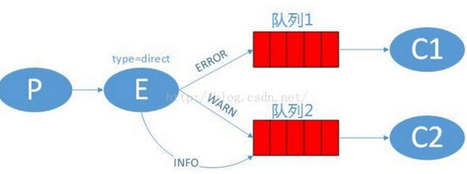
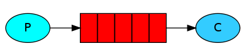
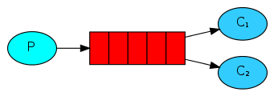
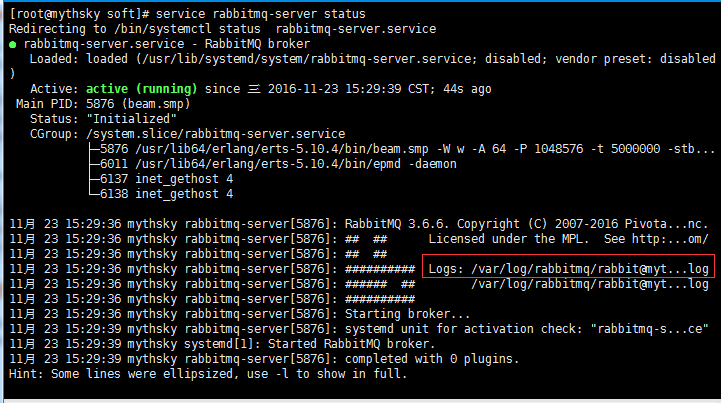
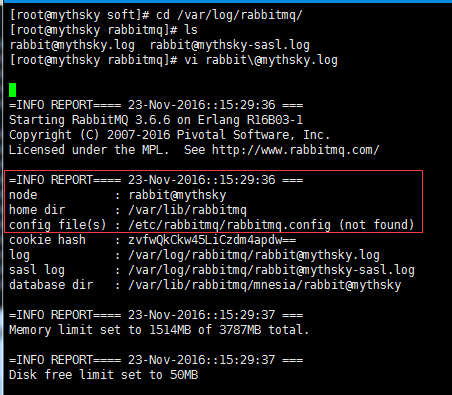
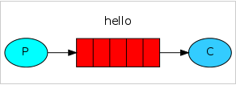
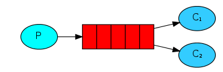
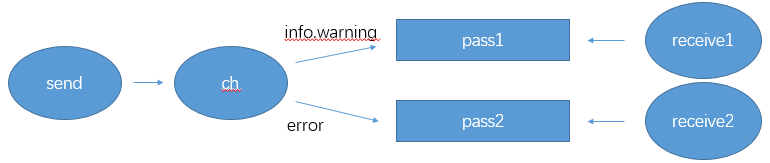
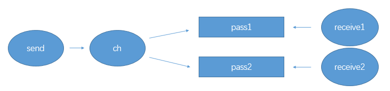
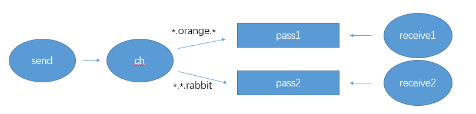

[TOC]

# 简介

RabbitMQ，遵循AMQP协议和Mozilla Public License开源协议，由支持大规模并发的erlang语言开发，用在实时的、对可靠性要求比较高的消息传递上。

RabbitMQ是一个消息的代理器，用于接收和发送消息，你可以这样想，他就是一个邮局，当您把需要寄送的邮件投递到邮筒之时，你可以确定的是邮递员先生肯定会把邮件发送到需要接收邮件的人的手里，不会送错的。在这个比喻中，RabbitMQ就是一个邮箱，也可以理解为邮局和邮递员，他们负责把消息发送出去和用于接收信息。

RabbitMQ和邮局这两者之间的主要区别是它不会处理纸质邮件，取而代之的是接收、存储和发送二进制数据块，也就是我们通常所说的消息。

# 术语说明

1.生产者： 在现实生活中就好比制造商品的工厂，他们是商品的生产者。生产者只管生产[发送消息]。生产[发送消息]的程序称之为一个生产者。


2.队列：这里的队列是指一个名称，但是名称所代表的队列实体寄存在RabbitMQ服务器端中。虽然消息流过RabbitMQ和您的应用程序，但它们只能存储在队列中。 队列只受主机的内存和磁盘的限制，它本质上是一个大的消息缓冲区。 许多生产者可以发送消息到一个队列，许多消费者可以尝试从一个队列接收数据。


3.消费者：消费者就好比是从商店购买或从仓库取走商品的人，消费的意思就是接收。消费者是一个程序，主要是等待接收消息。


4.交换器：在生产者和消息队列之间的交换器，功能类似于网络宽带的交换机，可以根据不同的关键字，将信息发送到不同的队列。

5.临时队列：根据需求临时创建的一条队列，在断开连接后自动删除。

其他术语说明：

Broker：消息队列服务器实体。

Exchange：消息交换机，它指定消息按什么规则，路由到哪个队列。

Queue：消息队列载体，每个消息都会被投入到一个或多个队列。

Binding：绑定，它的作用就是把exchange和queue按照路由规则绑定起来。

Routing Key：路由关键字，exchange根据这个关键字进行消息投递。

vhost：虚拟主机，一个broker里可以开设多个vhost，用作不同用户的权限分离。

producer：消息生产者，就是投递消息的程序。

consumer：消息消费者，就是接受消息的程序。

channel：消息通道，在客户端的每个连接里，可建立多个channel，每个channel代表一个会话任务。

注意：

MQ不能进行批量的消息处理，你看到的传输再多也只是消息被一条一条的存入队列，消费者从队列中一条一条的取出。这kafKa有区别，所以在效率上比不上kafKa，但是MQ主打的是稳定。

每次消费者取出消息时会通知队列，我拿到了，当队列接收到这条消息，就会把消息删除，这是默认的ACK机制。

如果在接收消息之后，还没处理完，消费者挂掉，或者任何情况没有返回ack，队列中这条消息将不会删除，可以一直存着，等待其他消费者来取。    注意，但是如果设置不返回ack，在不断的发送消息到队列又不删除，会导致MQ仓库崩溃。

# 流程

生产者发送一条消息给交换机 --> 交换机根据关键字匹配到对应的队列 --> 将消息存入队列 --> 消费者从队列中取出消息使用。



上图的E就是交换器，通过关键字绑定，如果生产者给的消息中指定类型是ERROR，就给队列1，如果是INFO或者WARN就给队列2。当然也可以一个关键字绑定两个队列。

(INFO等字段自己可以定义，也可以用*，#来匹配。*（星号）表示一个单词#（井号）表示零个或者多个单词。 比如ok.yes可以被ok.*匹配到)

# 优点

好处1：降低了两台服务器之间的耦合，哪怕是一台服务器挂了，另外一台服务器也不会报错或者休克，反正他监听的是MQ，只要服务器恢复再重新连上MQ发送消息，监听服务器就能再次接收。

好处2：MQ作为一个仓库，本身就提供了非常强大的功能，例如不再是简单的一对一功能，还能一对多，多对一，自己脑补保险箱场景，只要有特定的密码，谁都能存，谁都能取。也就是说能实现群发消息和以此衍生的功能。

好处3：现在普遍化的持久化功能，当MQ挂掉可以存储在磁盘等下重启恢复。（需要设置）

# **Queue** 

Queue（队列）是RabbitMQ的内部对象，用于存储消息，用下图表示。

RabbitMQ中的消息都只能存储在Queue中，生产者（下图中的P）生产消息并最终投递到Queue中，消费者（下图中的C）可以从Queue中获取消息并消费。



多个消费者可以订阅同一个Queue，这时Queue中的消息会被平均分摊给多个消费者进行处理，而不是每个消费者都收到所有的消息并处理。



# **安装** 

安装帮助：http://www.rabbitmq.com/install-rpm.html

首先需要安装erlang，这里以CentOS7.5为rabbitmq-server服务端

 

```
cat /etc/redhat-release
'''
CentOS Linux release 7.5.1804 (Core) 
'''

# epel源，安装稍慢
rpm -Uvh http://download.fedoraproject.org/pub/epel/7/x86_64/e/epel-release-7-8.noarch.rpm
yum install -y erlang

wget http://www.rabbitmq.com/releases/rabbitmq-server/v3.6.15/rabbitmq-server-3.6.15-1.el7.noarch.rpm
yum install rabbitmq-server-3.6.6-1.el7.noarch.rpm

systemctl start rabbitmq-server
systemctl status rabbitmq-server
```

查看状态



查看日志



这里提示：not found，创建一个即可

 

```
cd /etc/rabbitmq/
vi rabbitmq.config
"""
# rabbitmq默认创建的用户guest，密码也是guest，这个用户默认只能是本机访问，localhost或者127.0.0.1，从外部访问需要添加如下配置：
[{rabbit, [{loopback_users, []}]}].
"""

# 保存退出后重启服务
systemctl restart rabbitmq-server

# 如果带有防火墙
firewall-cmd --zone=public --add-port=5672/tcp --permanent
firewall-cmd --reload
```

python使用rabbitmq服务，可以使用的客户端有类库pika、txAMQP或者py-amqplib，这里选择了pika为例，客户端在windows系统上。

 

```
pip3 install pika
```

# **生产者消费者模型示例** 

示例的内容就是从send.py发送消息到rabbitmq，receive.py从rabbitmq接收send.py发送的信息。

对于RabbitMQ来说，生产和消费不再针对内存里的一个Queue对象，而是某台服务器上的RabbitMQ-Server实现的消息队列。



P表示produce，生产者的意思，也可以称为发送者，实例中表现为send.py；

C表示consumer，消费者的意思，也可以称为接收者，实例中表现为receive.py；

中间红色的表示队列的意思，实例中表现为hello队列。

## send.py 

 

```
#!/usr/bin/env python3
# -*- coding: utf-8 -*-

import pika
import random

# 新建连接，rabbitmq安装在linux服务器上，IP为172.16.2.1
hostname = '172.16.2.1'
conn = pika.BlockingConnection(pika.ConnectionParameters(host=hostname))

# 创建通道[队列]
channel = conn.channel()

# 声明一个队列，生产者和消费者都要声明一个相同的队列，用来防止万一某一方挂了，另一方能正常运行
channel.queue_declare(queue='hello')

# 为了区分队列中的数据，这里采用一个随机数
number = random.randint(1, 1000)
body_info = 'hello world:%s' % number

# 定义发送的消息
channel.basic_publish(
    exchange='',  # 交换机
    routing_key='hello',  # 队列名,写明将消息发往哪个队列
    body=body_info,  # 消息内容
)
print("[x] Sent %s" % body_info)  # 打印说明一下，发送了一次消息数据

# 断开与服务器的连接
connection.close()
```

## receive.py

 

```
#!/usr/bin/env python3
# -*- coding: utf-8 -*-

import pika

hostname = '172.16.2.1'
conn = pika.BlockingConnection(pika.ConnectionParameters(host=hostname))

channel = conn.channel()

# channel.queue_declare(queue='hello') # 如果生产者已经声明了队列，此处则无需再次声明

def callback(ch, method, properties, body):
    print(" [x] Received %r" % (body,))

# 告诉rabbitmq使用callback来接受信息
channel.basic_consume(callback, queue='hello', no_ack=True)

# 开始接受信息，并进入阻塞状态，队列里有信息才会调用callback处理，ctrl+c退出
print('[*] Waiting for messages. To exit press CTRL+C')  # 打印说明一下，接收到的消息数据
channel.start_consuming()
```

测试：

先运行两次send.py发送消息，此时队列中有了2条消息数据待接收，然后再运行一次receive.py接收消息，此时会一次性接收队列中的所有消息。

## **思考** 

消息可以理解为任务，消息发送者可以看成任务派送者(sender)，消息接收者可以看成工作者(worker)。

当工作者接收到一个任务，还没完任务时分配者又发一个任务，此时需要多个工作者来共同处理这些任务。

任务分派结构图如下：



说明：此时有一个任务派送人P，两个工作接收者C1和C2

情景模拟：

运行三次received.py，然后运行多次send.py，观察接收者接收到的数据情况。

在以上任务分配和完成情况中，有几个问题将会产生：

1.工作者任务是否完成？

2.工作者挂掉后，如何防止未完成的任务丢失，并且如何处理这些任务？

3.RabbitMQ自身出现问题，此时如何防止任务丢失？

4.任务有轻重之分，如何实现公平调度？

## 解决方案

### 1，消息确认(Message acknowledgment)

当任务完成后，工作者（receiver）将消息反馈给RabbitMQ。在实际应用中，可能会发生消费者收到Queue中的消息，没有处理完成就宕机（或出现其他意外）的情况，这种情况下就可能会导致消息丢失。为了避免这种情况发生，我们可以要求消费者在消费完消息后发送一个回执给RabbitMQ，RabbitMQ收到消息回执（Message acknowledgment）后才将该消息从Queue中移除；如果RabbitMQ没有收到回执并检测到消费者的RabbitMQ连接断开，则RabbitMQ会将该消息发送给其他消费者（如果存在多个消费者）进行处理。这里不存在timeout概念，一个消费者处理消息时间再长也不会导致该消息被发送给其他消费者，除非它的RabbitMQ连接断开。

 

```
# 回执信息定义在callback函数中
def callback(ch, method, properties, body):
    print("[x] Reveived %r" % (body,))
    time.sleep(3)  # 这里模拟程序处理时耗，同时也可方便ctrl+c退出
    print("[x] Done")
    
    # 回执信息:当处理完任务后，会反馈给rabbitmq
    ch.basic_ack(delivery_tag=method.delivery_tag)
```

### 2，保留任务(no_ack=False)

当工作者挂掉后，防止任务丢失，去掉参数no_ack=True或者设置为False，表示即便工作者ctrl+c退出后，正在执行的任务也不会丢失，rabbitmq会将任务重新分配给其他工作者。

 

```
channel.basic_consume(callback, queue='hello', no_ack=False)
```

### 3，消息持久化存储(Message durability)

在声明队列时，添加参数durable=True，即声明持久化存储

 

```
channel.queue_declare(queue='hello', durable=True)
```

在发送任务时，用delivery_mode=2参数来标记任务为持久化存储

 

```
channel.basic_publish(exchange='',
                      routing_key='hello',
                      body=body_info,
                      properties=pika.BasicProperties(delivery_mode=2,)
)
```

### 4，公平调度(Fair dispatch)

使用basic_qos设置prefetch_count=1，使得rabbitmq不会在同一时间给工作者分配多个任务，即只有工作者完成任务之后，才会再次接收到任务

 

```
channel.basic_qos(prefetch_count=1)
```

综上，解决方案如下：

send.py

 

```
#!/usr/bin/env python
# -*- coding:utf-8 -*-
# __author__ = "xiaofei"

import pika
import random

# 新建连接，rabbitmq安装在linux服务器上，IP为172.16.2.1
hostname = '172.16.2.1'
conn = pika.BlockingConnection(pika.ConnectionParameters(host=hostname))

# 创建通道[队列]
channel = conn.channel()

# 声明一个队列，生产者和消费者都要声明一个相同的队列，用来防止万一某一方挂了，另一方能正常运行,如果rabbitmq自身挂掉的话，那么任务会丢失。所以需要将任务持久化存储起来，声明持久化存储
channel.queue_declare(queue='world', durable=True)

numbers = random.randint(1, 1000)
messages = 'hello world:%s' % numbers

# 定义发送的消息,在发送任务的时候，用delivery_mode=2来标记任务为持久化存储
channel.basic_publish(
    exchange='',  # 交换机
    routing_key='world',  # 队列名,写明将消息发往哪个队列
    body=messages,  # 消息内容
    properties=pika.BasicProperties(delivery_mode=2,)
)
print("[x] Sent %s" % messages)  # 打印说明一下，发送了一次消息数据

# 断开与服务器的连接
conn.close()
```

receive.py

 

```
#!/usr/bin/env python
# -*- coding:utf-8 -*-
# __author__ = "xiaofei"

import pika
import time

hostname = '172.16.2.1'
conn = pika.BlockingConnection(pika.ConnectionParameters(host=hostname))

# 创建通道
channel = conn.channel()

# channel.queue_declare(queue='hello') # 如果生产者已经声明了队列，此处则无需再次声明

# durable=True后将任务持久化存储，防止任务丢失
channel.queue_declare(queue='world', durable=True)

# 定义task
def callback(ch, method, properties, body):
    print(" [x] Received %r" % (body,))
    time.sleep(5) # 模拟处理时长
    print("[x] Done")
    ch.basic_ack(delivery_tag=method.delivery_tag)  # 当工作者完成任务后，反馈给rabbitmq

# basic_qos设置prefetch_count=1，使得rabbitmq不会在同一时间给工作者分配多个任务，也就是说只有工作者任务完成后才会再次接收到新的任务。
channel.basic_qos(prefetch_count=1)

# 告诉rabbitmq使用callback来接受信息,no_ack=Fasle表示即便工作者ctrl+c退出后，正在执行的任务也不会丢失，rabbitmq会将任务重新分配给其他工作者。
channel.basic_consume(callback, queue='world', no_ack=False)

# 开始接受信息，并进入阻塞状态，队列里有信息才会调用callback处理，ctrl+c退出
print('[*] Waiting for messages. To exit press CTRL+C')  # 打印说明一下，接收到的消息数据
channel.start_consuming()
```

测试

首先启动三次receive.py，然后在多次启动send.py，观察receive接收到的消息。

## Exchange交换器

exchange_type='TYPE_NAME'

### 工作原理

每个接收端的消息队列在绑定交换机的时候，可以设定相应的路由键。

发送端通过交换机发送信息时，可以指明路由键 ，交换机会根据路由键把消息发送到相应的消息队列。

接收端可以根据路由键获取不同的消息队列。

### Exchange类型

Direct交换机

特点：通过routing_key=' '指定关键字，交换机会依据关键字key进行投递



如图所示：交换机ch绑定队列时，指定了关键字，带有info和warning关键字的数据发往pass1队列，带有error关键字的数据发往pass2队列，消费者receive根据自己的条件到对应的队列中获取数据即可。

 

```
########## send.py ##########
import pika
import random

# 新建连接，rabbitmq安装在linux服务器上，IP为172.16.2.1
hostname = '172.16.2.1'
conn = pika.BlockingConnection(pika.ConnectionParameters(host=hostname))

# 创建通道[队列]
channel = conn.channel()

# 定义交换机
channel.exchange_declare(exchange='direct_logs', exchange_type='direct')

message = 'hello,world.1111111111'  # 定义信息
key_word = 'error'  # 定义关键字key

channel.basic_publish(
    exchange='direct_logs',
    routing_key=key_word,
    body=message
)

print('[x] Sent %r' % message)

# 断开与服务器的连接
conn.close()

########## receive1.py ##########
import pika

# 连接服务
hostname = '172.16.2.1'
conn = pika.BlockingConnection(pika.ConnectionParameters(host=hostname))

# 创建通道
channel = conn.channel()

# 定义交换机,exchange指定名字，exchange_type指定类型
channel.exchange_declare(exchange='direct_logs', exchange_type='direct')

# 定义通道队列
channel.queue_declare(queue='pass1')

# 让交换机和队列绑定，指定关键字
channel.queue_bind(exchange='direct_logs', queue='pass1', routing_key='info')
channel.queue_bind(exchange='direct_logs', queue='pass1', routing_key='warning')

def callback(ch, method, properties, body):
    print(body)

# 从队列pass1中获取消息，交给callback函数处理
channel.basic_consume(callback, queue='pass1')

print('[*] Waiting for messages. To exit press ctrl+c')

channel.start_consuming()


########## receive2.py ##########
...
channel.queue_bind(exchange='direct_logs', queue='pass2', routing_key='error')
channel.basic_consume(callback, queue='pass2')
...
```

Fanout交换机

特点：不需要key，采取广播模式，一个消息进来时，投递到与该交换机绑定的所有队列。



如图所示，生产者send只管将生产的数据送给名字为ch的交换机，然后由ch交换机将数据转发到与自己绑定的所有的队列中(pass1和pass2)，然后消费者receive1和receive2可以从各自指定的队列中获取数据。

 

```
########## send.py ##########
import pika
import random

# 新建连接，rabbitmq安装在linux服务器上，IP为172.16.2.1
hostname = '172.16.2.1'
conn = pika.BlockingConnection(pika.ConnectionParameters(host=hostname))

# 创建通道[队列]
channel = conn.channel()

# 定义交换机
channel.exchange_declare(exchange='logs', exchange_type='fanout')

message = 'info: hello,world.'

channel.basic_publish(
    exchange='change_dir',
    routing_key='',
    body=message
)

print('[x] Sent %r' % message)

# 断开与服务器的连接
conn.close()


########## receive1.py ##########
import pika

# 连接服务
hostname = '172.16.2.1'
conn = pika.BlockingConnection(pika.ConnectionParameters(host=hostname))

# 创建通道
channel = conn.channel()

# 定义交换机,exchange指定名字，exchange_type指定类型
channel.exchange_declare(exchange='logs', exchange_type='fanout')

# 定义通道队列pass1
channel.queue_declare(queue='pass1')

# exchange绑定队列exchange=指定交换机名称，queue指定绑定的队列名称
channel.queue_bind(exchange='logs', queue='pass1')

def callback(ch, method, properties, body):
    print(body)

# 从队列pass1中获取消息，交给callback函数处理
channel.basic_consume(callback, queue='pass1')

print('[*] Waiting for messages. To exit press ctrl+c')

channel.start_consuming()

########## receive2.py ##########
...
channel.queue_declare(queue='pass2')
channel.queue_bind(exchange='logs', queue='pass2')
...
```

Topic交换机

特点：exchange对key进行模式匹配后进行投递

\#  匹配0个或多个

\*  匹配1个

例如

发送者路由值   队列中

old.boy.python    old.*    -- 不匹配

old.boy.python    old.#    -- 匹配



如图所示，要求消费者receive3接收带有old.*和old.#匹配的数据，receive4接收带有old.*的数据

 

```
########## send.py ##########
import pika

# 新建连接，rabbitmq安装在linux服务器上，IP为172.16.2.1
hostname = '172.16.2.1'
conn = pika.BlockingConnection(pika.ConnectionParameters(host=hostname))

# 创建通道[队列]
channel = conn.channel()

# 定义交换机
channel.exchange_declare(exchange='topic_logs', exchange_type='topic')

message = 'aaa'
key_word = 'old.info.warning'  # 定义关键字key


channel.basic_publish(
    exchange='topic_logs',
    routing_key=key_word,
    body=message
)

print('[x] Sent %r' % message)

# 断开与服务器的连接
conn.close()


########## receive1.py ##########
import pika

# 连接服务
hostname = '172.16.2.1'
conn = pika.BlockingConnection(pika.ConnectionParameters(host=hostname))

# 创建通道
channel = conn.channel()

# 定义交换机,exchange指定名字，exchange_type指定类型
channel.exchange_declare(exchange='topic_logs', exchange_type='topic')

# 定义通道队列
channel.queue_declare(queue='pass3')

# 让交换机和队列绑定，指定关键字
channel.queue_bind(exchange='topic_logs', queue='pass3', routing_key='old.*')
channel.queue_bind(exchange='topic_logs', queue='pass3', routing_key='old.#')

def callback(ch, method, properties, body):
    print(body)

# 从队列pass1中获取消息，交给callback函数处理
channel.basic_consume(callback, queue='pass3')

print('[*] Waiting for messages. To exit press ctrl+c')

channel.start_consuming()


########## receive2.py ##########
'''
channel.queue_declare(queue='pass4')
channel.queue_bind(exchange='topic_logs', queue='pass4', routing_key='old.*')
channel.basic_consume(callback, queue='pass4')
'''
```

注：

sys.args说明

test.py

 

```
import sys

a = sys.argv[0]
b = sys.argv[1:]
c = sys.argv[2:]
print(a)
print(b)
print(c)
```

打开命令行，linux的bash或win的命令提示符

 

```
C:\Users\admin>python D:\PycharmProjects\study\函数\test.py help1 a b c d e
"""
运行结果
D:\PycharmProjects\study\函数\test.py
['help1', 'a', 'b', 'c', 'd', 'e']
['a', 'b', 'c', 'd', 'e']
"""
```