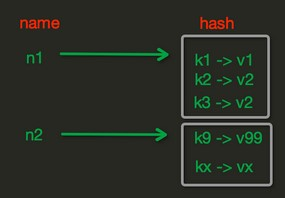
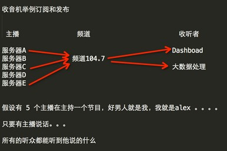

[TOC]

# 简介

redis是一个key-value存储系统。和Memcached类似，它支持存储的value类型相对更多，包括string(字符串)、list(链表)、set(集合)、zset(sorted set --有序集合)和hash（哈希类型）。这些数据类型都支持push/pop、add/remove及取交集并集和差集及更丰富的操作，而且这些操作都是原子性的。在此基础上，redis支持各种不同方式的排序。与memcached一样，为了保证效率，数据都是缓存在内存中。区别的是redis会周期性的把更新的数据写入磁盘或者把修改操作写入追加的记录文件，并且在此基础上实现了master-slave(主从)同步。

参考博客：http://www.cnblogs.com/wupeiqi/articles/5132791.html

# 特点

1，Redis支持数据的持久化，可以将内存中的数据保存在磁盘中，重启的时候可以再次加载进行使用；

2，Redis不仅仅支持简单的key-value类型的数据，同时还提供list，set，zset，hash等数据结构的存储；

3，Redis支持数据的备份，即master-slave模式的数据备份；

# 安装

 

```
# epel源yum安装
yum info redis
yum install redis -y

# 源码安装
yum install jemalloc gcc gcc++ -y
wget http://download.redis.io/releases/redis-4.0.9.tar.gz
tar xf redis-redis-4.0.9.tar.gz
cd redis-4.0.9
make || make MALLOC=libc

# make完后 redis-3.0.6目录下的src文件夹下会出现编译后的redis服务程序,包括redis-server,还有用于测试的客户端程序redis-cli等
cd src/
ls
"""
redis-benchmark # 性能测试工具
redis-check-dump # 用于修复有问题的dump.rdb文件
redis-cli # 客户端
redis-server # 服务端
redis-check-aof # 用于修复有问题的AOF文件
redis-sentinel # 用于集群管理
"""

cp redis.conf /etc/redis.conf
./redis-server /etc/redis.conf # 启动服务,使用指定配置文件,不指定则为默认

# 此时redis服务会进入监听状态,另开一个终端,通过redis-cli连接
./redis-cli
"""
> set foo hello
OK
> get foo
"hello"
"""
```

# API的使用

## 连接方式

redis-py提供两个类Redis和StrictRedis用于实现Redis操作的命令，StrictRedis用于实现大部分官方的命令，并使用官方的语法和命令，Redis是StrictRedis的子类，用于向后兼容旧版本的redis-py。

 

```
import redis
r = redis.Redis(host='172.16.1.101', port=6379)
r.set('k1','v1')
print(r.get('k1'))
# 运行结果：b'v1'
```

## 连接池 

redis-py使用connection pool来管理对一个redis server的所有连接，避免每次建立、释放连接的开销。默认，每个Redis实例都会维护一个自己的连接池。可以直接建立一个连接池，然后作为参数，这样就可以实现多个Redis实例共享一个连接池。

 

```
import redis
pool = redis.ConnectionPool(host='172.16.1.101', port=6379, max_connections=10)
conn = redis.Redis(connection_pool=pool)
conn.set('foo','Bar')
v = conn.get('foo')
print(v)
```

## 操作管道 

redis-py默认在执行每次请求都会创建（连接池申请连接）和断开（归还连接池）一次连接操作，如果想要在一次请求中指定多个命令，则可以使用pipline实现一次请求指定多个命令，并且默认情况下每一次pipline 是原子性的操作。

 

```
#!/usr/bin/env python
# -*- coding:utf-8 -*-

import redis
pool = redis.ConnectionPool(host='172.16.1.101', port=6379)  # 创建连接池

r = redis.Redis(connection_pool=pool)  # 接入连接池

# pipe = r.pipeline(transaction=False)
pipe = r.pipeline(transaction=True)  # 开启事务功能

pipe.multi()

pipe.set('name', 'alex')
pipe.set('role', 'sb')
 
pipe.execute()  # 执行此句之前的所有操作都具有原子性，也就是说，之前的操作如果有一项失败，全部回滚。
```

计数器示例

 

```
#!/usr/bin/env python
# -*- coding:utf-8 -*-
import redis
conn = redis.Redis(host='192.168.1.41',port=6379)
conn.set('count',1000)

with conn.pipeline() as pipe:
    # 先监视，自己的值没有被修改过
    conn.watch('count')

    # 事务开始
    pipe.multi()
    old_count = conn.get('count')
    count = int(old_count)
    if count > 0:  # 有库存
        pipe.set('count', count - 1)

    # 执行，把所有命令一次性推送过去
    pipe.execute()
```

## String 操作 

redis中的String在在内存中按照一个name对应一个value来存储。

存储格式：


**set**

在Redis中设置值，默认，不存在则创建，存在则修改

set(name, value, ex=None, px=None, nx=False, xx=False)

参数说明：

ex，过期时间（秒）

px，过期时间（毫秒）

nx，如果设置为True，则只有name不存在时，当前set操作才执行

xx，如果设置为True，则只有name存在时，岗前set操作才执行

相关命令：

setnx(name ,value)  设置值，只有name不存在时执行，相当于添加

setex(name, value, time)  设置值，time为过期时间，单位秒

psetex(name, time_ms, value)  设置值，time_ms为过期时间，单位毫秒

### mset

批量设置值

mset(*args, **kwargs)

 

```
import redis
r = redis.Redis(host='172.16.1.101', port=6379)
r.mset(k1 = 'v1', k2 = 'v2')
# 或r.mset({'k1':'v1', 'k2':'v2'})
```

### mget 

批量获取值

mget(keys*, *args)

 

```
import redis
r = redis.Redis(host='172.16.1.101', port=6379)
r.mset(k1 = 'v1', k2 = 'v2')
res = r.mget('k1', 'k2')
# 或res = r.mget(['k1','k2'])
print(res)
```

### getset

设置新值并获取原来的值

getset(name, value)

### getrange

获取子序列（根据字节获取，非字符）

getrange(key, start, end)

参数说明：

start  起始位置(字节)

end  结束位置(字节)

 

```
import redis
r = redis.Redis(host='172.16.1.101', port=6379)
r.set('sb','李杰是混蛋')
res = r.getrange('sb', 6, 15)  # 一个汉字占3个字节
print(str(res, encoding='utf-8'))  # 是混蛋
```

### setrange

修改字符串内容，从执行字符串索引开始，向后替换(如果新值过长，则向后增加)

setrange(name, offset, value)

参数说明：

offset  索引，字节(一个汉字占3个字节)

value  要设置的值

 

```
import redis
r = redis.Redis(host='172.16.1.101', port=6379)
res = r.setrange('sb', 3, '超')
v = r.get('sb')
print(str(v, encoding='utf-8'))  # 李超是混蛋

# res = r.setrange('sb', 3, '超超超超超超超')
# 李超超超超超超超
```

### setbit

对name对应的key的二进制表示的位进行操作

参数说明：

offset 位的索引(将key换成二进制后在进行索引)

value  要设置的值，只能是1或0

例如：

如果在Redis中有一个键值对： n1 = "foo"，

那么字符串foo的二进制表示为：01100110 01101111 01101111

所以，如果执行 setbit('n1', 7, 1)，则就会将第7位设置为1，

那么最终二进制则变成 01100111 01101111 01101111，即："goo"

特别的，如果n1是汉字 "晓飞"怎么办？

对于utf-8，每一个汉字占 3 个字节，那么 "武沛齐" 则有 9个字节

对于汉字，for循环时候会按照 字节 迭代，那么在迭代时，将每一个字节转换 十进制数，然后再将十进制数转换成二进制

 

```
n1 = 'foo'

for i in n1:
    num = ord(i)
    print(bin(num).replace('b',''))
"""
运行结果：
01100110(f)
01101111(o)
01101111(o)
"""
n1 = '你好'

for i in n1:
    num = ord(i)
    print(bin(num).replace('b',''))
"""
运行结果：
01001111 01100000(你)
01011001 01111101(好)
"""
```

### getbit

获取name对应的值的二进制表示中的某位的值(0或1)

getbit(name, offset)

### bitcount

获取name对应的值的二进制表示中1的个数

bitcount(key, start=None, end=None)

### bitop

获取多个值，并将值做位运算，将最后的结果保存至新的name对应的值

bitop(operation, dest, *keys)

 

```
bitop('AND', 'new_name', 'n1', 'n2', 'n3')
# 获取redis中n1,n2,n3对应值,然后将所有的值做位运算(求并集),然后将结果保存到new_name对应的值中
```

### strlen

返回name对应的字节长度(一个汉字3个字节)

strlen(name)

### incr

自增name对应的值,当name不存在时，则创建name=amount，否则自增

incr(self, name, amount)

参数说明：

amount  自增数,必须是整数

### incrbyfloat

自增name对应的值,当name不存在时，则创建name=amount，否则自增，amount为浮点型

### decr

自减name对应的值,当name不存在时，则创建name=amount，否则自减，amount为整数

### append

追加key对应的value内容

append(name, value)

## Hash 操作

存储格式：



hset(name, key, value)

hmset(name, mapping)

hget(name, key)

hmget(name, keys, *args)

hgetall(name)  获取name对应的hash的所有键值

hlen(name)

hkeys(name)

hkeys(name)

hvals(name)

hexists(name, key)

hdel(name, *keys)

hincrby(name, key, amount=1)

hincrbyfloat(name, key, amount=1.0)

### hscan

增量式迭代获取，对于数据大的数据非常有用，hscan可以实现分片的获取数据，并非一次性将数据全部获取完，从而防止内存被撑爆

hscan(name, cursor=0, match=None, count=None)

参数说明：

cursor  游标，基于游标分批去获取数据

match  匹配指定key，默认None，表示所有的key

count  每次分片最少获取个数，默认None，表示采用默认分片个数

 

```
# 第一次：cursor1, data1 = r.hscan('xx', cursor=0, match=None, count=None)
# 第二次：cursor2, data1 = r.hscan('xx', cursor=cursor1, match=None, count=None)
# ...
# 直到返回值cursor的值为0时，表示数据已经通过分片获取完毕
```

### hscan_iter

利用yield封装hscan创建生成器，实现分批去redis中获取数据

hscan_iter(name, match=None, count=None) 

参数说明：

match  匹配指定key，默认None,表示所有的key

count  每次分片最少获取个数，默认None,表示采用redis的默认分片个数

 

```
for item in r.hcan_iter('name')
    print(item)
```

## List 操作

存储格式


lpushx(name, value)  在name对应的list中添加元素，只有name已经存在时，值添加到列表的最左边

llen(name)  name对应的list的元素的个数

linsert(name, where, refvalue, value)  在name对应的列表的某一个值前或后插入一个新的值

r.lset(name, index, value)  对name对应的list中的某一个索引位置重新赋值

lpop(name)  在name对应的列表的左侧获取第一个元素并在列表中移除，返回值则是第一个元素

lindex(name, index)  在name对应的列表中根据索引获取列表元素

lrange(name, start, end)  在name对应的列表分片获取数据

ltrim(name, start, end)  在name对应的列表中移除没有在[start-end]索引之间的值

rpoplpush(src_list, dsc_list)  从一个列表取出最右边的元素，同时将其添加至另一个列表的最左边

blpop(keys, timeout)  将多个列表排列，按照从左到右去pop对应列表的元素

brpoplpush(src, dst, timeout=0)  从一个列表的右侧移除一个元素并将其添加到另一个列表的左侧

### lpush

添加元素，新元素都添加到列表的最左边

lpush(name, values)

 

```
r.lpush('foo', 11,22,33)
# 保存顺序为33,22,11

r.rpush('foo', 44,55,66)
# 保存顺序为 33,22,11,44,55,66
```

**lrem**

在name对应的list中删除指定的值

r.lrem(name, value, num) 

参数说明：

value  要删除的值

num  当num=0时，表示删除列表中所有的值，当num=2时，表示从前到后，删除2个值，num=-2时，表示从后向前，删除2个

### 自定义增量迭代

由于redis类库中没有提供对列表元素的增量迭代，如果想要循环name对应的列表的所有元素，那么就需要：

1、获取name对应的所有列表

2、循环列表

但是，如果列表非常大，那么就有可能在第一步时就将程序的内容撑爆，所有有必要自定义一个增量迭代的功能:

 

```
def list_iter(name):
    """
    自定义redis列表增量迭代
    :param name: redis中的name，即：迭代name对应的列表
    :return: yield 返回 列表元素
    """
    list_count = r.llen(name)  # 统计key对应的列表的元素的个数
    for index in xrange(list_count):
        yield r.lindex(name, index)
 
# 使用
for item in list_iter('pp'):
    print(item)
```

## Set 操作

set集合就是不允许重复的列表

sadd(name, values)

scard(name)  获取name对应的集合中元素的个数

sdiff(keys, *args)  在第一个name对应的集合中且不在其他name对应的集合的元素集合

sdiffstore(dest, keys, *args)  获取第一个name对应的集合中且不在其他name对应的集合，再将其新加入到dest对应的集合中

sinter(keys, *args)  获取多个name对应的集合的并集

sinterstore(dest, keys, *args)  获取多个name对应的集合的并集，在将其加入到dest对应的集合中

sismember(name, value)  检查value是否是name对应的集合的成员

smembers(name)  获取name对应的集合的所有成员

smove(src, dst, value)  将某个成员从一个集合中移动到另外一个集合

spop(name)  从集合的右侧(尾部)移除一个成员，并将其返回

srandmember(name, numbers)  从name对应的集合中随机获取numbers个元素

srem(name, values)  在name对应的集合中删除某些值

sunion(keys, *args)  获取多个name对应的集合的并集

sunionstore(dest, keys, *args)  获取多个name对应的集合的并集，并将结果保存到dest对应的集合中

sscan(name, cursor=0, match=None, count=None)

sscan_iter(name, match=None, count=None)

同字符串的操作，用于增量迭代分批获取元素，避免内存消耗过大

## Sort Set 操作

有序集合，在集合的基础上，为每元素排序；元素的排序需要根据另外一个值来进行比较，所以，对于有序集合，每一个元素有两个值，即：值和分数，分数专门用来做排序。

zadd(name, *args, **kwagrs)  在name对应的有序集合中添加元素

zcard(name)  获取name对应的有序集合元素的数量

zcount(name, min, max)  获取name对应的有序集合中分数在[min, max]之间的个数

zincrby(name, value, amount)  自增name对应的有序集合的name对应的分数

zrank(name, value)  获取某个值在name对应的有序集合中的排行(从0开始)

zrem(name, values)  删除name对应的有序集合中的值是values的成员

zremrangebyrank(name, min, max)  根据排行范围删除

zremrangebyscore(name, min, max)  根据分数范围删除

zremrangebylex(name, min, max)  根据值返回删除

zinterstore(dest, keys, aggregate=None)  获取两个有序集合的交集，如果遇到相同值不同分数，则按照aggregate进行操作

zunionstore(dest, keys, aggregate=None)  获取两个有序集合的并集，如果遇到相同值不同分数，则按照aggregate进行操作

zscan(name, cursor=0, match=None, count=None, score_cast_func=float)

zscan_iter(name, match=None, count=None,score_cast_func=float)

同字符串相似，相较于字符串新增score_cast_func，用来对分数进行操作

### zrange

按照索引范围获取name对应的有序集合的元素

r.zrange(name, start, end, desc=False, withscores=False, score_cast_func=float)

参数说明：

start  有序集合索引起始位置(非分数)

end  有序集合索引结束位置

desc  排序规则，默认按照分数从小到大排序

withscores  是否获取元素的分数，默认只获取元素的值

score_cast_func  对分数进行数据转换的函数

 

```
# 从大到小排序
# zrevrange(name, start, end, withscores=False, score_cast_func=float)

# 按照分数范围获取name对应的有序集合的元素
# zrangebyscore(name, min, max, start=None, num=None, withscores=False, score_cast_func=float)

# 从大到小排序
# zrevrangebyscore(name, max, min, start=None, num=None, withscores=False, score_cast_func=float)
```

### zrangebylex

当有序集合的所有成员都具有相同的分值时,有序集合的元素会根据成员的值(lexicographical ordering)来进行排序，而这个命令则可以返回给定的有序集合键 key中，元素的值介于 min 和 max 之间的成员对集合中的每个成员进行逐个字节的对比（byte-by-byte compare）， 并按照从低到高的顺序， 返回排序后的集合成员。 如果两个字符串有一部分内容是相同的话， 那么命令会认为较长的字符串比较短的字符串要大

zrangebylex(name, min, max, start=None, num=None) 

参数说明：

min  左区间(值)，+表示正无限，-表示负无限，(表示开区间，[表示闭区间

max  右区间(值)

start  对结果进行分片处理，索引位置

num  对结果进行分片处理，索引后面的num个元素

 

```
r.zadd('myzset','aa', 'ba', 'ca', 'da', 'ea', 'fa', 'ga')
r.zrangebylex('myzset', '-', '[ca')
# 结果['aa','ba','ca']
```

### 其他常用操作

delete(*names) 根据删除redis中的任意数据类型

exists(name) 检测redis的name是否存在

keys(pattern='*') 根据模型获取redis的name

更多：

KEYS * 匹配数据库中所有 key 。

KEYS h?llo 匹配 hello ， hallo 和 hxllo 等。

KEYS h*llo 匹配 hllo 和 heeeeello 等。

KEYS h[ae]llo 匹配 hello 和 hallo ，但不匹配 hillo

expire(name ,time) 为某个redis的某个name设置超时时间

rename(src, dst) 对redis的name重命名为

move(name, db)) 将redis的某个值移动到指定的db下

randomkey() 随机获取一个redis的name（不删除）

type(name) 获取name对应值的类型

scan(cursor=0, match=None, count=None)

scan_iter(match=None, count=None)

同字符串操作，用于增量迭代获取key

### 发布订阅 



发布者：服务器

订阅器：Dashboad和数据处理

Demo如下：

 

```
#!/usr/bin/env python
# -*- coding:utf-8 -*-
import redis
class RedisHelper:
    def __init__(self):
        self.__conn = redis.Redis(host='10.211.55.4')
        self.chan_sub = 'fm104.5'
        self.chan_pub = 'fm104.5'

    def public(self, msg):
        self.__conn.publish(self.chan_pub, msg)
        return True

    def subscribe(self):
        pub = self.__conn.pubsub()
        pub.subscribe(self.chan_sub)
        pub.parse_response()
        return pub
```

订阅者：

 

```
#!/usr/bin/env python
# -*- coding:utf-8 -*-
from monitor.RedisHelper import RedisHelper
obj = RedisHelper()
redis_sub = obj.subscribe()
while True:
    msg= redis_sub.parse_response()
    print(msg)
```

发布者：

 

```
#!/usr/bin/env python
# -*- coding:utf-8 -*-
from monitor.RedisHelper import RedisHelper
obj = RedisHelper()
obj.public('hello')
```

## sentinel

redis中的sentinel主要用于在redis主从复制中，实现自动将slave替换成master

 

```
#!/usr/bin/env python
# -*- coding:utf-8 -*-

from redis.sentinel import Sentinel

# 连接哨兵服务器(主机名也可以用域名)
sentinel = Sentinel([('10.211.55.20', 26379),
                     ('10.211.55.20', 26380),
                     ],
                    socket_timeout=0.5)

# # 获取主服务器地址
# master = sentinel.discover_master('mymaster')
# print(master)

# # # 获取从服务器地址
# slave = sentinel.discover_slaves('mymaster')
# print(slave)

# # # 获取主服务器进行写入
# master = sentinel.master_for('mymaster')
# master.set('foo', 'bar')

# # # # 获取从服务器进行读取（默认是round-roubin）
# slave = sentinel.slave_for('mymaster', password='redis_auth_pass')
# r_ret = slave.get('foo')
# print(r_ret)
```