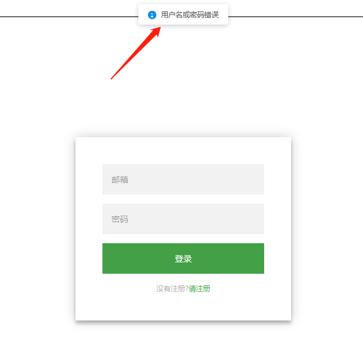

[TOC]

# Ant Design

Ant Design蚂蚁金服开源的React UI库。

官网：https://ant.design/index-cn

官方文档：https://ant.design/docs/react/introduce-cn

## 安装

```shell
$ npm install antd --save
```

## 导入

```
import DatePicker from 'antd/es/date-picker'; // 加载 JS
import 'antd/es/date-picker/style/css'; // 加载 CSS
// import 'antd/es/date-picker/style';         // 加载 LESS
```

手动导入

# 应用到登录组件中

在网页开发中，不管操作成功与否，有很多提示信息，目前信息都是控制台输出，用户看不到，使用Antd的message组件显示友好信息提示。

修改src/component/login.js

```javascript
import React, { useState, useEffect } from 'react';
import {
    Link,
    Redirect
} from "react-router-dom";
import "../css/login.css";
import UserService from "../service/user"
import { observer } from 'mobx-react';
import { message, Form, Icon, Input, Button, Checkbox } from 'antd';
import 'antd/lib/message/style';

const FormItem = Form.Item;
const service = new UserService();

export default class Login extends React.Component {
    render() {
        return <_Login service={service} />;
    }
}

@observer  // 观察者
class _Login extends React.Component {

    handleClick(event) {
        event.preventDefault();
        let fm = event.target.form;
        // 先判断用户名和密码是否为空,不为空则继续向后传递
        // console.log(fm[0].value, fm[1].value);
        // if (!fm[0].value){
        //     console.log('不能为空');
        // }
        this.props.service.login(
            fm[0].value,
            fm[1].value,
        );
        console.log('in login.js ~~~~~');
    }

    render() {
        console.log('~~~~~~~~~~~~~')

        if (this.props.service.errMsg) {
            message.info(
                this.props.service.errMsg,
                3,
                () => {
                    this.props.service.errMsg = '';
                },
            );
        }
        if (this.props.service.loggedin) {
            console.log('observer loging ~~~~~~~~');
            return (<Redirect to='/' />);
        }

        return (
            <div className="login-page">
                <div className='form'>
                    <form className="login-form">
                        <input type="text" placeholder="邮箱" />
                        <input type="password" placeholder="密码" />
                        <button onClick={this.handleClick.bind(this)}>登录</button>
                        <p className="message">
                            没有注册?
                            <Link to="reg">
                                请注册
                            </Link>
                        </p>
                    </form>
                </div>
            </div>
        );
    };
}
```

测试如下：



# 应用到注册组件中

编辑blog_web\src\component\reg.js

```javascript
import React from 'react';
import ReactDom from 'react-dom';
import { Link, Redirect } from "react-router-dom";
import "../css/login.css";
import UserService from '../service/user'
import { observer } from 'mobx-react';
import { message } from 'antd';  // new
import 'antd/lib/message/style';  // new

const service = new UserService();

export default class Reg extends React.Component {
    render() {
        return <_Reg service={service} />
    }
}

@observer  // 观察者
class _Reg extends React.Component {
    handleClick(event) {
        event.preventDefault();
        let fm = event.target.form;
        // 用户名、密码验证,邮箱验证  TODO
        // 传参要对应reg函数的参数位置
        this.props.service.reg(
            fm[1].value,  // 邮箱
            fm[2].value,  // 密码
            fm[0].value,  // 姓名
        );
        console.log('注册信息:', fm[0].value, fm[1].value, fm[2].value, fm[3].value);
    }

    render() {
        if (this.props.service.errMsg) {
            // 使用Antd的message的组件,注意大小写
            message.info(this.props.service.errMsg, 3, () => {
                this.props.service.errMsg = '';
            });
        }
        if (this.props.service.regged) {
            console.log('-----------------');
            return (<Redirect to='/login' />);
        }
        console.log('observer reg ~~~~~~~~~~~~');
        return (
            <div className="login-page">
                <div className='form'>
                    <form className="register-form">
                        <input type="text" placeholder="姓名" />
                        <input type="text" placeholder="邮箱" />
                        <input type="password" placeholder="密码" />
                        <input type="password" placeholder="确认密码" />
                        <button onClick={this.handleClick.bind(this)}>注册</button>
                        <p className="message">
                            已经注册?
                            <Link to="/login">
                                请登录
                            </Link>
                        </p>
                    </form>
                </div>
            </div>
        );
    }
}
```

测试